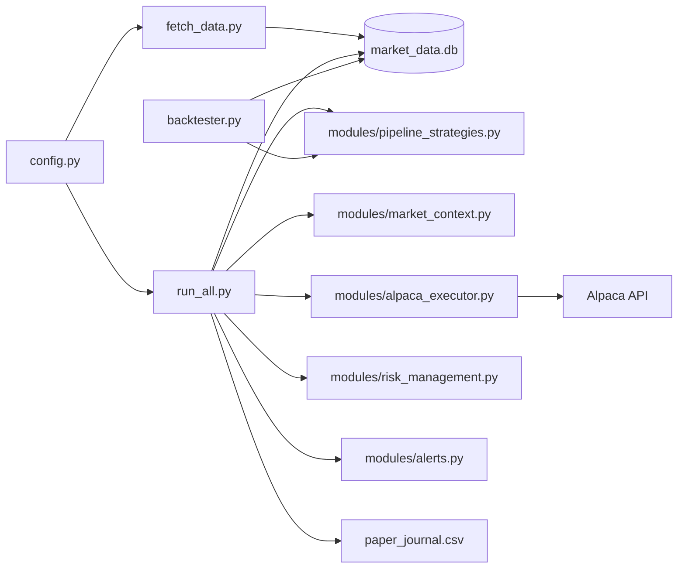

# PythonTrading

Alpaca paper-trading bot: download market data with yfinance, store in SQLite, classify market regime, and run crypto pair and equity MA50 strategies.

## Architecture



## Quick start

```powershell
cd PythonTrading
python -m venv .venv
.\.venv\Scripts\Activate.ps1
pip install -r requirements.txt
copy .env.example .env
# Edit .env with your APCA_* keys
python fetch_data.py
python run_all.py

# 365-day strategy backtest (daily bars; auto-downloads on first run)
python backtester.py
# Or: python fetch_data.py --daily --days 365 && python backtester.py
```

Always run commands from the **project root** so relative paths (`market_data.db`, logs) resolve correctly.

## Paper trading on Alpaca (recommended first month)

`run_all.py` trades **only on Alpaca paper** by default (`PAPER_TRADING=true`). Kraken keys are ignored by the bot.

1. Create **paper** API keys at [Alpaca Paper Dashboard](https://app.alpaca.markets/paper/dashboard/overview).
2. Put them in `.env` as `APCA_API_KEY_ID` and `APCA_API_SECRET_KEY` (not live keys).
3. Verify before leaving it running:

```powershell
python scripts/account/verify.py
python scripts/account/check_account.py
```

4. Refresh data, then start the loop (leave terminal open or use a process manager):

```powershell
python fetch_data.py
python run_all.py
```

5. Each week, review `trade_history.log`, `risk_events.log`, and equity on the Alpaca paper dashboard.

**Safety:** Live trading is blocked unless you set `PAPER_TRADING=false` **and** `ALLOW_LIVE_TRADING=yes` in `.env`. Do not set those during your paper month.

**Logs to watch:** `trade_history.log`, `risk_events.log`, `trading_history.jsonl`, `paper_journal.csv`, `bot_heartbeat.json`

### Before a one-month paper run (do this once)

```powershell
python scripts/account/preflight.py
python backtester.py
python run_all.py
```

Preflight checks paper mode, Alpaca connection, and data. The bot then:

- Sizes trades at **2% of equity** per order (capped at $10k)
- **5% stop-loss** exits on open positions each cycle
- **10% max drawdown** halts new trading
- Picks the **strongest** equity above MA50 (not first alphabetically)
- Requires **0.5+ correlation** on crypto pairs
- Writes **`paper_journal.csv`** for later analysis

### Alerts (optional)

Configure **Telegram** and/or **email** in `.env`, then test:

```powershell
python scripts/account/test_alerts.py
```

| Event | When |
|-------|------|
| **Risk halt** | Once when drawdown hits the limit (not every minute) |
| **Daily summary** | Once per day: equity, cash, regime, running/halted status |

**Telegram setup:**

1. Create a bot with [@BotFather](https://t.me/BotFather) and add `TELEGRAM_BOT_TOKEN` to `.env`.
2. Get your chat id — easiest: message [@userinfobot](https://t.me/userinfobot) and copy the `Id` number into `TELEGRAM_CHAT_ID`.
3. Or message your bot, then run:

```powershell
python scripts/account/get_telegram_chat_id.py --wait
python scripts/account/test_alerts.py
```

Alerts are non-fatal: if Telegram is slow, trading continues.

**Gmail setup:** Use an [app password](https://myaccount.google.com/apppasswords) with `SMTP_HOST=smtp.gmail.com`, port `587`.

## Environment variables

| Variable | Required | Used by |
|----------|----------|---------|
| `APCA_API_KEY_ID` | Yes (paper trading) | All Alpaca scripts via `config.get_alpaca_credentials()` |
| `APCA_API_SECRET_KEY` | Yes | Same |
| `PAPER_TRADING` | No | Default `true` — keep paper keys during evaluation |
| `ALLOW_LIVE_TRADING` | No | Must be `yes` to enable live (with `PAPER_TRADING=false`) |
| `TAVILY_API_KEY` | No | Sentiment in `run_all.py` (price fallback if missing) |
| `KRAKEN_API_KEY` | No | `scripts/exchange/` only (not used by `run_all.py`) |
| `KRAKEN_SECRET_KEY` or `KRAKEN_API_SECRET` | No | `scripts/exchange/` |
| `TELEGRAM_BOT_TOKEN` | No | Halt + daily alerts |
| `TELEGRAM_CHAT_ID` | No | Halt + daily alerts |
| `SMTP_HOST`, `SMTP_USER`, `SMTP_PASSWORD`, `ALERT_EMAIL_TO` | No | Email alerts |

Legacy `ALPACA_API_KEY` / `ALPACA_SECRET_KEY` still work as fallbacks.

**Never commit `.env`** — it is in `.gitignore`. Use `.env.example` as a template.

## Project layout

```
PythonTrading/
├── run_all.py              # Main 24/7 trading loop
├── fetch_data.py           # yfinance → SQLite
├── config.py               # Universe, credentials, paths
├── backtester.py           # 365-day backtest (daily bars, mirrors run_all.py)
├── simulate.py             # Mean-reversion simulation
├── modules/
│   ├── pipeline_strategies.py  # Shared crypto + equity logic (live + backtest)
│   ├── alpaca_executor.py
│   ├── alerts.py
│   └── ...
└── scripts/
    ├── db/                 # SQLite utilities
    ├── account/            # Alpaca + alerts (preflight, verify, test_alerts)
    ├── exchange/           # Kraken checks
    ├── maintenance/        # Cleanup, universe CSV
    └── dev/                # Tests and legacy loops
```

## Utility scripts

```powershell
python scripts/account/preflight.py          # Pre-flight before paper month
python scripts/account/verify.py
python scripts/account/check_account.py
python scripts/account/check_balance.py
python scripts/account/get_telegram_chat_id.py --wait
python scripts/account/test_alerts.py
python scripts/db/check_tables.py
python scripts/exchange/health_check.py      # Kraken only
```

## Data fetch

```powershell
python fetch_data.py                    # 5m bars for live bot (~5 days)
python fetch_data.py --daily --days 365 # daily bars for backtester
python backtester.py                    # 365-day simulation (default)
python backtester.py --days 90          # shorter window
```

## Logs and data

| File | Purpose |
|------|---------|
| `market_data.db` | SQLite OHLCV per ticker |
| `trade_history.log` | Trade log from `run_all.py` |
| `trading_history.jsonl` | Position ledger |
| `risk_events.log` | Drawdown halt and stop events |
| `paper_journal.csv` | Structured log for paper-month analysis |
| `bot_heartbeat.json` | Last cycle status (regime, equity, halted) |
| `alert_state.json` | Alert dedupe state (halt notified, last daily summary) |

## Notes

- **Single virtualenv:** Use `.venv` only. The old `venv/` folder has been removed; reinstall with `pip install -r requirements.txt`.
- **`write_bot.py`:** Regenerates `fetch_data.py` only. Does **not** overwrite `run_all.py` (maintained manually).
- **Paper trading:** `PAPER_TRADING=true` by default in `.env`.
- **Backtest alignment:** `backtester.py` and `run_all.py` share `modules/pipeline_strategies.py`.
- **Regime pauses:** Crypto and equity entries skip `RHYME_B` (panic) and `RHYME_E` (bearish) regimes.
