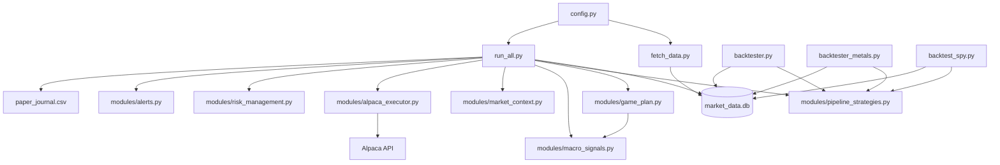

# PythonTrading

Personal systematic fund on Alpaca paper: three strategy sleeves (SPY trend, vol-gated crypto pairs, NYSE momentum), an optional **macro game plan** (yield gate + metal hedge + stress cash), shared risk controls, and SQLite market data from yfinance.

## Architecture



**One process:** `run_all.py` runs all sleeves on a single Alpaca account with per-sleeve capital caps enforced by `modules/alpaca_executor.py`.

## Fund sleeves (default allocation)

| Sleeve | Base cap | Strategy | When it trades |
|--------|----------|----------|----------------|
| **SPY** | 45% | Price > MA200 | US equity session open |
| **Crypto** | 20% | Z-score correlated pairs | **High volatility only** (`CRYPTO_VOL_ONLY`) |
| **NYSE** | 20% | Strongest stock/ETF above MA50 (excludes SPY) | US equity session open |
| **Metal** | 10% | GLD/SLV/CPER blend | Game plan only, on macro stress |
| **Cash headroom** | ~15% (baseline) | — | Dry powder inside Alpaca for next automated buys |

On a $100k account with game plan **off**, SPY can hold at most ~$45k; crypto at most ~$20k; NYSE at most ~$20k; ~$15k stays as cash headroom. Each buy is **2% of equity per order** within the sleeve cap (max $10k per order).

When **game plan** is enabled (default), long sleeves are scaled to **90%** of these base caps so **10%** of equity can go to the metal hedge sleeve. Effective caps are computed at runtime by `config.effective_sleeve_cap()` and `config.fund_allocation_pct()`.

Tune base caps in `config.py`:

```python
SPY_SLEEVE_CAP_PCT = 0.45
CRYPTO_SLEEVE_CAP_PCT = 0.20
NYSE_SLEEVE_CAP_PCT = 0.20
FUND_CASH_BUFFER_PCT = 0.15  # reference; see effective_cash_buffer_pct()
CRYPTO_VOL_ONLY = True
```

## Fund allocation & cash buffer

The **~15% cash** is **not** a standalone strategy sleeve. It is **structural headroom** from the fund’s max long deployment: base SPY + crypto + NYSE caps sum to **85%**, leaving **15%** unallocated so buys never assume 100% of equity is deployable.

| Concept | What it means |
|---------|----------------|
| **`FUND_CASH_BUFFER_PCT`** | Config reference (0.15). The live value comes from `effective_cash_buffer_pct()`. |
| **`effective_cash_buffer_pct()`** | `1 − metal sleeve − scaled long caps`. Ensures all sleeve caps sum to 100%. |
| **Dry powder** | Cash sitting in Alpaca above current positions — available for the next automated buy without breaching caps. |
| **`STRESS_CASH_PCT` (25%)** | **Separate** macro defense. On stress days only, game plan trims toward 25% cash. Not the everyday 15% headroom. |

**Game plan ON (default):**

| Piece | Fraction of equity |
|-------|-------------------|
| SPY / crypto / NYSE (each scaled ×0.9) | 40.5% / 18% / 18% |
| Metal sleeve (stress deploy) | 10% |
| Calm cash headroom | **~13.5%** |

**Game plan OFF:** long sleeves use full base caps (85% total); calm cash headroom is **15%**.

Preflight and `bot_heartbeat.json` report `effective_cash_buffer_pct()` alongside sleeve exposure so you can see headroom vs deployed capital.

## Game plan (live default: ON)

The **game plan** (`game_plan_gld_slv_cper`) adds macro hedging on top of the base fund. It is wired into `run_all.py` and enabled by default (`GAME_PLAN_ENABLED=true`).

| Piece | What it does |
|-------|----------------|
| **Yield gate** | Blocks **new SPY buys** when 10Y yield (TNX) is above MA50 and rising; falls back to TLT weakness |
| **Stress cash** | On macro stress only, trims SPY/crypto/NYSE toward **25% cash** (not every day) |
| **Metal sleeve (10%)** | On stress: deploy **50% GLD / 30% SLV / 20% CPER**; on calm: exit metals |
| **Long sleeve scale** | SPY/crypto/NYSE caps use **90%** of base caps to reserve room for metals |

**Stress** = SPY below MA200, OR TLT below MA50, OR bear/panic RHYME regime.

Game plan actions run during the **US equity session** (metals are ETFs). Crypto still runs 24/7 with its own vol gate.

### Fresh-capital 2022 backtest (fair stress read)

| Strategy | 2022 return | Sharpe |
|----------|-------------|--------|
| Baseline fund | +1.6% | 0.19 |
| **Game plan (live blend)** | **+16.2%** | **0.83** |
| VTI buy & hold | -20.0% | — |

Full 2017–2023 window: game plan ~**+292%** vs baseline ~**+289%** (yield gate edge; metals help most in stress years).

Re-run:

```powershell
python scripts/research/backtest_game_plan_live.py
```

### Game plan `.env` settings

```env
GAME_PLAN_ENABLED=true
YIELD_GATE_ENABLED=true
METAL_SLEEVE_CAP_PCT=0.10
METAL_BLEND_GLD=0.50
METAL_BLEND_SLV=0.30
METAL_BLEND_CPER=0.20
STRESS_CASH_PCT=0.25
WISDOM_MODE=arbitrage
```

Set `GAME_PLAN_ENABLED=false` to revert to the baseline fund only.

Preflight prints current macro signals (`stress`, `yield_gate`, `bond_stress`) and confirms GLD/SLV/CPER are in the data universe.

## Quick start

```powershell
cd PythonTrading
python -m venv .venv
.\.venv\Scripts\Activate.ps1
pip install -r requirements.txt
copy .env.example .env
# Edit .env only — never commit .env (gitignored). .env.example has no real passwords.
# Not the same as .venv/ (Python packages folder).
# Edit .env with your APCA_* paper keys
python fetch_data.py
python run_all.py
```

Always run commands from the **project root** so relative paths (`market_data.db`, logs) resolve correctly.

## Paper trading on Alpaca (recommended first month)

`run_all.py` trades **only on Alpaca paper** by default (`PAPER_TRADING=true`). Kraken keys in `.env` are for `scripts/exchange/` only — not used by the main fund loop.

1. Create **paper** API keys at [Alpaca Paper Dashboard](https://app.alpaca.markets/paper/dashboard/overview).
2. Put them in `.env` as `APCA_API_KEY_ID` and `APCA_API_SECRET_KEY` (not live keys).
3. Verify before leaving it running:

```powershell
python scripts/account/preflight.py
python scripts/account/verify.py
python scripts/account/check_account.py
```

4. Refresh data, then start the fund loop (leave terminal open, or use a VPS later):

```powershell
python fetch_data.py
python run_all.py
```

5. Each week, review logs and equity on the Alpaca paper dashboard.

**Safety:** Live trading is blocked unless you set `PAPER_TRADING=false` **and** `ALLOW_LIVE_TRADING=yes` in `.env`. Do not set those during your paper month.

### Before a one-month paper run

```powershell
python scripts/account/preflight.py
python backtester.py --days 500
python run_all.py
```

Preflight checks paper mode, Alpaca connection, market data, and (when enabled) game plan macro signals + metal tickers. The bot then:

- Enforces **sleeve caps** (SPY / crypto / NYSE / metal) on each buy
- Runs **game plan** when enabled: yield gate, stress cash trim, GLD/SLV/CPER sleeve
- Runs **crypto only in high-volatility** regimes (still skips panic/bear)
- Applies **5% stop-loss** exits on open positions each cycle
- **10% max drawdown** halts new trading
- Requires **0.5+ correlation** on crypto pairs
- Writes **`paper_journal.csv`** and **`bot_heartbeat.json`** each cycle

### Regime and risk

Market regime comes from `modules/market_context.py` (sentiment + volatility). All sleeves skip entries in:

- `RHYME_B: Panic_Volatility`
- `RHYME_E: Steady_Bearish_Decline`

Crypto has an additional gate: when `CRYPTO_VOL_ONLY=true`, pairs are skipped unless cross-asset volatility is **High**.

## How to review bot performance

The bot writes a **wisdom journal** every cycle and runs a **daily self-evaluation** (when `WISDOM_EVAL_ENABLED=true`) that compares live equity to aligned backtest sims on the same calendar window. Live equity is resampled to **daily last** so returns match daily-bar sim cadence.

### Quick aligned snapshot (recommended)

```powershell
# Regenerate scorecard + print live vs sim for the active WISDOM_MODE window
python scripts/analysis/live_vs_backtest_snapshot.py --refresh-eval

# Same, plus trade-level journal vs Alpaca fill reconciliation
python scripts/analysis/live_vs_backtest_snapshot.py --refresh-eval --reconcile
```

The snapshot reports live return, active-mode sim return, `live_minus_active_sim_pp`, VTI benchmark, and trade signal count for the window.

### Manual evaluation

```powershell
# Daily rolling scorecard (same hook as run_all, but on demand)
python scripts/maintenance/evaluate_wisdom.py
python scripts/maintenance/evaluate_wisdom.py --force

# Calendar-month rollup
python scripts/maintenance/evaluate_wisdom.py --monthly --force
python scripts/maintenance/evaluate_wisdom.py --monthly --month 2026-05 --force
```

Outputs: `wisdom_scorecard.json`, append-only `wisdom_evaluations.jsonl`, and optional `wisdom_monthly_YYYY-MM.json`.

### Trade reconciliation only

```powershell
python scripts/analysis/trade_reconciliation.py
python scripts/analysis/trade_reconciliation.py --days 30 --json reconcile_report.json
```

Matches `paper_journal.csv` signals to Alpaca fills and estimates notional/slippage vs sim sizing.

### What to read

| File | Purpose |
|------|---------|
| `wisdom_scorecard.json` | Latest daily eval: live vs all sim modes |
| `wisdom_evaluations.jsonl` | History of daily scorecards |
| `wisdom_journal.csv` | Per-cycle equity, regime, wisdom mode |
| `paper_journal.csv` | Trade signals and game plan events |
| `bot_heartbeat.json` | Last cycle: sleeves, cash headroom, halted state |

## Live vs backtest expectations

Short live history is normal. Live P&L will **diverge** from simulation for several structural reasons:

| Factor | Live | Backtest / wisdom sim |
|--------|------|------------------------|
| Bar cadence | 5-minute bars | Daily bars |
| Fills | Alpaca market orders, fees, partial fills | Model fills at daily close |
| Sleeve enforcement | Real-time cap checks on each order | Same logic, daily rebalance |
| Gates | Yield gate, vol gate, regime skip in real time | Forward-filled daily macro |
| Game plan | `backtester_wisdom.py` and wisdom sim include game plan when enabled | Aligned window in scorecard |

Use the snapshot script for an **apples-to-apples** read: same calendar dates, daily-resampled live equity, and sim modes run over that exact window. Large gaps early on often mean too few live days — check `daily_samples` in the scorecard.

Directional backtests remain useful for strategy design; the performance review tools are for **tracking live drift** once paper trading is running.

## Backtesting

```powershell
# Full fund: SPY + vol-gated crypto + NYSE (daily bars)
python backtester.py
python backtester.py --days 500

# Game plan + metal sleeves (2017-2023 default)
python backtester_metals.py
python backtester_metals.py --from 2022 --to 2022

# Live game plan summary (full window + fresh-capital 2022 stress test)
python scripts/research/backtest_game_plan_live.py

# Macro hedge variants (yield gate, GLD, dynamic cash)
python backtester_macro_hedge.py --game-plan

# SPY sleeve only — grid search all MA/allocation combos
python backtest_spy.py
python backtest_spy.py --compare
python backtest_spy.py --all --days 500

# Wisdom sentiment modes + game plan (daily bars)
python backtester_wisdom.py
python backtester_wisdom.py --from 2017 --to 2023

# Fetch longer daily history first (free via yfinance)
python fetch_data.py --daily --days 500
```

| Script | What it tests |
|--------|----------------|
| `backtester.py` | Integrated fund logic (shared strategies module) |
| `backtester_metals.py` | Metal sleeves + `game_plan_gld_slv_cper` (50/30/20 GLD/SLV/CPER) |
| `backtester_macro_hedge.py` | Yield gate, GLD hedge, stress cash, full game plan |
| `scripts/research/backtest_game_plan_live.py` | Live blend vs baseline; saves `fund_game_plan_*.csv` |
| `backtest_spy.py` | SPY MA200 sleeve in isolation; saves `spy_backtest_results.csv` |
| `backtester_wisdom.py` | Price vs wisdom sentiment modes; includes game plan when enabled |
| `scripts/analysis/live_vs_backtest_snapshot.py` | Aligned live vs sim comparison (`--refresh-eval`, `--reconcile`) |
| `scripts/analysis/trade_reconciliation.py` | Journal signals vs Alpaca fills |
| `scripts/maintenance/evaluate_wisdom.py` | Manual daily/monthly wisdom evaluation |

Live bot uses **5-minute** bars; backtests and wisdom sims use **daily** bars. Results are directional — use the performance review section for aligned live tracking.

## Optional: standalone SPY bot

`run_spy.py` runs **only** the SPY sleeve in its own loop. **Prefer `run_all.py`** for the integrated fund. Do not run both on the same account unless you know the caps overlap.

```powershell
python scripts/account/preflight_spy.py
python run_spy.py
```

Standalone SPY logs go to `spy_paper_journal.csv`, `spy_bot_heartbeat.json`, etc.

## Alerts (optional)

Configure **Telegram** and/or **email** in `.env`, then test:

```powershell
python scripts/account/test_alerts.py
```

| Event | When |
|-------|------|
| **Risk halt** | Once when drawdown hits the limit (not every minute) |
| **Daily summary** | Once per day: equity, cash, regime, running/halted status |

**Telegram setup:**

1. Create a bot with [@BotFather](https://t.me/BotFather) and add `TELEGRAM_BOT_TOKEN` to `.env`.
2. Get your chat id — easiest: message [@userinfobot](https://t.me/userinfobot) and copy the `Id` number into `TELEGRAM_CHAT_ID`.
3. Or message your bot, then run:

```powershell
python scripts/account/get_telegram_chat_id.py --wait
python scripts/account/test_alerts.py
```

Alerts are non-fatal: if Telegram is slow, trading continues.

**Gmail setup:** Use an [app password](https://myaccount.google.com/apppasswords) with `SMTP_HOST=smtp.gmail.com`, port `587`.

## Environment variables

| Variable | Required | Used by |
|----------|----------|---------|
| `APCA_API_KEY_ID` | Yes (paper trading) | All Alpaca scripts via `config.get_alpaca_credentials()` |
| `APCA_API_SECRET_KEY` | Yes | Same |
| `PAPER_TRADING` | No | Default `true` — keep paper keys during evaluation |
| `ALLOW_LIVE_TRADING` | No | Must be `yes` to enable live (with `PAPER_TRADING=false`) |
| `SENTIMENT_SOURCE` | No | Default `price` (free). Set `tavily` only if you have API quota |
| `WISDOM_MODE` | No | Default `arbitrage`. Also: `baseline`, `web_regime`, `wisdom_pause` |
| `WISDOM_GAP_THRESHOLD` | No | Web vs price divergence gate (default `0.25`) |
| `GAME_PLAN_ENABLED` | No | Default `true` — yield gate + metal sleeve + stress cash |
| `YIELD_GATE_ENABLED` | No | Default `true` — block new SPY buys on hostile rates |
| `METAL_SLEEVE_CAP_PCT` | No | Metal sleeve cap (default `0.10`) |
| `METAL_BLEND_GLD` / `SLV` / `CPER` | No | Weights within metal sleeve (default 50/30/20) |
| `STRESS_CASH_PCT` | No | Cash target on macro stress (default `0.25`) |
| `WISDOM_EVAL_ENABLED` | No | Daily self-eval (default `true`) |
| `WISDOM_EVAL_DAYS` | No | Rolling window for scorecard (default `30`) |
| `WISDOM_MONTHLY_ENABLED` | No | Calendar-month rollup + alert (default `true`) |
| `TAVILY_API_KEY` | No | Only when `SENTIMENT_SOURCE=tavily` |
| `SPY_APCA_API_KEY_ID` | No | Optional separate paper account for `run_spy.py` only |
| `SPY_APCA_API_SECRET_KEY` | No | Same |
| `KRAKEN_API_KEY` | No | `scripts/exchange/` only (not used by `run_all.py`) |
| `KRAKEN_SECRET_KEY` or `KRAKEN_API_SECRET` | No | `scripts/exchange/` |
| `TELEGRAM_BOT_TOKEN` | No | Halt + daily alerts |
| `TELEGRAM_CHAT_ID` | No | Halt + daily alerts |
| `SMTP_HOST`, `SMTP_USER`, `SMTP_PASSWORD`, `ALERT_EMAIL_TO` | No | Email alerts |

Legacy `ALPACA_API_KEY` / `ALPACA_SECRET_KEY` still work as fallbacks.

**Never commit `.env`** — it is in `.gitignore`. Use `.env.example` as a template.

## Project layout

```
PythonTrading/
├── run_all.py              # Main 24/7 integrated fund loop (+ game plan)
├── run_spy.py              # Optional standalone SPY loop
├── fetch_data.py           # yfinance → SQLite (5m live, daily backtest)
├── config.py               # Universe, sleeves, game plan, credentials, paths
├── backtester.py           # Fund backtest (SPY + crypto + NYSE)
├── backtester_metals.py    # Metal hedge + game_plan_gld_slv_cper backtests
├── backtester_macro_hedge.py  # Yield gate, GLD, stress cash variants
├── backtest_spy.py         # SPY sleeve backtest + grid search
├── backtester_wisdom.py    # Wisdom sentiment modes + game plan backtest
├── simulate.py             # Mean-reversion research
├── modules/
│   ├── pipeline_strategies.py  # SPY, crypto, NYSE strategies
│   ├── game_plan.py            # Metal sleeve + stress cash (live)
│   ├── macro_signals.py        # TNX/TLT daily signals for game plan
│   ├── alpaca_executor.py      # Sleeve caps + order sizing
│   ├── wisdom_evaluator.py     # Daily scorecard, live vs sim modes
│   ├── data_refresh.py         # Session-aware data refresh
│   ├── market_context.py       # Regime / volatility / sentiment
│   ├── alerts.py
│   └── ...
└── scripts/
    ├── analysis/           # Live vs backtest snapshot, trade reconciliation
    ├── research/           # Game plan backtests, projections
    ├── db/                 # SQLite utilities
    ├── account/            # Alpaca + alerts (preflight, preflight_spy, verify)
    ├── exchange/           # Kraken checks
    ├── maintenance/        # Cleanup, universe CSV, evaluate_wisdom.py
    └── dev/                # Tests and legacy loops
```

## Utility scripts

```powershell
python scripts/account/preflight.py          # Pre-flight before paper month
python scripts/analysis/live_vs_backtest_snapshot.py --refresh-eval
python scripts/maintenance/evaluate_wisdom.py --force
python scripts/research/backtest_game_plan_live.py  # Game plan backtest summary
python scripts/account/preflight_spy.py      # SPY-only standalone check
python scripts/account/verify.py
python scripts/account/check_account.py
python scripts/account/check_balance.py
python scripts/account/get_telegram_chat_id.py --wait
python scripts/account/test_alerts.py
python scripts/db/check_tables.py
python scripts/exchange/health_check.py      # Kraken only
```

## Data fetch

```powershell
python fetch_data.py                    # 5m bars for live bot (~5 days)
python fetch_data.py --daily --days 365 # daily bars for backtester
python fetch_data.py --daily --days 500 # longer history (free via yfinance)
```

## Logs and data

| File | Purpose |
|------|---------|
| `market_data.db` | SQLite OHLCV per ticker |
| `trade_history.log` | Trade log from `run_all.py` |
| `trading_history.jsonl` | Position ledger |
| `risk_events.log` | Drawdown halt and stop events |
| `paper_journal.csv` | Structured log for paper-month analysis (`game_plan` events when enabled) |
| `bot_heartbeat.json` | Last cycle: regime, sleeve exposure, game plan state, trades, halted |
| `wisdom_journal.csv` | Every cycle: wisdom config, web/price/gap, equity, shadow modes |
| `wisdom_scorecard.json` | Latest daily self-evaluation (live vs sim modes) |
| `wisdom_evaluations.jsonl` | Append-only history of daily scorecards (perpetual log) |
| `wisdom_monthly_YYYY-MM.json` | Calendar-month rollup (live vs sim modes) |
| `wisdom_monthly_history.jsonl` | Append-only history of monthly rollups |
| `web_sentiment_live.json` | Cached daily headline sentiment |
| `spy_backtest_results.csv` | Output of `backtest_spy.py --all` |
| `fund_game_plan_live_backtest.csv` | Full-window game plan vs baseline |
| `fund_game_plan_fresh_2022.csv` | Fresh-capital 2022 stress test results |
| `fund_metals_backtest_results.csv` | Output of `backtester_metals.py` |
| `spy_paper_journal.csv` | Standalone `run_spy.py` journal only |
| `spy_bot_heartbeat.json` | Standalone SPY bot heartbeat |
| `alert_state.json` | Alert dedupe state (halt notified, last daily summary) |

## Running on a server (later)

The bot is lightweight (Python + API calls + SQLite). A **$5–12/mo Linux VPS** is enough for 24/7 uptime once you trust paper results. Copy the repo and `.env`; run `python run_all.py` under `systemd` or similar.

## Notes

- **Single virtualenv:** Use `.venv` only. Reinstall with `pip install -r requirements.txt` after pulling changes.
- **`write_bot.py`:** Regenerates `fetch_data.py` only. Does **not** overwrite `run_all.py`.
- **Paper trading:** `PAPER_TRADING=true` by default in `.env`.
- **Strategy sharing:** `run_all.py`, `backtester.py`, and `backtest_spy.py` share `modules/pipeline_strategies.py`.
- **Alpaca crypto fees:** ~0.25% taker per leg on market orders. Kraken keys are available for future crypto-only execution but are not wired to `run_all.py`.
- **NYSE overlap:** SPY and NYSE sleeves both hold US equities; caps limit double exposure. SPY is excluded from the NYSE MA50 picker. GLD, SLV, and CPER are excluded from NYSE momentum and counted in the metal sleeve.
- **Game plan metals:** GLD, SLV, CPER are in `UNIVERSE` for data refresh but not in the NYSE momentum picker. Macro daily bars (TLT, TNX) bootstrap on first `run_all.py` cycle.
