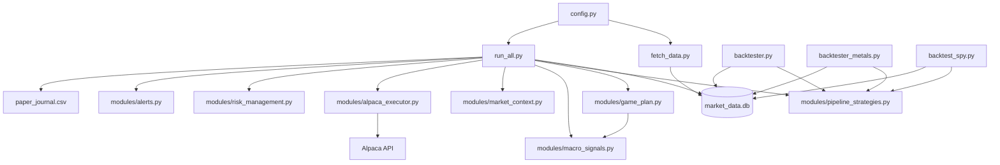

# PythonTrading

**Personal systematic fund** on Alpaca. Currently running **live on a small ~$100 account** (adding ~$200 soon → ~$300).

The bot automatically applies **small-account safety** when equity &lt; $500:

- **90% VTI core** (passive index anchor)
- **~10% active sleeves** (SPY, NYSE momentum, vol-gated crypto)
- **1% risk per trade** (~$1–$3 orders)
- **$10 max per order**

**Recommended live stack** (already default — no extra flags required):

- `WISDOM_MODE=dynamic`
- Yield-gate-only game plan (`GAME_PLAN_YIELD_GATE_ONLY=true`)
- **90% VTI core** on small accounts (`SMALL_ACCOUNT_VTI_CORE_PCT=0.90`)
- Overlap filter, adaptive chunk, co-fire, SPY MA exit, social sleeve, macro adaptor — **off by default** (opt-in via `.env`)

**Paper research** (`paper_aggressive`): dynamic VTI (40–75%), overlap filter + adaptive chunk + co-fire **on**, macro adaptor + social + SPY MA exit **off**. See [Dual fund bots](#dual-fund-bots-live--paper-sharpe-chase).

**At-a-glance status:** `python status.py` — live + paper equity, regime, and key flags.

---

## Two deployment profiles

The repo supports **two distinct stacks**. Live defaults stay conservative; paper research opts into aggressive layers via existing hooks (`PAPER_CHASE_MODE`, `configure_paper_chase()`). Summary: [`scripts/analysis/OPTIMIZED_SYSTEM_SUMMARY.md`](scripts/analysis/OPTIMIZED_SYSTEM_SUMMARY.md).

### Profile A: Live small account (`current_dynamic`)

**Use for:** live ~$100 account, default `run_all.py`, `preflight.py` when not in paper chase.

| Layer | Setting |
|-------|---------|
| **VTI core** | **90%** when equity &lt; $500; **80%** when ≥ $500 |
| **Active sleeves** | ~10% (small) / ~20% (large) of equity |
| **Risk / orders** | 1% / **$10 max** (small) or 2% / scaled (large) |
| **Game plan** | Yield-gate-only |
| **WISDOM_MODE** | `dynamic` |
| **NYSE overlap / beta scaling** | **off** (opt-in via `.env`) |
| **Adaptive chunk / co-fire** | **off** (opt-in) |
| **SPY MA exit** | **off** (opt-in) |
| **Halt** | 10% DD; resume 8%; liquidate on breach |

Preflight / `run_all.py` print Profile A via `config.print_live_stack_flags()`.

### Profile B: Paper research (`paper_aggressive`)

**Use for:** paper book, `run_paper_bot.py`, `backtester.py --paper-aggressive`, portal paper user — **not** default live.

| Layer | Setting |
|-------|---------|
| **VTI core** | **Dynamic 40–75%** (`PAPER_DYNAMIC_VTI=true`) or 20% static fallback |
| **Active sleeves** | Full 45/20/20 base caps × **1.40 boost** (~79% deployed) |
| **Game plan** | Yield-gate-only (same gate logic) |
| **NYSE overlap filter** | **on** (`PAPER_NYSE_OVERLAP_FILTER_ENABLED=true`) |
| **NYSE beta scaling** | **on** when `PAPER_CHASE_EXTRA=true` |
| **Adaptive chunk / co-fire** | **on** (`PAPER_ADAPTIVE_CHUNK_ENABLED`, `PAPER_COFIRE_BUDGET_ENABLED`) |
| **SPY MA exit** | **off** (`PAPER_SPY_EXIT_ON_MA_BREAK=false`) |
| **Macro regime adaptor** | **off** (`PAPER_MACRO_REGIME_ADAPTOR_ENABLED=false`) |
| **Crypto vol gate** | **off** (`PAPER_CRYPTO_VOL_ONLY=false`) |
| **Social / Felix sleeve** | **off** (`PAPER_SOCIAL_SLEEVE_ENABLED=false`; Felix sync optional via chase extras) |

Set `PAPER_CHASE_MODE=1` (portal sets this for paper users). Preflight prints Profile B via `config.print_paper_research_stack_flags()`.

---

## Quick Start – Live $100 Account

1. **Install** (once):

```powershell
cd PythonTrading
python -m venv .venv
.\.venv\Scripts\Activate.ps1
pip install -r requirements.txt
```

2. **Connect live Alpaca keys** (pick one):

   - **Desktop (recommended):** `streamlit run portal.py` → **Register** → **Settings** → paste live keys, **Paper trading OFF**, **Allow live ON**. Then use **`launch.bat`** and sign in (same account as the portal).
   - **CLI only:** copy `.env.example` → `.env` and set:

```env
APCA_API_KEY_ID=your_live_key
APCA_API_SECRET_KEY=your_live_secret
PAPER_TRADING=false
ALLOW_LIVE_TRADING=yes
```

Never commit `.env` — it is gitignored.

3. **Preflight & market data:**

```powershell
python fetch_data.py
python scripts/account/preflight.py
```

Preflight checks live mode, Alpaca connection, alerts, and prints small-account sizing (1% risk, 90% VTI, $10 cap).

4. **Start monitor + bot:**

```powershell
.\launch.bat
# or: python dashboard_app.py --launch-bot
```

Sign in with your portal user. The dashboard shows equity, regime, VTI core, and active sleeves. **Stop Bot** before restarting to avoid duplicate processes.

5. **Check status anytime:**

```powershell
python status.py
```

6. **Optional — paper Sharpe chase in parallel:** [Dual fund bots](#dual-fund-bots-live--paper-sharpe-chase) (`launch_both.bat`). Backtest paper settings before changing live caps.

At equity **≥ $500**, small-account rules relax automatically (80% VTI, 2% risk per trade).

---

Three strategy sleeves (SPY trend, vol-gated crypto pairs, NYSE momentum), a **yield-gate-only** macro overlay, VTI passive core, shared risk controls, and SQLite market data from yfinance. Also supports **paper research** (~$98k book) and the [friend portal](#friends-download-from-github-and-run-locally).

## Architecture



**One process:** `run_all.py` runs all sleeves on a single Alpaca account with per-sleeve capital caps enforced by `modules/alpaca_executor.py`.

**Two Alpaca books (optional):**

| Book | Keys | Role |
|------|------|------|
| **Live / main** | `APCA_*` | Small live account (~$100) or primary paper keys |
| **Paper research** | `PAPER_APCA_*` | Isolated ~$98k paper book for strategy research (`scripts/research/run_paper_piece.py`) |

Live and paper research use **different allocation profiles** — see [VTI core](#vti-passive-core-live) and [Paper aggressive research](#paper-aggressive-research-profile).

## Fund sleeves (default allocation)

| Sleeve | Base cap | Strategy | When it trades |
|--------|----------|----------|----------------|
| **SPY** | 45% | Price > MA200; exit on MA break | US equity session open |
| **Crypto** | 20% | Z-score correlated pairs | **High volatility only** (`CRYPTO_VOL_ONLY`) |
| **NYSE** | 20% | Strongest stock/ETF above MA50 (excludes SPY) | US equity session open |
| **Cash buffer** | 15% | — | Structural headroom for next buys |
| **Metal** | 0% (default) | GLD/SLV/CPER | Only when full game plan is on (not yield-gate-only) |

On a $100k account with **Profile A** (live default), SPY can hold at most ~$45k; crypto ~$20k; NYSE ~$20k; ~$15k stays as cash headroom. Each buy is **2% of equity per order** on large accounts (capped at $10k per order). **Adaptive chunk** and **co-fire budget** are off unless you opt in via `.env`.

On a **~$100 live account** (equity &lt; $500), `config.configure_account_profile()` auto-applies **1% risk**, **$10 max per order**, and **90% VTI core** — active sleeves scale to the remaining ~10%.

Effective caps come from `config.effective_sleeve_cap()` and `config.fund_allocation_pct()`. With **yield-gate-only** (default), long sleeves use **full** base caps — no 0.9 scale and no metal sleeve.

When **VTI core** is enabled, active sleeves scale to the **remaining equity slice** after the passive VTI allocation — e.g. 90% VTI + 10% active (small live) → SPY cap ≈ 4.5% of total equity (45% × 10%); 80% VTI + 20% active (large live) → SPY cap ≈ 9%.

Tune base caps in `config.py`:

```python
SPY_SLEEVE_CAP_PCT = 0.45
CRYPTO_SLEEVE_CAP_PCT = 0.20
NYSE_SLEEVE_CAP_PCT = 0.20
FUND_CASH_BUFFER_PCT = 0.15  # reference; see effective_cash_buffer_pct()
CRYPTO_VOL_ONLY = True
```

## Fund allocation & cash buffer

The **~15% cash** is **not** a standalone strategy sleeve. It is **structural headroom** from the fund’s max long deployment: base SPY + crypto + NYSE caps sum to **85%**, leaving **15%** unallocated so buys never assume 100% of equity is deployable.

| Concept | What it means |
|---------|----------------|
| **`FUND_CASH_BUFFER_PCT`** | Config reference (0.15). The live value comes from `effective_cash_buffer_pct()`. |
| **`effective_cash_buffer_pct()`** | `1 − metal sleeve − scaled long caps`. Ensures all sleeve caps sum to 100%. |
| **Dry powder** | Cash sitting in Alpaca above current positions — available for the next automated buy without breaching caps. |
| **`STRESS_CASH_PCT` (25%)** | **Separate** macro defense. On stress days only, game plan trims toward 25% cash. Not the everyday 15% headroom. |

**Yield-gate-only (recommended default):** SPY 45% / crypto 20% / NYSE 20% / cash **15%** — full long caps, no metal sleeve.

**Full game plan** (`GAME_PLAN_YIELD_GATE_ONLY=false`): long sleeves ×0.9, metal 10%, cash ~13.5%; stress cash trim to 25% on macro stress.

Preflight and `bot_heartbeat.json` report `effective_cash_buffer_pct()` alongside sleeve exposure.

## Recommended configuration by profile

Sharpe phase backtests selected **current_dynamic** as the **live** baseline. Paper research uses **paper_aggressive** with optional chase extras. Details: [`scripts/analysis/OPTIMIZED_SYSTEM_SUMMARY.md`](scripts/analysis/OPTIMIZED_SYSTEM_SUMMARY.md).

### Profile A — live (`current_dynamic`)

| Layer | Setting |
|-------|---------|
| **Game plan** | Yield-gate-only — `GAME_PLAN_YIELD_GATE_ONLY=true` |
| **Sleeves (base)** | 45% SPY / 20% crypto / 20% NYSE / 15% cash (scaled by VTI core) |
| **SPY** | MA200 entry; `SPY_EXIT_ON_MA_BREAK=false` (opt-in) |
| **NYSE** | Overlap filter off; beta scaling off (opt-in) |
| **Crypto** | Vol-gated pairs only; min correlation 0.5 |
| **Sizing** | Adaptive chunk + co-fire off (opt-in) |
| **Risk** | 10% max DD halt; resume at 8%; liquidate to 25% cash on breach |
| **Regime** | Skip panic/bear entries; `DERIVED_BEAR_PAUSE_ENABLED=false` |
| **Wisdom** | `WISDOM_MODE=dynamic`, `SENTIMENT_SOURCE=price` |
| **Small account** | equity &lt; $500 → 90% VTI, 1% risk, $10 max order |

Preflight prints Profile A via `config.print_recommended_stack_flags()` (dispatches to `print_live_stack_flags()`):

```
--- current_dynamic live stack (Profile A) ---
  game_plan:              yield-gate-only
  yield_gate:             True
  nyse_overlap_filter:    False (corr max 0.8)
  nyse_beta_scaling:      False
  spy_exit_on_ma_break:   False
  adaptive_chunk:         False
  cofire_budget:          False
  halt_resume_dd:         8% | liquidate_on_breach: True
  derived_bear_pause:     False
  wisdom_mode:            dynamic
  small_account:        ON (<$500) | risk 1% | max order $10
  vti_core:             90% VTI passive | active 10%
  sleeves: SPY 5% | crypto 2% | NYSE 2% | metal 0% | cash 1%
```

(Sleeve percentages above are effective on a ~$100 account with 90% VTI core.)

### Profile B — paper research (`paper_aggressive`)

| Layer | Setting |
|-------|---------|
| **VTI core** | **Dynamic 40–75%** (`PAPER_DYNAMIC_VTI=true`); static 20% fallback |
| **Game plan** | Yield-gate-only (same as live) |
| **NYSE overlap filter** | **on** (`PAPER_NYSE_OVERLAP_FILTER_ENABLED=true`) |
| **NYSE beta scaling** | on when `PAPER_CHASE_EXTRA=true` |
| **Adaptive chunk / co-fire** | **on** (paper defaults) |
| **SPY MA exit** | **off** |
| **Macro regime adaptor** | **off** |
| **Crypto** | All vol regimes (`PAPER_CRYPTO_VOL_ONLY=false`) |
| **Social / Felix sleeve** | **off** (opt-in via `.env`) |

```
--- paper_aggressive research stack (Profile B) ---
  paper_chase_mode:       ON (PAPER_CHASE_MODE)
  nyse_overlap_filter:    True
  nyse_beta_scaling:      True (recommended ON for research grids)
  adaptive_chunk:         True
  cofire_budget:          True
  spy_exit_on_ma_break:   False
  macro_regime_adaptor:   False
  social_sleeve:          off
  vti_core:             dynamic 40-75% VTI | active boost 1.40x
  crypto_vol_only:      False
  sleeves: SPY 45% | crypto 20% | NYSE 20% | metal 0% | cash 15%
```

## Game plan (yield-gate-only default)

Macro overlay is wired into `run_all.py`. **Recommended:** yield gate only — blocks **new SPY buys** when 10Y yield (TNX) is above MA50 and rising (TLT weakness fallback). No metal deploy, no stress-cash trim, no 0.9 long-scale haircut.

| Mode | Yield gate | Metal 10% | Stress cash | Long scale |
|------|------------|-----------|-------------|------------|
| **Yield-gate-only** (default) | yes | no | no | 1.0 |
| Full `game_plan_gld_slv_cper` | yes | yes (50/30/20 GLD/SLV/CPER) | yes (25% cash on stress) | 0.9 |

**Stress** (full plan only) = SPY below MA200, OR TLT below MA50, OR bear/panic RHYME regime.

### Game plan A/B (2017–2026)

Verified 2026-06-02 (`game_plan_ab_test.py`, max daily history):

| Variant | Full-window return | Sharpe | Fresh 2022 return |
|---------|-------------------|--------|-------------------|
| Baseline | +259.75% | 0.75 | −21.40% |
| yield_gate_only (recommended) | +259.16% | 0.75 | **−17.75%** (+3.65 pp vs baseline) |
| game_plan_gld_slv_cper | +257.01% | 0.80 | −13.16% |

Yield-gate-only keeps full caps with ~0.6 pp return drag on the long window while avoiding metal sleeve, stress-cash trims, and 0.9 long-scale complexity. Full metal plan helps fresh 2022 MaxDD but costs return on recent windows.

Re-run: `python scripts/analysis/game_plan_ab_test.py` or `python scripts/research/backtest_game_plan_live.py`.

### Game plan `.env` (recommended)

```env
GAME_PLAN_ENABLED=true
GAME_PLAN_YIELD_GATE_ONLY=true
YIELD_GATE_ENABLED=true
```

Full legacy blend: set `GAME_PLAN_YIELD_GATE_ONLY=false` and keep metal/stress env vars in `.env.example`.

Preflight prints macro signals (`stress`, `yield_gate`, `bond_stress`) when game plan is active.

## VTI passive core (Profile A live)

Backtests showed **80/20 VTI + active bot** beat active-only on Sharpe (+28% vs +16% over 365d in a recent window). Live applies **90% VTI** automatically when equity &lt; $500.

| Layer | Setting (equity ≥ $500) | Small account (&lt; $500) |
|-------|-------------------------|---------------------------|
| **VTI core** | `VTI_CORE_PCT=0.80` | **90%** (`SMALL_ACCOUNT_VTI_CORE_PCT`) |
| **Rebalance** | `modules/vti_core.py` — drift threshold 2% | same |
| **Active sleeves** | ~20% of equity | ~10% of equity |
| **Protection** | VTI excluded from halt liquidation, stop-loss, and NYSE momentum picks |

```env
VTI_CORE_ENABLED=true
VTI_CORE_PCT=0.80
VTI_CORE_REBALANCE_DRIFT_PCT=0.02
```

Backtest compare:

```powershell
python backtester.py --days 365 --compare-vti-core
python backtester.py --days 365 --vti-core 0.8
```

## Social / Felix sleeve (legacy — off by default)

Creator-macro sleeve driven by **YouTube transcripts** (Felix & Friends + **Andrei Jikh**) blended with headline web sentiment. **Disabled by default** on both live and paper; code kept for future opt-in. When enabled, runs on the **paper research book** (`PAPER_APCA_*`); optional **live mirror** on the main account.

| Setting | Default | Meaning |
|---------|---------|---------|
| `SOCIAL_SLEEVE_ENABLED` | `false` (opt-in) | Turn on Felix + social rotation |
| `SOCIAL_SLEEVE_CAP_PCT` | `0.10` | Paper social book cap (% of that account) |
| `SOCIAL_MIRROR_TO_LIVE_PCT` | `0.15` | Live reserve = social cap × this (e.g. 1.5% of live equity) |
| `FELIX_SENTIMENT_ENABLED` | `false` (opt-in; auto-on with paper chase) | Score latest synced transcript |
| `SPACEX_IPO_AUTO_BUY` | `false` on live | IPO auto-buy disabled |

Targets: **GLD** (bearish macro), **XLE** (bullish energy), **SPY** (neutral). Live mirror skips SPY when the main fund already runs the SPY sleeve.

Sync creator transcripts:

```powershell
python scripts/maintenance/sync_felix_transcripts.py --max 30 --backfill-dates
python scripts/maintenance/sync_felix_transcripts.py --channel andrei_jikh --max 15
```

Registered channels: `felix_and_friends`, `andrei_jikh` (`UCGy7SkBjcIAgTiwkXEtPnYg`). Weights: `SOCIAL_FELIX_CHANNEL_WEIGHT` / `SOCIAL_ANDREI_JIKH_WEIGHT` (default 50/50).

## Paper aggressive research profile (Sharpe chase)

The **paper book** can run a profit-seeking profile **without changing live ~$100 caps**.

| How to run | Command |
|------------|---------|
| **24/7 loop** (recommended) | `python run_paper_bot.py` or portal **Start bot** with **paper** keys |
| **One-shot pieces** | `python scripts/research/run_paper_piece.py --piece all-active --apply` |

`PAPER_CHASE_MODE=1` enables the aggressive profile inside `run_all.py` (portal sets this automatically when your saved keys are paper).

**Hardware / WiFi:** the bot is idle **most of the time** (45–60s sleep between cycles; price refresh every 10–15m). You are **not** maxing out a modern PC or home broadband. Paper chase auto-enables overlap/chunk/co-fire, Felix sync (sentiment only), NYSE beta scaling, and faster refresh — **not** social sleeve or macro adaptor. Still light load.

| Setting | Live (~$100, equity &lt; $500) | Live (≥ $500) | Paper aggressive |
|---------|-------------------------------|---------------|------------------|
| VTI core | **90%** (`SMALL_ACCOUNT_VTI_CORE_PCT`) | **80%** (`VTI_CORE_PCT`) | **Dynamic 40–75%** (`PAPER_DYNAMIC_VTI=true`) |
| Active sleeves | ~10% total | ~20% total | **~31% avg** with dynamic VTI; 1.40× boost on base caps |
| Social / macro | **off** | **off** | **off** (opt-in via `.env`) |
| Crypto vol gate | High vol only | High vol only | **Off** (`PAPER_CRYPTO_VOL_ONLY=false`) |
| Wisdom sizing floor | defensive cuts | defensive cuts | **1.0** (no shrink) |

```powershell
# Inspect profile (dry-run)
python scripts/research/run_paper_piece.py --piece status --piece alloc

# Deploy when US market is open
python scripts/research/run_paper_piece.py --piece all-active --apply

# Mirror live-like caps on paper
python scripts/research/run_paper_piece.py --piece alloc --conservative
```

Backtest the paper profile:

```powershell
python backtester.py --days 365 --compare-paper-aggressive
python backtester.py --days 365 --paper-aggressive
```

Recent 365d A/B (2025-04 → 2026-06): live-like 80/20 **+28.2%** Sharpe 1.43; paper aggressive 20/80 **+16.5%** Sharpe 0.85; active-only +15.1%. Paper aggressive wins on active deployment but lags when VTI has a strong year.

## Quick start (paper / CLI)

For **live ~$100**, use [Quick Start – Live $100 Account](#quick-start--live-100-account) above.

**Paper evaluation** (default `PAPER_TRADING=true`):

```powershell
copy .env.example .env
# Edit .env with Alpaca paper APCA_* keys
python fetch_data.py
python scripts/account/preflight.py
python run_all.py
```

**Desktop monitor:** [Desktop monitor](#desktop-monitor-customtkinter) — sign in, then `launch.bat` or `python dashboard_app.py --launch-bot`.

### Dual fund bots (live + paper Sharpe chase)

Two **separate** `run_all.py` processes — one command:

```powershell
.\launch_both.bat
# or: python launch_bots.py
```

**One-time setup**

**Option A — two portal users** (`streamlit run portal.py`):

1. **you-live** → live Alpaca keys, **Paper trading OFF**, Allow live ON (conservative 90% VTI when equity &lt; $500).
2. **you-paper** → paper Alpaca keys, **Paper trading ON** (Sharpe chase: 20% VTI, extra layers).
3. Copy `data/portal/fund_pair.json.example` → `data/portal/fund_pair.json`:

```json
{ "live_user": "you-live", "paper_user": "you-paper" }
```

**Option B — live portal user + paper keys in project `.env`** (common owner setup):

1. **you-live** in the portal with live keys (paper OFF, allow live ON).
2. Keep **paper** `APCA_*` keys in the project root `.env` with `PAPER_TRADING=true`.
3. Set `"paper_user": "@root"` in `fund_pair.json` (see example file). Paper bot logs go to `data/fund/paper/` — separate from live.

Or save the pair in one step:

```powershell
python launch_bots.py --live-user you-live --paper-user you-paper --init-pair
python launch_bots.py --live-user you-live --paper-user @root --init-pair
```

Override without editing JSON: `FUND_LIVE_USER` and `FUND_PAPER_USER` in `.env`.

**Where data lives**

| Shared (one copy) | Per book (do not mix) |
|-------------------|------------------------|
| `market_data.db` | Portal user: `data/portal/users/<username>/` — heartbeat, journal, bot.log, `.env` |
| `fetch_data.py` once | `@root` paper slot: `data/fund/paper/` — heartbeat, journal, bot.log (keys still in project `.env`) |
| | `@root` live slot (if used): `data/fund/live/` |

Log in to the desktop monitor as **you-live** or **you-paper** to see that book’s heartbeat. `python launch_bots.py --status` / `--stop` manages both.

**Backtest paper chase before changing live** (after paper bot has run or anytime):

```powershell
python backtester.py --days 365 --paper-aggressive
python backtester.py --days 365 --compare-paper-aggressive
```

Always run commands from the **project root** so relative paths (`market_data.db`, logs) resolve correctly.

## Paper trading on Alpaca (recommended first month)

`run_all.py` trades **only on Alpaca paper** by default (`PAPER_TRADING=true`). Kraken keys in `.env` are for `scripts/exchange/` only — not used by the main fund loop.

1. Create **paper** API keys at [Alpaca Paper Dashboard](https://app.alpaca.markets/paper/dashboard/overview).
2. Put them in `.env` as `APCA_API_KEY_ID` and `APCA_API_SECRET_KEY` (not live keys).
3. Verify before leaving it running:

```powershell
python scripts/account/preflight.py
python scripts/account/verify.py
python scripts/account/check_account.py
```

4. Refresh data, then start the fund loop (leave terminal open, or use a VPS later):

```powershell
python fetch_data.py
python run_all.py
```

5. Each week, review logs and equity on the Alpaca paper dashboard.

**Safety:** Live trading is blocked unless you set `PAPER_TRADING=false` **and** `ALLOW_LIVE_TRADING=yes` in `.env`. Do not set those during your paper month.

### Before going live (real money)

See [Quick Start – Live $100 Account](#quick-start--live-100-account) for the main flow. Use `PAPER_APCA_*` for the separate paper research book (`run_paper_bot.py`).

| Setting | Default | Notes |
|---------|---------|-------|
| `WISDOM_MODE` | `dynamic` | Price + sentiment sizing |
| `GAME_PLAN_YIELD_GATE_ONLY` | `true` | Blocks hostile-rate SPY entries |
| `VTI_CORE_ENABLED` | `true` | Passive core sleeve |
| `VTI_CORE_PCT` | `0.80` | Large accounts; **90%** auto when equity &lt; $500 |
| `NYSE_OVERLAP_FILTER_ENABLED` | `false` | Opt-in |
| `ADAPTIVE_CHUNK_ENABLED` | `false` | Opt-in |
| `COFIRE_BUDGET_ENABLED` | `false` | Opt-in |
| `SPY_EXIT_ON_MA_BREAK` | `false` | Opt-in |
| `SOCIAL_SLEEVE_ENABLED` | `false` | Felix/social off on live |
| `MACRO_REGIME_ADAPTOR_ENABLED` | `false` | Macro adaptor off on live |

**Extra checklist** before first live cycle:

```powershell
# 1. Full preflight (includes Live Trading Checklist when PAPER_TRADING=false)
python scripts/account/preflight.py

# 2. Refresh 5m bars (preflight also fetches; re-run if checklist flagged stale data)
python fetch_data.py

# 3. Confirm Telegram/email alerts fire
python scripts/account/test_alerts.py

# 4. Start monitor + bot (recommended)
.\launch.bat

# Or terminal only (10-second abort window on first startup)
python run_all.py
```

`preflight.py` verifies: `ALLOW_LIVE_TRADING=yes`, equity &gt; $50, alerts configured, recent `market_data.db` refresh, and prints small-account sizing when applicable. `run_all.py` prints a loud **LIVE TRADING ENABLED** banner with equity and waits 10 seconds before the first cycle.

**Daily use:** double-click **`launch.bat`** (or a desktop shortcut to it). Use the dashboard **Stop Bot** button before restarting to avoid duplicate `run_all.py` processes.

**Stop bot from terminal:**

```powershell
python -c "from dashboard_app import _stop_bot_processes; print(_stop_bot_processes())"
```

Set `KRAKEN_AUTOPILOT_ENABLED=false` in `.env` if you want **Alpaca-only** live (preflight warns when Kraken autopilot is also live).

Optional sanity checks:

```powershell
python scripts/account/verify.py
python scripts/account/check_account.py
python backtester.py --days 365
```

### Before a one-month paper run

```powershell
python scripts/account/preflight.py
python backtester.py --days 500
python run_all.py
```

Preflight checks paper mode, Alpaca connection, market data, and game plan macro signals. The bot then:

- Enforces **sleeve caps** (scaled by VTI core and account size) on each buy
- Runs **yield-gate-only** game plan by default (blocks hostile-rate SPY entries)
- **Adaptive chunk** and **co-fire budget** are off by default (opt-in via `.env`)
- Runs **crypto only in high-volatility** regimes (still skips panic/bear)
- Applies **5% stop-loss** exits; **10% max drawdown** halt with **8% resume** and optional breach liquidation
- **Cost-basis aware**: scales buys when a sleeve is underwater on avg entry; blocks discretionary sells below cost (stops still fire)
- **Macro event guard**: reduces sizing before NFP/CPI/FOMC/PPI/GDP releases (hardcoded calendar in `modules/macro_calendar.py`)
- Requires **0.5+ correlation** on crypto pairs
- **Scan schedule** (`modules/scan_schedule.py`): overnight crypto-only when US equity is closed; equity sleeves at session open
- Writes **`paper_journal.csv`** and **`bot_heartbeat.json`** each cycle

### Regime and risk

Market regime comes from `modules/market_context.py` (sentiment + volatility). All sleeves skip entries in:

- `RHYME_B: Panic_Volatility`
- `RHYME_E: Steady_Bearish_Decline`

Crypto has an additional gate: when `CRYPTO_VOL_ONLY=true`, pairs are skipped unless cross-asset volatility is **High**.

## Desktop monitor (CustomTkinter)

Primary monitor for a small live account — dark theme, auto-refresh, calm layout.

### One-click launch (recommended)

Double-click **`launch.bat`** in the project root. It activates `.venv`, opens the **sign-in** screen (no console window), then starts the bot for the logged-in portal user:

```text
launch.bat  →  pythonw dashboard_app.py --launch-bot
```

**Sign in** with the same username/password as the web portal (`portal.py`). Use **Register** on first run, then **Account → Edit Alpaca keys…** to paste API keys (or connect keys in the portal **Settings** tab). **Remember username** is stored in `data/portal/desktop_prefs.json`.

**Desktop shortcut (Windows):**

1. Right-click `launch.bat` → **Show more options** → **Send to** → **Desktop (create shortcut)**.
2. Right-click the new shortcut → **Properties**.
3. **Start in:** set to your project folder, e.g. `C:\Users\Owner\PythonTrading` (must match where `.env` and `run_all.py` live).
4. **Run:** `Minimized` (optional — hides the brief cmd window if `pythonw` is unavailable).
5. **Change Icon…** → Browse to `assets\dashboard.ico` (generate first: `python scripts/generate_dashboard_icon.py`).
6. Rename the shortcut to e.g. **PythonTrading Live**.

Portal users store keys under `data/portal/users/<username>/.env`. A project-root `.env` is still used for CLI (`run_all.py`, `@root` paper slot). Errors are appended to `logs\dashboard_launch.log`.

**Troubleshooting:**

| Issue | Fix |
|-------|-----|
| Dashboard window missing | Run `python dashboard_app.py --launch-bot` in a terminal to see errors |
| Multiple bots running | **Stop Bot** in dashboard, or `_stop_bot_processes()` above, then `launch.bat` once |
| `No run_all.py process found` | Normal after stop — run `launch.bat` to start again |
| Stale heartbeat | Bot not running — relaunch with `launch.bat` |

### Manual launch

```powershell
pip install -r requirements.txt
python dashboard_app.py
python dashboard_app.py --launch-bot   # also start run_all.py
```

Tabs: **Overview**, **Positions**, **Trades**, **Wisdom**, **Charts** (VTI + SPY by default). Shows small-account mode (1% risk, 90% VTI, $10 max order), a **Small Account Summary** panel, equity sparkline, and a red **LIVE TRADING** banner when `PAPER_TRADING=false`. Use **Refresh** for an immediate update; **Stop Bot** ends `run_all.py` (does not liquidate positions). Charts are **off by default** — enable **Charts on refresh** or open the Charts tab. Optional **Minimize to tray** keeps the monitor running in the system tray when you close the window.

Auto-refresh every **60 seconds**. Data sources: per-user `bot_heartbeat.json` (portal path or `data/fund/<slot>/`), Alpaca API, `paper_journal.csv`, `wisdom_scorecard.json`, `market_data.db`.

### Build a Windows .exe (optional)

For a standalone monitor executable (bot still uses `.venv` Python via `--launch-bot`):

```powershell
.\build_dashboard.bat
```

Or manually:

```powershell
.\.venv\Scripts\Activate.ps1
pip install pyinstaller pillow
python scripts/generate_dashboard_icon.py
python -m PyInstaller dashboard.spec --noconfirm
```

Use **`python -m PyInstaller`** (not bare `pyinstaller`) so you don't need PyInstaller on PATH. Install into **`.venv`**, not global Python.

**Before rebuilding:** quit **PythonTradingMonitor.exe** (and the system tray icon if minimized there). If the app is open, PyInstaller cannot delete `dist\PythonTradingMonitor` (locked `users.db`).

Output: `dist\PythonTradingMonitor\PythonTradingMonitor.exe`

**Deploy the .exe in the project root** next to `.env`, `run_all.py`, and `.venv` so `--launch-bot` can spawn the bot. Shortcut target example:

```text
C:\Users\Owner\PythonTrading\dist\PythonTradingMonitor\PythonTradingMonitor.exe --launch-bot
```

Or copy `PythonTradingMonitor.exe` to the project root and shortcut that with `--launch-bot`.

**Streamlit backup** (browser UI):

```powershell
streamlit run dashboard.py
```

## Friends: download from GitHub and run locally

Share this repo with programmer friends. Each person runs the bot **on their own computer** with **their own Alpaca paper account** (or live, if they choose).

**Repo:** [github.com/dawimberly/trading-bot](https://github.com/dawimberly/trading-bot)

### Windows (easiest)

1. **Install [Python 3.11+](https://www.python.org/downloads/)** (check “Add python.exe to PATH”).
2. **Clone the repo:**
   ```powershell
   git clone https://github.com/dawimberly/trading-bot.git
   cd trading-bot
   ```
3. **Double-click `friend_setup.bat`** — installs dependencies and opens the portal in the browser.
4. In the portal:
   - **Register** an account (local to their PC)
   - **Connect Alpaca** — paste [paper API keys](https://app.alpaca.markets/paper/dashboard/overview); keep **Paper trading** checked
   - **Bot** tab → **Download market data** (once) → **Start bot**
5. **Dashboard** tab shows equity, regime, and sleeves.

No manual `.env` editing. Keys are stored under `data/portal/users/<username>/.env` on their machine only.

### Mac / Linux

```bash
git clone https://github.com/dawimberly/trading-bot.git
cd trading-bot
chmod +x friend_setup.sh
./friend_setup.sh
```

### Manual setup (any OS)

```powershell
cd trading-bot
python -m venv .venv
.\.venv\Scripts\Activate.ps1   # Mac/Linux: source .venv/bin/activate
pip install -r requirements.txt
python fetch_data.py
streamlit run portal.py
```

### What friends get

| Step | What happens |
|------|----------------|
| Login | Local account in `data/portal/users.db` |
| Alpaca / Settings | Connect or update API keys (paper or live) |
| Bot page | Start/stop `run_all.py` with their keys |
| Dashboard | Their heartbeat, positions, regime |

**Paper first:** friends should use Alpaca **paper** keys until they trust the stack. Live requires checking **Allow live trading** on the Alpaca setup page and `ALLOW_LIVE_TRADING=yes` in their saved config.

**Optional:** `python scripts/account/preflight.py` still works if they copy their portal `.env` to the project root as `.env` for CLI checks.

### Optional: you host one server

If you prefer one shared server instead of everyone cloning:

```powershell
$env:PORTAL_INVITE_CODE = "your-secret-code"
streamlit run portal.py --server.address 0.0.0.0 --server.port 8501
```

Share URL + invite code. For most friends, **clone + `friend_setup.bat` on their PC** is simpler.

| File | Purpose |
|------|---------|
| `friend_setup.bat` / `friend_setup.sh` | One-click install + open portal |
| `portal.py` | Login, Alpaca keys, dashboard, bot |
| `launch.bat` | Owner’s local desktop monitor + bot (not required for friends) |

## How to review bot performance

The bot writes a **wisdom journal** every cycle and runs a **daily self-evaluation** (when `WISDOM_EVAL_ENABLED=true`) that compares live equity to aligned backtest sims on the same calendar window. Live equity is resampled to **daily last** so returns match daily-bar sim cadence.

### Quick aligned snapshot (recommended)

```powershell
# Regenerate scorecard + print live vs sim for the active WISDOM_MODE window
python scripts/analysis/live_vs_backtest_snapshot.py --refresh-eval

# Same, plus trade-level journal vs Alpaca fill reconciliation
python scripts/analysis/live_vs_backtest_snapshot.py --refresh-eval --reconcile
```

The snapshot reports live return, active-mode sim return, `live_minus_active_sim_pp`, VTI benchmark, and trade signal count for the window.

### Manual evaluation

```powershell
# Daily rolling scorecard (same hook as run_all, but on demand)
python scripts/maintenance/evaluate_wisdom.py
python scripts/maintenance/evaluate_wisdom.py --force

# Calendar-month rollup
python scripts/maintenance/evaluate_wisdom.py --monthly --force
python scripts/maintenance/evaluate_wisdom.py --monthly --month 2026-05 --force
```

Outputs: `wisdom_scorecard.json`, append-only `wisdom_evaluations.jsonl`, and optional `wisdom_monthly_YYYY-MM.json`.

### Trade reconciliation only

```powershell
python scripts/analysis/trade_reconciliation.py
python scripts/analysis/trade_reconciliation.py --days 30 --json reconcile_report.json
```

Matches `paper_journal.csv` signals to Alpaca fills and estimates notional/slippage vs sim sizing.

### What to read

| File | Purpose |
|------|---------|
| `wisdom_scorecard.json` | Latest daily eval: live vs all sim modes |
| `wisdom_evaluations.jsonl` | History of daily scorecards |
| `wisdom_journal.csv` | Per-cycle equity, regime, wisdom mode |
| `paper_journal.csv` | Trade signals and game plan events |
| `bot_heartbeat.json` | Last cycle: sleeves, cash headroom, halted state |

## Live vs backtest expectations

Short live history is normal. Live P&L will **diverge** from simulation for several structural reasons:

| Factor | Live | Backtest / wisdom sim |
|--------|------|------------------------|
| Bar cadence | 5-minute bars | Daily bars |
| Fills | Alpaca market orders, fees, partial fills | Model fills at daily close |
| Sleeve enforcement | Real-time cap checks on each order | Same logic, daily rebalance |
| Gates | Yield gate, vol gate, regime skip in real time | Forward-filled daily macro |
| Game plan | `backtester_wisdom.py` and wisdom sim include game plan when enabled | Aligned window in scorecard |

Use the snapshot script for an **apples-to-apples** read: same calendar dates, daily-resampled live equity, and sim modes run over that exact window. Large gaps early on often mean too few live days — check `daily_samples` in the scorecard.

Directional backtests remain useful for strategy design; the performance review tools are for **tracking live drift** once paper trading is running.

## Backtesting

Uses **Profile A** flags by default; `--paper-aggressive` uses Profile B (`config.print_recommended_stack_flags(profile=...)` on startup).

```powershell
# Integrated fund (recommended stack; prints sleeve flags)
python backtester.py --days 500
python backtester.py --max              # full history with halt
python backtester.py --max --no-halt    # validate crypto sleeve path

# VTI core A/B (70/30, 80/20 vs active-only)
python backtester.py --days 365 --compare-vti-core
python backtester.py --days 365 --vti-core 0.8

# Paper aggressive (dynamic VTI, overlap/chunk/co-fire; social/macro off)
python backtester.py --days 365 --paper-aggressive
python backtester.py --days 365 --compare-dynamic-vti
python backtester.py --days 365 --compare-paper-sleeve-features

# Game plan A/B grid (yield_gate_only vs full blend)
python scripts/analysis/game_plan_ab_test.py
python backtester_metals.py --from 2017 --to 2023
python scripts/research/backtest_game_plan_live.py

# Risk / sizing / NYSE refinement grids
python scripts/analysis/risk_layer_ab.py
python scripts/analysis/deployment_efficiency_ab.py
python scripts/analysis/refinements_grid_ab.py
python scripts/analysis/nyse_anti_overlap_ab.py

# Macro hedge variants
python backtester_macro_hedge.py --game-plan

# SPY sleeve only
python backtest_spy.py --days 500

# Wisdom modes
python backtester_wisdom.py --from 2017 --to 2023

python fetch_data.py --daily --days 500
```

| Script | What it tests |
|--------|----------------|
| `backtester.py` | Integrated fund + sleeve-aware executor; `--vti-core`, `--compare-vti-core`, `--paper-aggressive`, `--compare-paper-aggressive` |
| `scripts/research/run_paper_piece.py` | Isolated paper book pieces: `status`, `alloc`, `vti_core`, `social`, `spy`, `crypto`, `nyse`, `all-active` |
| `scripts/maintenance/sync_felix_transcripts.py` | Bulk-sync Felix YouTube transcripts for social sleeve |
| `backtester_metals.py` | Game plan variants incl. `yield_gate_only` |
| `backtester_macro_hedge.py` | Yield gate, GLD, stress cash |
| `scripts/research/backtest_game_plan_live.py` | Live blend vs baseline CSVs |
| `scripts/analysis/game_plan_ab_test.py` | Yield-gate-only vs full game plan |
| `scripts/analysis/risk_layer_ab.py` | Halt resume + liquidate grid |
| `scripts/analysis/deployment_efficiency_ab.py` | Adaptive chunk / co-fire |
| `scripts/analysis/refinements_grid_ab.py` | SPY exit, ladder, NYSE beta |
| `scripts/analysis/nyse_anti_overlap_ab.py` | NYSE–SPY correlation filter |
| `scripts/analysis/OPTIMIZED_SYSTEM_SUMMARY.md` | Post-optimization stack reference |
| `backtest_spy.py` | SPY MA200 sleeve in isolation |
| `backtester_wisdom.py` | Wisdom sentiment modes |
| `scripts/analysis/live_vs_backtest_snapshot.py` | Aligned live vs sim |
| `scripts/maintenance/evaluate_wisdom.py` | Manual wisdom evaluation |

Live bot uses **5-minute** bars; backtests and wisdom sims use **daily** bars. Results are directional — use the performance review section for aligned live tracking.

## Optional: standalone SPY bot

`run_spy.py` runs **only** the SPY sleeve in its own loop. **Prefer `run_all.py`** for the integrated fund. Do not run both on the same account unless you know the caps overlap.

```powershell
python scripts/account/preflight_spy.py
python run_spy.py
```

Standalone SPY logs go to `spy_paper_journal.csv`, `spy_bot_heartbeat.json`, etc.

## Alerts (optional)

Configure **Telegram** and/or **email** in `.env`, then test:

```powershell
python scripts/account/test_alerts.py
```

| Event | When |
|-------|------|
| **Risk halt** | Once when drawdown hits the limit (not every minute) |
| **Daily summary** | Once per day: equity, cash, regime, running/halted status |

**Telegram setup:**

1. Create a bot with [@BotFather](https://t.me/BotFather) and add `TELEGRAM_BOT_TOKEN` to `.env`.
2. Get your chat id — easiest: message [@userinfobot](https://t.me/userinfobot) and copy the `Id` number into `TELEGRAM_CHAT_ID`.
3. Or message your bot, then run:

```powershell
python scripts/account/get_telegram_chat_id.py --wait
python scripts/account/test_alerts.py
```

Alerts are non-fatal: if Telegram is slow, trading continues.

**Gmail setup:** Use an [app password](https://myaccount.google.com/apppasswords) with `SMTP_HOST=smtp.gmail.com`, port `587`.

## Environment variables

| Variable | Required | Used by |
|----------|----------|---------|
| `APCA_API_KEY_ID` | Yes (paper trading) | All Alpaca scripts via `config.get_alpaca_credentials()` |
| `APCA_API_SECRET_KEY` | Yes | Same |
| `PAPER_TRADING` | No | Default `true` — keep paper keys during evaluation |
| `ALLOW_LIVE_TRADING` | No | Must be `yes` to enable live (with `PAPER_TRADING=false`) |
| `SENTIMENT_SOURCE` | No | Default `price` (free). Set `tavily` only if you have API quota |
| `WISDOM_MODE` | No | Default `dynamic`. Fallback: `baseline`. Legacy modes (`arbitrage`, `governor`, etc.) map to dynamic with a warning |
| `WISDOM_GAP_THRESHOLD` | No | Web vs price divergence gate (default `0.25`) |
| `GAME_PLAN_ENABLED` | No | Default `true` |
| `GAME_PLAN_YIELD_GATE_ONLY` | No | Default `true` — yield gate without metal/stress/0.9 scale |
| `YIELD_GATE_ENABLED` | No | Default `true` — block new SPY buys on hostile rates |
| `ADAPTIVE_CHUNK_ENABLED` | No | Default `false` (opt-in) — larger chunks when sleeve room allows |
| `COFIRE_BUDGET_ENABLED` | No | Default `false` (opt-in) — shared budget when SPY+NYSE co-fire |
| `SPY_EXIT_ON_MA_BREAK` | No | Default `false` (opt-in) |
| `HALT_RESUME_DRAWDOWN_PCT` | No | Default `0.08` (set `0` for legacy never-resume) |
| `HALT_LIQUIDATE_ON_BREACH` | No | Default `true` |
| `NYSE_OVERLAP_FILTER_ENABLED` | No | Default `false` (opt-in); `NYSE_SPY_CORR_MAX=0.80` |
| `NYSE_BETA_SCALING_ENABLED` | No | Default `false` (opt-in) — size NYSE picks by inverse beta vs SPY |
| `DERIVED_BEAR_PAUSE_ENABLED` | No | Default `false` |
| `METAL_SLEEVE_CAP_PCT` | No | Full game plan only (default `0.10`) |
| `STRESS_CASH_PCT` | No | Full game plan only (default `0.25`) |
| `VTI_CORE_ENABLED` | No | Passive VTI slice (default `true`) |
| `VTI_CORE_PCT` | No | Live VTI target (default `0.80`; **0.90** auto when equity &lt; $500) |
| `SMALL_ACCOUNT_EQUITY_THRESHOLD` | No | Small-account cutoff (default `500`) |
| `SMALL_ACCOUNT_RISK_PER_TRADE` | No | Risk when small (default `0.01`) |
| `SMALL_ACCOUNT_MAX_NOTIONAL` | No | Max order when small (default `10`) |
| `SMALL_ACCOUNT_VTI_CORE_PCT` | No | VTI % when small (default `0.90`) |
| `PAPER_APCA_API_KEY_ID` | No | Separate Alpaca paper book for research |
| `PAPER_APCA_API_SECRET_KEY` | No | Same |
| `PAPER_AGGRESSIVE` | No | Paper research profit profile (default `true` in `.env.example`) |
| `PAPER_CHASE_MODE` | No | Sharpe chase profile in `run_all.py` (portal/paper bot set automatically) |
| `PAPER_VTI_CORE_PCT` | No | Paper VTI target (default `0.20`) |
| `PAPER_ACTIVE_SLEEVE_BOOST` | No | Active sleeve multiplier on paper (default `1.40`) |
| `FUND_LIVE_USER` | No | Override `fund_pair.json` live portal username |
| `FUND_PAPER_USER` | No | Override paper username or `@root` for project `.env` paper keys |
| `SOCIAL_SLEEVE_ENABLED` | No | Felix / social macro sleeve |
| `SOCIAL_MIRROR_TO_LIVE_PCT` | No | Fraction of social cap mirrored to live account |
| `FELIX_SENTIMENT_ENABLED` | No | Blend Felix transcript mood into social score |
| `WISDOM_EVAL_ENABLED` | No | Daily self-eval (default `true`) |
| `WISDOM_EVAL_DAYS` | No | Rolling window for scorecard (default `30`) |
| `WISDOM_MONTHLY_ENABLED` | No | Calendar-month rollup + alert (default `true`) |
| `TAVILY_API_KEY` | No | Only when `SENTIMENT_SOURCE=tavily` |
| `SPY_APCA_API_KEY_ID` | No | Optional separate paper account for `run_spy.py` only |
| `SPY_APCA_API_SECRET_KEY` | No | Same |
| `KRAKEN_API_KEY` | No | `scripts/exchange/` only (not used by `run_all.py`) |
| `KRAKEN_SECRET_KEY` or `KRAKEN_API_SECRET` | No | `scripts/exchange/` |
| `TELEGRAM_BOT_TOKEN` | No | Halt + daily alerts |
| `TELEGRAM_CHAT_ID` | No | Halt + daily alerts |
| `SMTP_HOST`, `SMTP_USER`, `SMTP_PASSWORD`, `ALERT_EMAIL_TO` | No | Email alerts |

Legacy `ALPACA_API_KEY` / `ALPACA_SECRET_KEY` still work as fallbacks.

**Never commit `.env`** — it is in `.gitignore`. Use `.env.example` as a template.

## Project layout

```
PythonTrading/
├── friend_setup.bat        # Friends: clone → install → open portal (Windows)
├── friend_setup.sh         # Friends: same on Mac/Linux
├── portal.py               # Friends: login + Alpaca keys + bot (browser)
├── launch.bat              # One-click: sign in + dashboard + bot (pythonw)
├── launch_both.bat         # Start live + paper bots together
├── launch_bots.py          # Dual-bot launcher (--status, --stop, --init-pair)
├── run_paper_bot.py        # 24/7 paper Sharpe chase (root .env, isolated logs)
├── build_dashboard.bat     # Rebuild Windows monitor .exe
├── dashboard_app.py        # Desktop monitor (CustomTkinter) — owner UI
├── dashboard.py            # Streamlit monitor (backup)
├── dashboard.spec          # PyInstaller config for Windows .exe
├── assets/dashboard.ico    # Shortcut / exe icon
├── data/
│   ├── portal/             # users.db, fund_pair.json, users/<name>/
│   └── fund/               # @root bot slots (e.g. paper/ heartbeat, journal)
├── run_all.py              # Main 24/7 integrated fund loop (+ game plan)
├── status.py               # One-line live + paper equity, regime, flags
├── run_spy.py              # Optional standalone SPY loop
├── fetch_data.py           # yfinance → SQLite (5m live, daily backtest)
├── config.py               # Universe, sleeves, game plan, credentials, paths
├── backtester.py           # Fund backtest (SPY + crypto + NYSE)
├── backtester_metals.py    # Metal hedge + game_plan_gld_slv_cper backtests
├── backtester_macro_hedge.py  # Yield gate, GLD, stress cash variants
├── backtest_spy.py         # SPY sleeve backtest + grid search
├── backtester_wisdom.py    # Wisdom sentiment modes + game plan backtest
├── simulate.py             # Mean-reversion research
├── modules/
│   ├── pipeline_strategies.py  # SPY, crypto, NYSE strategies
│   ├── vti_core.py             # Passive VTI rebalance (live + paper)
│   ├── macro_regime_adaptor.py # Oil/gold/VIX/geo regime (paper opt-in)
│   ├── social_sleeve.py        # Felix / social macro (legacy, off by default)
│   ├── social_sleeve_backtest.py  # Parallel social book in backtester
│   ├── felix_sentiment.py      # Transcript sync + scoring
│   ├── cost_basis.py           # Avg-entry sizing guard
│   ├── macro_calendar.py       # NFP/CPI/FOMC sizing reduction
│   ├── game_plan.py            # Metal sleeve + stress cash (live)
│   ├── macro_signals.py        # TNX/TLT daily signals for game plan
│   ├── alpaca_executor.py      # Sleeve caps + order sizing
│   ├── deployment_sizing.py    # Adaptive chunk + co-fire budget
│   ├── wisdom_evaluator.py     # Daily scorecard, live vs sim modes
│   ├── data_refresh.py         # Session-aware data refresh
│   ├── scan_schedule.py        # Overnight crypto-only vs US equity session
│   ├── fund_config.py          # fund_pair.json + @root slot validation
│   ├── portal_auth.py          # Portal/desktop login (SQLite)
│   ├── portal_bot.py           # Start/stop bot per portal user or @root slot
│   ├── portal_paths.py         # Per-user data paths
│   ├── market_context.py       # Regime / volatility / sentiment
│   ├── alerts.py
│   └── ...
└── scripts/
    ├── analysis/           # A/B grids, OPTIMIZED_SYSTEM_SUMMARY.md, live vs backtest
    ├── research/           # Game plan backtests, run_paper_piece.py
    ├── maintenance/        # evaluate_wisdom, sync_felix_transcripts, cleanup
    ├── db/                 # SQLite utilities
    ├── account/            # Alpaca + alerts (preflight, preflight_spy, verify)
    ├── generate_dashboard_icon.py  # Icon for launch shortcut / PyInstaller
    ├── exchange/           # Kraken checks
    └── dev/                # Tests and legacy loops
```

## Utility scripts

```powershell
python status.py                             # Live + paper equity, regime, flags
python scripts/generate_dashboard_icon.py    # assets/dashboard.ico for shortcuts
python scripts/account/preflight.py          # Pre-flight before paper month
python scripts/analysis/live_vs_backtest_snapshot.py --refresh-eval
python scripts/maintenance/evaluate_wisdom.py --force
python scripts/research/backtest_game_plan_live.py
python scripts/analysis/game_plan_ab_test.py
python scripts/account/preflight_spy.py      # SPY-only standalone check
python scripts/account/verify.py
python scripts/account/check_account.py
python scripts/account/check_balance.py
python scripts/account/get_telegram_chat_id.py --wait
python scripts/account/test_alerts.py
python scripts/db/check_tables.py
python scripts/exchange/health_check.py      # Kraken only
```

## Data fetch

```powershell
python fetch_data.py                    # 5m bars for live bot (~5 days)
python fetch_data.py --daily --days 365 # daily bars for backtester
python fetch_data.py --daily --days 500 # longer history (free via yfinance)
```

## Logs and data

| File | Purpose |
|------|---------|
| `market_data.db` | SQLite OHLCV per ticker |
| `trade_history.log` | Trade log from `run_all.py` |
| `trading_history.jsonl` | Position ledger |
| `risk_events.log` | Drawdown halt and stop events |
| `paper_journal.csv` | Structured log for paper-month analysis (`game_plan` events when enabled) |
| `bot_heartbeat.json` | Last cycle: regime, sleeve exposure, game plan state, trades, halted |
| `logs/dashboard_launch.log` | stderr from `launch.bat` / `pythonw` if dashboard fails silently |
| `wisdom_journal.csv` | Every cycle: wisdom config, web/price/gap, equity, shadow modes |
| `wisdom_scorecard.json` | Latest daily self-evaluation (live vs sim modes) |
| `wisdom_evaluations.jsonl` | Append-only history of daily scorecards (perpetual log) |
| `wisdom_monthly_YYYY-MM.json` | Calendar-month rollup (live vs sim modes) |
| `wisdom_monthly_history.jsonl` | Append-only history of monthly rollups |
| `web_sentiment_live.json` | Cached daily headline sentiment |
| `spy_backtest_results.csv` | Output of `backtest_spy.py --all` |
| `fund_game_plan_live_backtest.csv` | Full-window game plan vs baseline |
| `fund_game_plan_fresh_2022.csv` | Fresh-capital 2022 stress test results |
| `fund_metals_backtest_results.csv` | Output of `backtester_metals.py` |
| `spy_paper_journal.csv` | Standalone `run_spy.py` journal only |
| `spy_bot_heartbeat.json` | Standalone SPY bot heartbeat |
| `alert_state.json` | Alert dedupe state (halt notified, last daily summary) |

## Running on a server (later)

The bot is lightweight (Python + API calls + SQLite). A **$5–12/mo Linux VPS** is enough for 24/7 uptime once you trust paper results. Copy the repo and `.env`; run `python run_all.py` under `systemd` or similar.

## Notes

- **Single virtualenv:** Use `.venv` only. Reinstall with `pip install -r requirements.txt` after pulling changes.
- **`write_bot.py`:** Regenerates `fetch_data.py` only. Does **not** overwrite `run_all.py`.
- **Paper trading:** `PAPER_TRADING=true` by default in `.env`.
- **Desktop launch:** `launch.bat` → sign in → `pythonw dashboard_app.py --launch-bot`. Shortcut **Start in** must be the project root.
- **Dual bots:** `launch_bots.py` / `launch_both.bat`; pair live + paper in `data/portal/fund_pair.json` (paper can be `@root`).
- **Small account:** equity &lt; $500 triggers 1% risk, $10 max order, 90% VTI — see `config.configure_account_profile()`.
- **Strategy sharing:** `run_all.py`, `backtester.py`, and `backtest_spy.py` share `modules/pipeline_strategies.py`.
- **Alpaca fees:** US stocks/ETFs are commission-free. Crypto market orders use `ALPACA_CRYPTO_TAKER_FEE_PCT` (default 0.25% per leg); live sizing and `backtester.py` reserve that fee on crypto buys only (`ALPACA_CRYPTO_FEE_AWARE=true`).
- **NYSE overlap:** SPY and NYSE sleeves both hold US equities; caps limit double exposure. SPY is excluded from the NYSE MA50 picker. GLD, SLV, and CPER are excluded from NYSE momentum and counted in the metal sleeve.
- **Game plan metals:** GLD, SLV, CPER are in `UNIVERSE` for data refresh but not in the NYSE momentum picker. Macro daily bars (TLT, TNX) bootstrap on first `run_all.py` cycle.
