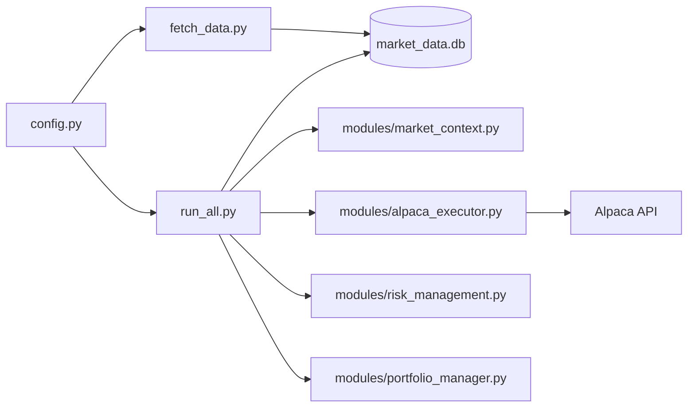

# PythonTrading

Alpaca paper-trading bot: download market data with yfinance, store in SQLite, classify market regime, and run crypto pair and equity MA50 strategies.

## Architecture



## Quick start

```powershell
cd PythonTrading
python -m venv .venv
.\.venv\Scripts\Activate.ps1
pip install -r requirements.txt
copy .env.example .env
# Edit .env with your APCA_* keys
python fetch_data.py
python run_all.py
```

Always run commands from the **project root** so relative paths (`market_data.db`, logs) resolve correctly.

## Environment variables

| Variable | Required | Used by |
|----------|----------|---------|
| `APCA_API_KEY_ID` | Yes (live trading) | All Alpaca scripts via `config.get_alpaca_credentials()` |
| `APCA_API_SECRET_KEY` | Yes | Same |
| `TAVILY_API_KEY` | No | Sentiment in `run_all.py` (price fallback if missing) |
| `KRAKEN_API_KEY` | No | `scripts/exchange/` |
| `KRAKEN_SECRET_KEY` | No | `scripts/exchange/` |

Legacy `ALPACA_API_KEY` / `ALPACA_SECRET_KEY` still work as fallbacks.

## Project layout

```
PythonTrading/
├── run_all.py              # Main 24/7 trading loop
├── fetch_data.py           # yfinance → SQLite
├── config.py               # Universe, credentials, paths
├── backtester.py           # Backtest mirroring run_all.py pipeline
├── simulate.py             # Mean-reversion simulation
├── modules/                # Shared library
├── strategy_module/        # MA signal helper
└── scripts/
    ├── db/                 # SQLite utilities
    ├── account/            # Alpaca account tools
    ├── exchange/           # Kraken checks
    ├── maintenance/        # Cleanup, universe CSV
    └── dev/                # Tests and legacy loops
```

## Utility scripts

```powershell
python scripts/db/check_tables.py
python scripts/account/verify.py
python scripts/account/check_balance.py
python scripts/exchange/health_check.py
```

## Logs and data

| File | Purpose |
|------|---------|
| `market_data.db` | SQLite OHLCV per ticker |
| `trade_history.log` | Trade log from `run_all.py` |
| `trading_history.jsonl` | Position ledger |
| `risk_events.log` | Drawdown halt events |

## Notes

- **Single virtualenv:** Use `.venv` only. The old `venv/` folder has been removed; reinstall with `pip install -r requirements.txt`.
- **`write_bot.py`:** Regenerates `fetch_data.py` only. Does **not** overwrite `run_all.py` (maintained manually).
- **Paper trading:** `config.PAPER_TRADING = True` by default.
