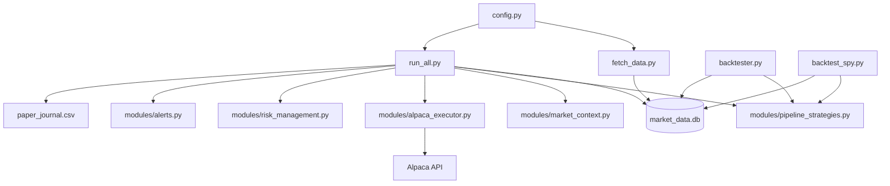

# PythonTrading

Personal systematic fund on Alpaca paper: three strategy sleeves (SPY trend, vol-gated crypto pairs, NYSE momentum), shared risk controls, and SQLite market data from yfinance.

## Architecture



**One process:** `run_all.py` runs all sleeves on a single Alpaca account with per-sleeve capital caps enforced by `modules/alpaca_executor.py`.

## Fund sleeves (default allocation)

| Sleeve | Cap | Strategy | When it trades |
|--------|-----|----------|----------------|
| **SPY** | 45% | Price > MA200 | US equity session open |
| **Crypto** | 20% | Z-score correlated pairs | **High volatility only** (`CRYPTO_VOL_ONLY`) |
| **NYSE** | 20% | Strongest stock/ETF above MA50 (excludes SPY) | US equity session open |
| **Cash buffer** | 15% | — | Held as dry powder |

On a $100k account, SPY can hold at most ~$45k; total crypto positions at most ~$20k; NYSE names at most ~$20k. Each buy is **2% of equity per order** within the sleeve cap (max $10k per order).

Tune caps in `config.py`:

```python
SPY_SLEEVE_CAP_PCT = 0.45
CRYPTO_SLEEVE_CAP_PCT = 0.20
NYSE_SLEEVE_CAP_PCT = 0.20
FUND_CASH_BUFFER_PCT = 0.15
CRYPTO_VOL_ONLY = True
```

## Quick start

```powershell
cd PythonTrading
python -m venv .venv
.\.venv\Scripts\Activate.ps1
pip install -r requirements.txt
copy .env.example .env
# Edit .env with your APCA_* paper keys
python fetch_data.py
python run_all.py
```

Always run commands from the **project root** so relative paths (`market_data.db`, logs) resolve correctly.

## Paper trading on Alpaca (recommended first month)

`run_all.py` trades **only on Alpaca paper** by default (`PAPER_TRADING=true`). Kraken keys in `.env` are for `scripts/exchange/` only — not used by the main fund loop.

1. Create **paper** API keys at [Alpaca Paper Dashboard](https://app.alpaca.markets/paper/dashboard/overview).
2. Put them in `.env` as `APCA_API_KEY_ID` and `APCA_API_SECRET_KEY` (not live keys).
3. Verify before leaving it running:

```powershell
python scripts/account/preflight.py
python scripts/account/verify.py
python scripts/account/check_account.py
```

4. Refresh data, then start the fund loop (leave terminal open, or use a VPS later):

```powershell
python fetch_data.py
python run_all.py
```

5. Each week, review logs and equity on the Alpaca paper dashboard.

**Safety:** Live trading is blocked unless you set `PAPER_TRADING=false` **and** `ALLOW_LIVE_TRADING=yes` in `.env`. Do not set those during your paper month.

### Before a one-month paper run

```powershell
python scripts/account/preflight.py
python backtester.py --days 500
python run_all.py
```

Preflight checks paper mode, Alpaca connection, and data. The bot then:

- Enforces **sleeve caps** (SPY / crypto / NYSE) on each buy
- Runs **crypto only in high-volatility** regimes (still skips panic/bear)
- Applies **5% stop-loss** exits on open positions each cycle
- **10% max drawdown** halts new trading
- Requires **0.5+ correlation** on crypto pairs
- Writes **`paper_journal.csv`** and **`bot_heartbeat.json`** each cycle

### Regime and risk

Market regime comes from `modules/market_context.py` (sentiment + volatility). All sleeves skip entries in:

- `RHYME_B: Panic_Volatility`
- `RHYME_E: Steady_Bearish_Decline`

Crypto has an additional gate: when `CRYPTO_VOL_ONLY=true`, pairs are skipped unless cross-asset volatility is **High**.

## Backtesting

```powershell
# Full fund: SPY + vol-gated crypto + NYSE (daily bars)
python backtester.py
python backtester.py --days 500

# SPY sleeve only — grid search all MA/allocation combos
python backtest_spy.py
python backtest_spy.py --compare
python backtest_spy.py --all --days 500

# Fetch longer daily history first (free via yfinance)
python fetch_data.py --daily --days 500
```

| Script | What it tests |
|--------|----------------|
| `backtester.py` | Integrated fund logic (shared strategies module) |
| `backtest_spy.py` | SPY MA200 sleeve in isolation; saves `spy_backtest_results.csv` |

Live bot uses **5-minute** bars; backtests use **daily** bars. Results are directional, not identical to live fills.

## Optional: standalone SPY bot

`run_spy.py` runs **only** the SPY sleeve in its own loop. **Prefer `run_all.py`** for the integrated fund. Do not run both on the same account unless you know the caps overlap.

```powershell
python scripts/account/preflight_spy.py
python run_spy.py
```

Standalone SPY logs go to `spy_paper_journal.csv`, `spy_bot_heartbeat.json`, etc.

## Alerts (optional)

Configure **Telegram** and/or **email** in `.env`, then test:

```powershell
python scripts/account/test_alerts.py
```

| Event | When |
|-------|------|
| **Risk halt** | Once when drawdown hits the limit (not every minute) |
| **Daily summary** | Once per day: equity, cash, regime, running/halted status |

**Telegram setup:**

1. Create a bot with [@BotFather](https://t.me/BotFather) and add `TELEGRAM_BOT_TOKEN` to `.env`.
2. Get your chat id — easiest: message [@userinfobot](https://t.me/userinfobot) and copy the `Id` number into `TELEGRAM_CHAT_ID`.
3. Or message your bot, then run:

```powershell
python scripts/account/get_telegram_chat_id.py --wait
python scripts/account/test_alerts.py
```

Alerts are non-fatal: if Telegram is slow, trading continues.

**Gmail setup:** Use an [app password](https://myaccount.google.com/apppasswords) with `SMTP_HOST=smtp.gmail.com`, port `587`.

## Environment variables

| Variable | Required | Used by |
|----------|----------|---------|
| `APCA_API_KEY_ID` | Yes (paper trading) | All Alpaca scripts via `config.get_alpaca_credentials()` |
| `APCA_API_SECRET_KEY` | Yes | Same |
| `PAPER_TRADING` | No | Default `true` — keep paper keys during evaluation |
| `ALLOW_LIVE_TRADING` | No | Must be `yes` to enable live (with `PAPER_TRADING=false`) |
| `SENTIMENT_SOURCE` | No | Default `price` (free). Set `tavily` only if you have API quota |
| `WISDOM_MODE` | No | Default `arbitrage`. Also: `baseline`, `web_regime`, `wisdom_pause` |
| `WISDOM_GAP_THRESHOLD` | No | Web vs price divergence gate (default `0.25`) |
| `WISDOM_EVAL_ENABLED` | No | Daily self-eval (default `true`) |
| `WISDOM_EVAL_DAYS` | No | Rolling window for scorecard (default `30`) |
| `WISDOM_MONTHLY_ENABLED` | No | Calendar-month rollup + alert (default `true`) |
| `TAVILY_API_KEY` | No | Only when `SENTIMENT_SOURCE=tavily` |
| `SPY_APCA_API_KEY_ID` | No | Optional separate paper account for `run_spy.py` only |
| `SPY_APCA_API_SECRET_KEY` | No | Same |
| `KRAKEN_API_KEY` | No | `scripts/exchange/` only (not used by `run_all.py`) |
| `KRAKEN_SECRET_KEY` or `KRAKEN_API_SECRET` | No | `scripts/exchange/` |
| `TELEGRAM_BOT_TOKEN` | No | Halt + daily alerts |
| `TELEGRAM_CHAT_ID` | No | Halt + daily alerts |
| `SMTP_HOST`, `SMTP_USER`, `SMTP_PASSWORD`, `ALERT_EMAIL_TO` | No | Email alerts |

Legacy `ALPACA_API_KEY` / `ALPACA_SECRET_KEY` still work as fallbacks.

**Never commit `.env`** — it is in `.gitignore`. Use `.env.example` as a template.

## Project layout

```
PythonTrading/
├── run_all.py              # Main 24/7 integrated fund loop
├── run_spy.py              # Optional standalone SPY loop
├── fetch_data.py           # yfinance → SQLite (5m live, daily backtest)
├── config.py               # Universe, sleeves, credentials, paths
├── backtester.py           # Fund backtest (SPY + crypto + NYSE)
├── backtest_spy.py         # SPY sleeve backtest + grid search
├── simulate.py             # Mean-reversion research
├── modules/
│   ├── pipeline_strategies.py  # SPY, crypto, NYSE strategies
│   ├── alpaca_executor.py      # Sleeve caps + order sizing
│   ├── data_refresh.py         # Session-aware data refresh
│   ├── market_context.py       # Regime / volatility / sentiment
│   ├── alerts.py
│   └── ...
└── scripts/
    ├── db/                 # SQLite utilities
    ├── account/            # Alpaca + alerts (preflight, preflight_spy, verify)
    ├── exchange/           # Kraken checks
    ├── maintenance/        # Cleanup, universe CSV
    └── dev/                # Tests and legacy loops
```

## Utility scripts

```powershell
python scripts/account/preflight.py          # Pre-flight before paper month
python scripts/account/preflight_spy.py      # SPY-only standalone check
python scripts/account/verify.py
python scripts/account/check_account.py
python scripts/account/check_balance.py
python scripts/account/get_telegram_chat_id.py --wait
python scripts/account/test_alerts.py
python scripts/db/check_tables.py
python scripts/exchange/health_check.py      # Kraken only
```

## Data fetch

```powershell
python fetch_data.py                    # 5m bars for live bot (~5 days)
python fetch_data.py --daily --days 365 # daily bars for backtester
python fetch_data.py --daily --days 500 # longer history (free via yfinance)
```

## Logs and data

| File | Purpose |
|------|---------|
| `market_data.db` | SQLite OHLCV per ticker |
| `trade_history.log` | Trade log from `run_all.py` |
| `trading_history.jsonl` | Position ledger |
| `risk_events.log` | Drawdown halt and stop events |
| `paper_journal.csv` | Structured log for paper-month analysis |
| `bot_heartbeat.json` | Last cycle: regime, sleeve exposure, trades, halted |
| `wisdom_journal.csv` | Every cycle: wisdom config, web/price/gap, equity, shadow modes |
| `wisdom_scorecard.json` | Latest daily self-evaluation (live vs sim modes) |
| `wisdom_evaluations.jsonl` | Append-only history of daily scorecards (perpetual log) |
| `wisdom_monthly_YYYY-MM.json` | Calendar-month rollup (live vs sim modes) |
| `wisdom_monthly_history.jsonl` | Append-only history of monthly rollups |
| `web_sentiment_live.json` | Cached daily headline sentiment |
| `spy_backtest_results.csv` | Output of `backtest_spy.py --all` |
| `spy_paper_journal.csv` | Standalone `run_spy.py` journal only |
| `spy_bot_heartbeat.json` | Standalone SPY bot heartbeat |
| `alert_state.json` | Alert dedupe state (halt notified, last daily summary) |

## Running on a server (later)

The bot is lightweight (Python + API calls + SQLite). A **$5–12/mo Linux VPS** is enough for 24/7 uptime once you trust paper results. Copy the repo and `.env`; run `python run_all.py` under `systemd` or similar.

## Notes

- **Single virtualenv:** Use `.venv` only. Reinstall with `pip install -r requirements.txt` after pulling changes.
- **`write_bot.py`:** Regenerates `fetch_data.py` only. Does **not** overwrite `run_all.py`.
- **Paper trading:** `PAPER_TRADING=true` by default in `.env`.
- **Strategy sharing:** `run_all.py`, `backtester.py`, and `backtest_spy.py` share `modules/pipeline_strategies.py`.
- **Alpaca crypto fees:** ~0.25% taker per leg on market orders. Kraken keys are available for future crypto-only execution but are not wired to `run_all.py`.
- **NYSE overlap:** SPY and NYSE sleeves both hold US equities; caps limit double exposure. SPY is excluded from the NYSE MA50 picker.
