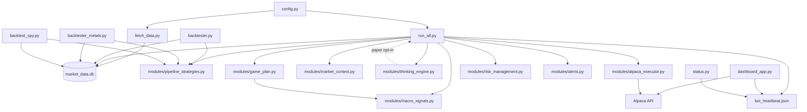

# PythonTrading

**Personal systematic fund** on Alpaca. Two books: **live ~$300** and **paper ~$96k**.

**Current lock (paper + live):**

- **VTI core OFF.** Do not rebuy VTI as core.
- **NYSE 100%.** Vanguard names (if any leftover) count as NYSE, not a separate sleeve.
- **SPY / crypto / stat-arb / social OFF.**
- **Existing VTI leftover:** paper flattened; live qty **0**. Do not restock.

**Paper hygiene (still):** max **2** adds/symbol · same-day reentry block · ATR sleeve cooldown · **12**/cycle · `MAX_ACTIVE=25` · ~**8%** per-name ceiling. Clip size is risk/wisdom (~$1,300), not the 8% cap.

**Live:** ~$300 book · `MAX_ACTIVE` **6–10** · 8% per name · does **not** use `PAPER_NYSE_MAX_ADDS` · do not size options. Small-account order caps still apply (1% risk, **$10** max/order, **$1** min).

**Standing:** one change at a time · measure first · no live flatten/orders from this README · do not invent new sleeves.

Older v1.5.4 / 40–75% Dynamic VTI / Profile A ~85% VTI write-ups below are **historical research**, not current runtime. Confirm with `python status.py`.

**At-a-glance status:** `python status.py` — live + paper equity, regime, and key flags.

**Architecture reference:** [`PROJECT_MANIFEST.md`](PROJECT_MANIFEST.md) · compact LLM manifest: [`data/bot_manifest.txt`](data/bot_manifest.txt) (regenerate with `python scripts/mcp/export_bot_manifest.py`).

---

## Launch & build (consolidated layout)

**Home folder:** `stock-bot/` — all launchers set `PYTHONTRADING_ROOT` to `stock-bot/`. Runtime EXEs and writable data live under **`stock-bot/dist/`**.

**`.env` precedence:** `stock-bot/.env` wins. Frozen EXE loads `stock-bot/.env` first; `dist/.env` only fills keys missing from stock-bot. `build_all.bat` syncs stock-bot → dist as a portable fallback.

| Path | Purpose |
|------|---------|
| `stock-bot/` | Source, **`.env` (edit here)**, portal data, `run_all.py` |
| `stock-bot/dist/` | `Weinstein-Trading-Bot.exe`, `PythonTradingMonitor/`, logs, heartbeats, `market_data.db` |
| `stock-bot/dist/.env` | Fallback copy — do not treat as primary config |
| `stock-bot/dist/PythonTradingMonitor/` | Frozen desktop monitor (CustomTkinter) |

### First-time setup

```powershell
cd C:\Users\Owner\PythonTrading\stock-bot
copy .env.example .env
# Edit .env — Alpaca keys, PAPER_TRADING, optional AUTO_LAUNCH_DASHBOARD=true
python -m venv .venv
.\.venv\Scripts\pip install -r requirements.txt
python scripts\account\preflight.py
```

**Owner PC (Python 3.11, recommended):** shared venv at repo root — one-time `scripts\setup_venv.bat` creates `C:\Users\Owner\PythonTrading\venv311` and installs `requirements.txt`. Daily: `scripts\activate_venv.bat` (activate + `cd stock-bot`).

### Daily usage (recommended)

**Double-click once each morning** (before market open):

```
C:\Users\Owner\PythonTrading\Start_Bot_and_Dashboard.bat
```

Same logic is available as `Start Trading.bat` (repo root) or `stock-bot\fix_setup.bat` (troubleshooting).

#### What it does

1. Stops stray bot and dashboard processes from earlier runs
2. Restarts **both portal books** for your user (`alpaca_live` + `alpaca_paper`):
   - **Live** (~$300) — NYSE 100%, VTI core OFF, via `run_all.py`
   - **Paper** (~$96k) — NYSE 100%, VTI core OFF, via `run_paper_bot.py`
3. Opens the **desktop monitor** (`dashboard_app.py` via `pythonw` — no extra console window)
4. Shows a small **startup console** with progress, then minimizes on success

Wait **~60 seconds**, then sign in on the dashboard and open **Overview → Bot status (both books)**. Both books should show fresh heartbeats (not **STALE**).

**Run the launcher only once** per session. Double-clicking again creates duplicate processes.

#### Desktop shortcut

1. In File Explorer, go to `C:\Users\Owner\PythonTrading`
2. Right-click **`Start_Bot_and_Dashboard.bat`** → **Send to** → **Desktop (create shortcut)**
3. Rename the shortcut to something like **PythonTrading Daily**

The shortcut works from the Desktop — the batch file resolves paths from its own location.

#### Do **not** use for daily ops

| Launcher | Why not |
|----------|---------|
| `Weinstein-Trading-Bot.exe` | Single bot, wrong heartbeat path → dashboard shows **STALE** |
| `launch.bat` / `launch_both.bat` | Same — one bot only, not dual-book portal |
| `start.bat` (repo root) | Forwards to EXE / `launch.bat` |
| `dist\Start Weinstein Trading Bot.bat` | Standalone EXE wrapper |

Those are legacy or for quick standalone tests. Portal-managed dual-book ops use **`Start_Bot_and_Dashboard.bat`**.

#### Other launchers (special cases)

| Launcher | When to use |
|----------|-------------|
| **`launch_monitor.bat`** | Open monitor only — with default `DASHBOARD_RESTART_BOTS_ON_OPEN=true` this still clean-restarts both books on sign-in; set that env to `false` for true monitor-only |
| **`stop_dashboard.bat`** | Close stuck dashboard windows |
| **`launch.bat`** | Legacy single-bot (warns you to use daily launcher) |
| **`build_all.bat`** | Rebuild frozen EXEs after code changes |

Portal heartbeats and PID files live under `data/portal/users/<username>/books/alpaca_live/` and `.../alpaca_paper/` — not `dist/bot_heartbeat.json`.

```powershell
cd C:\Users\Owner\PythonTrading\stock-bot
# Monday prep (lock v1.5.4, verify stack, restart both books + dashboard):
Lock_v15.bat
python scripts\owner_reset.py
# Or: python scripts\full_system_verify.py  then  Start_Bot_and_Dashboard.bat
# Optional journal hygiene: python scripts\maintenance\cleanup_journal_csv.py --dry-run
# Overnight autonomous (paper restart + 9:00 AM ET Telegram):
#   Start_Autonomous.bat
```

**Config:** edit **`stock-bot/.env`** and per-book portal `.env` files under `data/portal/users/`. `dist/.env` is only a fallback copy.

### Build frozen EXEs

```powershell
cd C:\Users\Owner\PythonTrading\stock-bot
.\build_all.bat          # monitor + bot (recommended)
# or separately:
.\build_dashboard.bat    # → dist\PythonTradingMonitor\PythonTradingMonitor.exe
python build_exe.py      # → dist\Weinstein-Trading-Bot.exe
```

Quit **PythonTradingMonitor.exe** before rebuilding (unlocks `dist\PythonTradingMonitor\`).

**Logs:** `dist\logs\run_all.log` · `dist\logs\dashboard_auto_launch.log` · `logs\dashboard_crash.log`

## What the bot is set to do (runtime defaults)

This section is the **authoritative summary** of what actually runs on **live and paper bots**. Older v1.5.4 / 40–75% VTI / ~85% Profile A text elsewhere is **historical**. Confirm with `python status.py`.

**Both books (current lock):** VTI core **OFF** · NYSE **100%** · SPY / crypto / stat-arb / social **OFF** · do not rebuy VTI as core · leftover Vanguard (if any) is NYSE, not a separate sleeve · paper VTI leftover was flattened · live VTI qty **0** · do not restock. One change at a time; measure first; no live flatten/orders from this README; do not invent new sleeves.

### Profile A — live (`run_all.py`, ~$300)

| Layer | Runtime default |
|-------|-----------------|
| **VTI core** | **OFF** (qty **0**; do not restock) |
| **Active sleeves** | **NYSE 100%** only |
| **SPY / crypto / stat-arb / social** | **OFF** |
| **Name cap** | `MAX_ACTIVE` **6–10** · ~**8%** per name |
| **Max-adds** | Live does **not** use `PAPER_NYSE_MAX_ADDS` |
| **Options** | Do not size options |
| **Risk / orders** | 1% per trade (~$3 clip), **$1** min, **$10** max |
| **Thinking engine** | **Off** |

### Profile B — paper (`run_paper_bot.py` / `PAPER_CHASE_MODE=1`)

| Layer | Runtime default |
|-------|-----------------|
| **VTI core** | **OFF** (paper flattened; do not rebuy as core) |
| **Equity path** | NYSE momentum (`run_nyse_momentum_and_stat_arb`) |
| **NYSE** | **100%** · leftover Vanguard counts as NYSE |
| **SPY / crypto / stat-arb / social** | **OFF** |
| **Hygiene** | max **2** adds/symbol · same-day reentry block · ATR sleeve cooldown |
| **Portfolio guards** | ~**8%**/name ceiling · `MAX_ACTIVE=25` · **12**/cycle |
| **Clip size** | risk/wisdom (~$1,300), **not** the 8% cap |
| **Thinking engine** | **Off** unless `PAPER_THINKING_ENGINE_ENABLED=true` |

### Hard-disabled on all bots (research / backtest only)

These modules and flags stay in the repo for A/B tests. **Setting them in `.env` does not enable them on `run_all.py` or `run_paper_bot.py`.**

| Experiment | Backtest command | Bot runtime |
|------------|------------------|-------------|
| **Expanded Alpaca crypto universe** | `python backtester.py --days 365 --paper-aggressive --compare-crypto-universe` | **Off** — uses 24 base pairs only |
| **Profit target (+25% arm / trailing stop)** | `python backtester.py --days 365 --paper-aggressive --compare-profit-target` | **Off** |
| **Crypto sleeve v3 filters** | `python scripts/research/improve_crypto_sleeve_v3.py` | **Off** — not adopted |
| **Crypto vol sleeve (isolated book)** | `scripts/research/backtest_crypto_vol_v5.py` | **Off** — `CRYPTO_VOL_SLEEVE_ENABLED=false` |

Other research compares (safe to run; do not wire to bots without re-backtesting): `--compare-dynamic-universe`, `--compare-ipo-rules`, `--compare-final`, `--compare-thinking`.

### Sharing this doc with Grok (or another LLM)

**Yes, mostly** — this README (especially the section above) tells Grok **how the system is designed** and **which features are on by default** for live vs paper.

**Grok still will not know** unless you paste it separately:

- Your actual `.env` overrides (e.g. strict dynamic universe, thinking engine)
- Current equity, cash, open positions, or today's regime (not this README's historical VTI %)
- Whether a bot process is running and which profile is active

**Best bundle to paste into Grok:**

1. This **“What the bot is set to do”** section (or the whole README)
2. Output of `python status.py` from `stock-bot/` (live + paper flags as of that moment)
3. Optional: [`data/bot_manifest.txt`](data/bot_manifest.txt) for a shorter architecture index

That combination is enough for Grok to answer “what should my bot be doing?” and “what experiments are research-only?” without access to your machine.

---

## System overview

One **24/7 loop** (`run_all.py`) drives everything on Alpaca: refresh bars → regime → yield-gate game plan → NYSE sleeve (VTI core **OFF**) → capped orders → heartbeat JSON → sleep. The **desktop monitor** (`dashboard_app.py`) and **`status.py`** read portal book heartbeats + Alpaca for at-a-glance health; the **portal** (`portal.py`) is the friend/onboarding path.

**Dual-book owner setup:** one portal user (e.g. `dawimberly`) with two books — `alpaca_live` (Profile A) and `alpaca_paper` (Profile B). Start both daily with **`Start_Bot_and_Dashboard.bat`**.

| Component | Role |
|-----------|------|
| **`run_all.py`** | Main orchestrator — Profile A live default, Profile B when `PAPER_CHASE_MODE=1` |
| **`run_paper_bot.py`** | Isolated paper Sharpe chase (Best Paper v2.2) on separate keys/book |
| **`dashboard_app.py`** | CustomTkinter monitor — equity, positions, trades, wisdom; 60s auto-refresh |
| **`status.py`** | CLI snapshot — live + paper equity, regime, stack flags, heartbeat age |
| **`modules/thinking_engine.py`** | Opt-in Ollama PM tilts (paper only by default; live requires manual approval) |
| **`backtester.py`** | Daily-bar mirror of the live stack for validation |

**Two books (same lock, different size):**

- **Profile A — live** (~$300): NYSE 100%, VTI core OFF, `MAX_ACTIVE` 6–10, 8% per name, 1% / $10 caps. Does not use `PAPER_NYSE_MAX_ADDS`.
- **Profile B — paper** (~$96k): NYSE 100%, VTI core OFF, hygiene (max 2 adds, same-day block, ATR cooldown), 12/cycle, `MAX_ACTIVE=25`, ~8% ceiling, ~$1,300 clips.

---

## What's New in v1.5

### v1.5.4 final summary (Monday / production-ready paper)

**Realistic Research v1.5.4** is a **historical paper research lock** (`REALISTIC_RESEARCH_VERSION = "1.5.4"`). **Current runtime is VTI core OFF / NYSE 100%** — see [What the bot is set to do](#what-the-bot-is-set-to-do-runtime-defaults). Do not treat 40–75% Dynamic VTI or ~85% live VTI as live policy.

**Historical v1.5.4 paper defaults (research record, not current runtime):**

| Layer | v1.5.4 lock |
|-------|-------------|
| **Regime** | **RHYME primary locked**; HMM soft-signal only (`MARKOV_HMM_PRIMARY_REGIME=false`) |
| **GARCH vol sizing** | **Paper ON**; **Live Conservative ON** via `enforce_live_conservative_profile()` (`GARCH_VOL_LIVE_ENABLED`) |
| **Daily Profit Banking** | Bank ≥**0.8%** day gain → risk ×**0.4** + VTI nudge (paper ON; live off) |
| **Stat arb quality** | **8–12** pairs, corr ≥ **0.68**, coint **p &lt; 0.12**, Z **2.1–2.7**, RR **1.7:1**, trail **45%/30%**, partial@**1.2R**, ADV **$50M**, 35b hold, 7% cap |
| **Dynamic VTI** | **LOCKED** Smart **40–75%** (hard floor **≥40%**; tiers stress 75% / default 65% / calm 50%) + **SPY-like boosts** (paper ON; live off) |
| **ARIMA / ARIMA–GARCH** | **Optional, default OFF** (`ARIMA_ENABLED=false`) — 365d tune: ON worse return/Sharpe; leave off unless re-validated |
| **RVOL / ORB / Catalyst** | RVOL min **2.0×**; ORB **30m**; Catalyst min **65** |
| **ATR / conviction / MTF / exits** | ATR **14d / 2.0× / 4%** cap; conviction **0.4–1.8×**; MTF ≥ **0.65**; partial @ **1R** + trail |
| **Corr guard / shorts** | Corr &gt; **0.65** → scale (floor **0.60×**); protective **8–18%** gross, RR **1.6:1**, sector ETF shorts |
| **Tail risk / health** | Vol ceiling, DD tiers, per-name **8%** cap; Bot Health Score + strategy ratings |

**Validation headlines:**
- **Thorough 1000d** (`backtest_v154_thorough_1000.txt`): **+53.36%** return, Sharpe **1.02**, Max DD **−16.23%**, vs VTI **+45.53%** (~875 calendar days / 800 bars). GARCH + Dynamic VTI + Daily Banking + RHYME primary / HMM soft.
- **365d tune takeaways:** Stat Arb quality beats fill-rate baseline (~**+1.45pp** / **+0.07** Sharpe); ARIMA stay OFF; optional VTI floor + SPY-like boosts flat/harmless — keep paper defaults.

**Carried from v1.4:** overlap/chunk/co-fire, vol overlay, options income, weekly MD/HTML + Friday Telegram, insider monitor. Full verify: `Lock_v15.bat` or `python scripts/full_system_verify.py`.

---

## Monday Ready (daily routine)

**One-click (preferred):** double-click **`Monday_Checklist.bat`** every Monday before open (prefers repo-root `.venv`). Runs paper + live verify, `Lock_v15 --verify-only`, `owner_reset`, RESPONDING/FINAL LOCK checks, Telegram `/status`, paper Health ≥90 + Strategy Performance, and confirms the Friday weekly path. Exit non-zero on FAIL. Optional schedule: `python scripts\monday_checklist.py --install-task` (Monday 08:00 local). Smoke / re-check without restart: `python scripts\monday_checklist.py --quick --skip-reset --no-telegram-send`.

Use this sequence before market open (or Sunday night for autonomous overnight). Confirms **current lock** on both books: VTI core **OFF**, NYSE **100%**, SPY/crypto/stat-arb/social **OFF**. Do not expect ~85% VTI or Dynamic VTI 40–75%.

| Step | Command | Purpose |
|------|---------|---------|
| * | `Monday_Checklist.bat` | **Automated** Monday checklist (verify both + reset + heartbeats + Telegram + health) |
| 0 | `Lock_v15.bat` | Cancel stray backtests + verify v1.5.4 paper FINAL LOCK |
| 1 | `python scripts\full_system_verify.py` | Paper 12-section PASS/WARN/FAIL + FINAL LOCK Monday banner |
| 1b | `python scripts\full_system_verify.py --live` | Live Conservative FINAL LOCK ON/OFF matrix |
| 2 | `python scripts\maintenance\cleanup_journal_csv.py --dry-run` | Optional: flag malformed journal rows before open |
| 3 | `python scripts\owner_reset.py` | Stop orphans, restart live + paper + dashboard |
| 4 | `python status.py` | Equity, regime, heartbeat age, stack flags |

**Paper bot Monday checklist (v1.5.4 FINAL LOCK):**
- Startup shows `REALISTIC RESEARCH v1.5.4 (LOCKED)` / `FINAL LOCK` and `Regime lock: RHYME primary | HMM soft-signal only`
- GARCH paper banner present; live book shows `Live Conservative FINAL LOCK` with GARCH ON
- Daily Profit Banking banner present (paper only)
- Heartbeat age &lt; 30m after restart; no cycle NameErrors in `logs/run_all.log`
- Portal paper book (`alpaca_paper`) using chase journal / heartbeat paths
- Scheduled task `PythonTrading_Autonomous_Paper` is **Ready** (11:00 PM → `Start_Autonomous.bat`, prefers repo-root `.venv`)

**Live bot Monday checklist (current lock):**
- VTI core **OFF**, qty **0** — do not restock
- NYSE **100%**, `MAX_ACTIVE` 6–10, ~8% per name; does **not** use `PAPER_NYSE_MAX_ADDS`
- SPY / crypto / stat-arb / social **OFF**; do not size options
- `ALLOW_LIVE_TRADING=yes` only when intentionally running the live book

### Autonomous overnight (paper)

Leave the paper book running overnight safely — sleep / PC awake, power settings not set to hibernate mid-session.

| Goal | What to run |
|------|-------------|
| **Paper only overnight** | Double-click **`stock-bot\Start_Autonomous.bat`** — restarts paper bot, runs verify, writes pre-market report, sends **9:00 AM ET** Telegram |
| **Both books + dashboard** | Repo-root **`Start_Bot_and_Dashboard.bat`** once (live + paper + monitor). Prefer this if you want the dashboard open overnight |
| **Do not** | Re-click launchers (duplicates); use `launch.bat` / `launch_both.bat` / frozen EXE for overnight portal ops; flip live GARCH / ARIMA / HMM-primary; edit `.env` mid-run without a clean restart |

**Heartbeat / watchdog:** portal paper heartbeat under `data/portal/users/<user>/books/alpaca_paper/bot_heartbeat.json` (not `dist/`). Autostart polls freshness after restart; optional `scripts/background_runner.py --mode auto` checks stale heartbeats. Dashboard Overview → Bot status should not show **STALE**.

**Env reminders (paper):** `PAPER_TRADING=true` / chase mode on the paper book; GARCH paper ON; `MARKOV_HMM_PRIMARY_REGIME=false`; `ARIMA_ENABLED=false`; Alpaca paper keys in `stock-bot/.env` (or portal book `.env`). Telegram needs token + chat id for the 9 AM summary.

**Morning check (~2 min):**
1. `python status.py` — equity, regime, heartbeat age
2. Tail `logs\autostart_paper.log` (if overnight) and `logs\run_all.log` / portal `bot.log` for cycle errors
3. Smoke: `python scripts\full_system_verify.py` (WARN on quiet scanners after hours is OK; FAIL is not)
4. If stale: run `Start_Bot_and_Dashboard.bat` once, or dashboard **Restart Bot**

```powershell
cd C:\Users\Owner\PythonTrading\stock-bot
# Prefer repo-root venv when present:
C:\Users\Owner\PythonTrading\.venv\Scripts\python.exe scripts\full_system_verify.py
C:\Users\Owner\PythonTrading\.venv\Scripts\python.exe scripts\maintenance\cleanup_journal_csv.py --dry-run
C:\Users\Owner\PythonTrading\.venv\Scripts\python.exe scripts\owner_reset.py
C:\Users\Owner\PythonTrading\.venv\Scripts\python.exe status.py
# Overnight autonomous (paper):
Start_Autonomous.bat
```

---

## Memory & performance (Phase 3.2)

Long-running bots and the dashboard were tuned to avoid loading full journals/logs/backtest matrices into RAM:

| Improvement | Where | What it does |
|-------------|-------|--------------|
| **Journal tail reads** | `dashboard_app._read_csv_tail()` | Reads last N CSV rows via `deque` — Trades/Wisdom tabs never load full `paper_journal.csv` |
| **Log tail seek** | `modules/portal_bot.read_bot_log_tail()` | Seeks from end of `bot.log` (~8 KB window) instead of reading the whole file |
| **Backtest cache trim** | `modules/backtester_core.py` | In-process matrix cache capped (`BACKTEST_MEM_CACHE_MAX`, default 2); disk cache under `data/cache/backtest/` kept |
| **Backtest memory release** | `release_backtest_memory()` | Clears in-process caches + `gc.collect()` between compare arms in `backtester.py --compare-final` |
| **Dashboard refresh debounce** | `dashboard_app.refresh_data()` | Coalesces overlapping refresh requests (`_refresh_busy` / `_refresh_pending`) so rapid tab clicks don't stack Alpaca calls |
| **Optional memory indicator** | Dashboard status bar | Shows process RSS (e.g. `142 MB`) when `psutil` is installed — omit from `requirements.txt` if not needed |

No trading logic, risk rules, or order sizing changed — I/O and cache bounds only.

---

## June 2026 stability fixes

Operational hardening for 24/7 live + paper on one PC (no strategy changes on Profile A live):

| Fix | Where | What changed |
|-----|-------|--------------|
| **RAM / I/O bounds** | `dashboard_app.py`, `backtester_core.py`, `portal_bot.py` | Journal/log tail reads, backtest cache cap, refresh debounce — see [Memory & performance](#memory--performance-phase-32) |
| **Daily breaker false trips** | `modules/trading_safety.py` | Detects **anchor contamination** (live ~$300 vs paper ~$98k in `trading_safety_state.json`), resets stale anchors, auto-clears trips when loss is below limit; live session re-primes on startup |
| **Stat-arb reconcile** | `modules/stat_arb_sleeve.py` | Startup reconcile ignores VTI/SPY/NYSE longs and crypto when sleeves disabled; purges stale book rows; resolves orphan pair registries — no spurious orphan warnings on Profile A |
| **Dashboard restart** | `dashboard_app.py`, `modules/portal_bot.py`, `scripts/owner_reset.py` | **Restart Both** always clean-restarts `alpaca_paper` + `alpaca_live` (stale PIDs cleared; positions not closed) |
| **Dashboard open dual reset** | `dashboard_app.py`, `scripts/owner_reset.py` | On open/reopen (default): `clean_restart_both_bots` — opt out with `DASHBOARD_RESTART_BOTS_ON_OPEN=false`; closing the monitor prompts to stop portal bots (paper default; live optional) |
| **Dashboard refresh bot** | `dashboard_app.py`, `modules/portal_bot.py` | **Refresh Bot** — confirm → stop book → `fetch_data.py --daily` → restart (progress in status bar) |
| **Heartbeat reporting** | `run_all.py`, `status.py`, `status_metrics.py` | Heartbeats include `last_cycle_error`; `status.py` shows age, **STARTING** / **WARMING UP** / **STALE**, scan phase; prefers fresh Alpaca equity over stale heartbeat |
| **Crypto vol gate** | `modules/crypto_vol_gate.py` | Centralized allow/deny with regime pause + vol-only check; optional SpaceX narrative override; status surfaces gate reason |
| **Crypto vol sleeve (paper)** | `modules/crypto_vol_sleeve.py` | Mean-reversion on **RENDER + SOL** only (was 5-coin); backtest: `python backtest_crypto_vol.py --render-only` |
| **Anchor contamination guard** | `modules/trading_safety.py` | Live open-equity anchor capped vs current equity; paper anchor rejects live-scale values on paper book |

### Verify / test commands

Run from `stock-bot/` (venv active):

```powershell
python tests/test_trading_safety_status.py   # daily loss status + false-trip auto-clear
python tests/test_stat_arb_reconcile.py      # stat-arb orphan filtering / book purge
python status.py                            # live + paper equity, breaker, heartbeat age
python scripts/account/preflight.py         # keys, alerts, small-account sizing
```

---

## Live vs paper — when to use each

| Goal | Profile | How to run | Key env |
|------|---------|------------|---------|
| **Real money ~$100–$300** | Profile A | Portal book `alpaca_live` — started by **`Start_Bot_and_Dashboard.bat`** | `PAPER_TRADING=false`, `ALLOW_LIVE_TRADING=yes` |
| **Paper evaluation / first month** | Profile A on paper keys | Same loop with paper keys | `PAPER_TRADING=true` (default) |
| **Sharpe research ~$98k book** | Profile B | Portal book `alpaca_paper` — same daily launcher | `PAPER_CHASE_MODE=1`, paper Alpaca keys in portal |
| **Both in parallel** | A + B | **`Start_Bot_and_Dashboard.bat`** (recommended) | `data/portal/users/<user>/books/alpaca_{live,paper}/` |

**Monitoring:** `python status.py` prints live + paper equity, regime, stack ON/OFF lines, heartbeat timestamps, and **STALE** when heartbeat age &gt; 90 min. Dashboard **Overview** shows **Bot status (both books)**. Heartbeats: `data/portal/users/<user>/books/alpaca_live/bot_heartbeat.json` and `.../alpaca_paper/bot_heartbeat.json`.

**Before first live cycle:** always run `python scripts/account/preflight.py` (checks keys, alerts, data freshness, small-account sizing). See [Before going live](#before-going-live-real-money).

---

## Long-running stability

Recommended setup for a Windows PC left running 24/7:

1. **Start via daily launcher** — **`Start_Bot_and_Dashboard.bat`** once per session. Use dashboard **Restart Bot** for mid-day recovery; use **Stop Bot** only when shutting down for the day.
2. **Task Scheduler (optional)** — schedule `scripts/background_runner.py --mode auto --trigger startup` at logon and `--trigger midnight` daily. Lightweight mode runs `status.py`, checks heartbeats (stale &gt; 30 min), daily loss circuit, and can auto-start `run_paper_bot.py` when paper-only.
3. **Logging rotation** — `modules/logging_utils.setup_project_logging()` attaches midnight-rotating handlers to `logs/run_all.log` and `logs/events.log` (7 days retained). No manual log cleanup needed for normal operation.
4. **Heartbeat monitoring** — each book writes `bot_heartbeat.json` under its portal book folder. If timestamp is stale (&gt; 90 min in `status.py`): run **`Start_Bot_and_Dashboard.bat`** again (once), or **Restart Bot** in the dashboard. Check `last_cycle_error` in heartbeat / `status.py` output.
5. **Preflight before live** — `python scripts/account/preflight.py` with live keys; confirms `ALLOW_LIVE_TRADING=yes`, equity, alerts, and recent `market_data.db`.
6. **Data refresh** — `fetch_data.py` on schedule or when preflight flags stale DB; background runner can trigger refresh when DB age &gt; 24 h.

### Bulletproof monitoring (daily)

| Check | Command / file | Action if bad |
|-------|----------------|---------------|
| Live + paper health | `python status.py` | Banner, regime, stack ON/OFF, heartbeat age, daily breaker |
| Positions / dust | `python status.py --positions` | Stale paper: `python scripts/cleanup_stale_positions.py --help`; live: `python scripts/cleanup_live_stale_positions.py --dry-run` |
| Heartbeats | `bot_heartbeat.json`, `paper_chase_heartbeat.json` | Timestamp &lt; 30 min when bot running; investigate `last_cycle_error` |
| Daily loss anchor | `trading_safety_state.json` | Live `open` ≈ current equity (~$300), not paper-scale; `circuit_tripped` false unless real loss |
| Crypto vol gate (paper) | `crypto_vol_heartbeat.json` | Gate reason when crypto sleeve active |
| Thinking audit (paper opt-in) | `thinking_engine_last.json`, `logs/thinking_engine.log` | Review before enabling on live |
| Unit tests (after changes) | `python tests/test_trading_safety_status.py` etc. | Run the three tests under [Verify / test commands](#verify--test-commands) |
| Config change | dashboard **Restart Bot** or `python run_paper_bot.py` | Restart paper after `.env` edits |

Dual-bot owners: see [Dual fund bots](#dual-fund-bots-live--paper-sharpe-chase) for isolated heartbeat/journal paths per book.

---

## Remaining known limitations (non-blocking)

These are informational warnings or optional paths — **no action required** for Alpaca live Profile A:

| Item | Symptom | Notes |
|------|---------|-------|
| ~~**Stat-arb orphan warnings**~~ | ~~`Stat-arb orphans (not in book)` at startup~~ | **Resolved (2026-06)** — reconcile filters VTI/SPY/NYSE/crypto when sleeves off; real orphans still logged on paper Profile B |
| ~~**Daily breaker false trip**~~ | ~~`circuit_tripped` with tiny loss~~ | **Resolved (2026-06)** — anchor contamination repair + auto-clear in `trading_safety.py`; verify with `python tests/test_trading_safety_status.py` |
| **Thinking engine calibration** | Heuristic fallback common on first cycles | Keep off on live; use `--simulate-live-thinking` before enabling |
| **Universe screener age** | `status.py` universe line &gt; 7 days | Run `python scripts/analysis/universe_screener.py --force` on paper book — see [Dynamic universe](#dynamic-nyse-universe-paper-only) |
| **Legacy Streamlit dashboard** | `dashboard.py` still works | CustomTkinter `dashboard_app.py` is primary; Streamlit is backup |
| **Log file lock on Windows** | `PermissionError` rotating `run_all.log` | Duplicate bot process — use **Restart Bot** to dedupe |

---

## Dynamic NYSE universe (paper only)

**Live Profile A** always uses the **fixed** NYSE candidate list (~28 tickers). **Paper** can union that list with the weekly screener for a larger momentum pool.

| Mode | Env | NYSE candidates | Where |
|------|-----|-----------------|-------|
| **Fixed only** | `USE_DYNAMIC_UNIVERSE=false` (default) | Config `UNIVERSE` minus ETFs/crypto | Live + paper |
| **Combined** | `USE_DYNAMIC_UNIVERSE=true` | Fixed ∪ screener **top 75** (~**103** tickers) | **Paper only** — live ignores screener |

Paper startup prints universe size, e.g. `NYSE universe: 103 tickers (dynamic+fixed)` (`run_paper_bot.py`).

### Universe screener

`scripts/analysis/universe_screener.py` ranks NYSE/NASDAQ names and writes `data/screener_universe.json`. Filters: **$5B** market cap, **$100M** revenue (when fundamentals fetch is on), **smoothed momentum** (avg 20d + 60d returns), **sector cap** (max 15 per GICS sector in top 75), plus liquidity/ATR gates. yfinance **rate limiting**: 45s backoff + retry; skipped tickers logged to `data/screener_skipped.txt`.

```powershell
python scripts/analysis/universe_screener.py --force          # refresh JSON + prefetch bars
python scripts/analysis/universe_screener.py --compare        # vs fixed get_nyse_universe()
python scripts/analysis/universe_screener.py --force --compare
```

`PAPER_DYNAMIC_UNIVERSE_ENABLED=true` (default on paper chase) enables the weekly screener path; **`USE_DYNAMIC_UNIVERSE=true`** is the separate switch for the **combined** fixed+screener pool.

### Backtest A/B

```powershell
python backtester.py --days 365 --compare-universe   # Fixed vs Screener vs Combined (Profile A stack)
```

### Research only (not wired to bot)

```powershell
python scripts/research/backtest_sector_rotation.py --days 730   # weekly sector-ETF rotation vs VTI
```

### NYSE momentum entry quality (paper only)

Gated by **`PAPER_MOMENTUM_QUALITY_FIXES=true`** in the paper book `.env` (default `false` in repo template). **Live Profile A is unchanged.** Implemented in `modules/pipeline_strategies.py` + exit logging in `modules/position_exits.py`.

| Filter | Behavior |
|--------|----------|
| **Open cooldown** | No new NYSE momentum entries **9:30–10:00 ET** (blocks open chase / fade setups) |
| **Gap filter** | Skip entry if today’s open is **>2%** above prior close |
| **One entry / day** | At most one NYSE momentum buy per symbol per calendar day (journal + in-memory) |
| **Time-of-day bias** | **Prefer 12:00–14:00 ET**: +momentum rank boost; RSI allowed up to **72** in window vs **70** outside (does not block other hours) |
| **Exit journal** | NYSE exits log **`exit_reason`** (`stop_loss`, `take_profit`, `max_hold`, `atr_stop`, …) and **`entry_hour`** (ET bucket) to `paper_journal.csv` / `paper_chase_journal.csv` |

```powershell
# Paper book .env (portal user) — not live
PAPER_MOMENTUM_QUALITY_FIXES=true
```

Restart `run_paper_bot.py` or portal **Restart Bot** after enabling.

**Daily `backtester.py` cannot replay intraday rules** (open cooldown, hour-of-day). Use the intraday research script below to validate those filters.

### Intraday NYSE backtest (research only)

`scripts/research/backtest_intraday.py` — standalone **5-minute** simulator (does **not** modify `backtester.py`). Fetches Alpaca paper market data (`PAPER_APCA_*`), caches bars under `data/intraday_cache/`, uses `config.get_nyse_universe()` (set **`USE_DYNAMIC_UNIVERSE=true`** via paper `.env` for ~103 tickers).

```powershell
# Point at paper book keys + combined universe
$env:PYTHONTRADING_ENV_FILE="data\portal\users\<you>\books\alpaca_paper\.env"

python scripts/research/backtest_intraday.py --days 90 --quality-fixes   # smoke test + with/without table
python scripts/research/backtest_intraday.py --quality-fixes             # up to 2y (cached after first run)
python scripts/research/backtest_intraday.py --refresh --quality-fixes # force re-download
```

Output: comparison table (`--quality-fixes`), hour-of-day stats, trade log → `scripts/research/intraday_backtest_results.csv`. First full download can take **20–40 minutes**; reruns are fast from cache.

---

## Two deployment profiles

The repo supports **three deployment targets**. Live defaults stay conservative; paper research opts into aggressive layers via `PAPER_CHASE_MODE`. VPS cloud uses the same Best Paper stack via `cloud_bot/`. Summary: [`scripts/analysis/OPTIMIZED_SYSTEM_SUMMARY.md`](scripts/analysis/OPTIMIZED_SYSTEM_SUMMARY.md).

### Profile A: live (`alpaca_live`)

**Use for:** live ~$300 account, default `run_all.py`.

**Current lock** (not the historical ~85% VTI “Live Conservative” write-up):

| Layer | Setting |
|-------|---------|
| **VTI core** | **OFF** (qty **0**; do not restock) |
| **NYSE** | **100%** |
| **SPY / crypto / stat-arb / social** | **OFF** |
| **Name cap** | `MAX_ACTIVE` **6–10** · ~**8%** per name |
| **Max-adds** | Does **not** use `PAPER_NYSE_MAX_ADDS` |
| **Options** | Do not size options |
| **Risk / orders** | 1% / **$10 max** (small) |
| **Thinking engine** | **off** |
| **Halt** | 10% DD; resume 8%; liquidate on breach |

Preflight / `run_all.py` print Profile A via `config.print_live_stack_flags()` and the Live Conservative banner/headline.

### Profile B: Realistic Research v1.5.4 (`paper_aggressive`)

**Use for:** paper book, `run_paper_bot.py`, `backtester.py --paper-aggressive`, portal paper user — **not** default live.

**Config source:** `config.py` → `enforce_realistic_research_profile()` (locked on paper chase). Legacy alias: `config/best_paper_config.py`.

**Tagline:** `v1.5.4 — Sector-Aware Portfolio Constructor`

**Goal:** Research velocity with full scanner stack, attribution, and risk-adjusted monitoring on the ~$98k paper book.

#### ON (default)

| Layer | Default | Env flag |
|-------|---------|----------|
| **VTI core** | **OFF** (do not rebuy as core). Historical 40–75% Dynamic VTI is research-only. | `VTI_CORE_ENABLED=false`, `PAPER_VTI_CORE_PCT=0` |
| **Equity path** | **`run_nyse_momentum_and_stat_arb`** primary | `pipeline_strategies` / `run_all` |
| **Portfolio guards** | ≤**8%**/name · auto-dust **&lt;$10** · max **25** non-core | `CONCENTRATION_GUARD_*`, `AUTO_DUST_*`, `MAX_ACTIVE_TICKERS` |
| **Telegram / errors** | Yields OFF or change-only · fills ≥$5 ON · error watcher ON | `TELEGRAM_ALERT_YIELDS`, `TELEGRAM_ALERT_FILLS`, `ERROR_WATCHER_*` |
| **Risk per trade** | Dynamic **1.1–2.2%** (calm cap 2.2%) | `PAPER_DYNAMIC_RISK_ENABLED=true` |
| **SPY / NYSE MAs** | **MA150 / MA70** (tuned 365d grid) | `PAPER_SPY_MA_WINDOW`, `PAPER_NYSE_MA_WINDOW` |
| **RHYME_E sizing** | **1.60×** | `PAPER_REGIME_E_SIZING_MULT` |
| **NYSE max hold** | **60 bars** | `PAPER_POSITION_MAX_HOLD_BARS` |
| **Stat arb** | v1.5.4 quality: corr≥0.68, coint p&lt;0.12, **8–12 pairs**, Z **2.1–2.7** + vol&lt;5.5%, RR **1.7:1**, trail **45%/30%**, partial@**1.2R**, ADV **$50M**, conviction **0.6–1.4×**, 35b hold, 7% cap | `PAPER_STAT_ARB_*` in `.env.example` |
| **Daily Profit Banking** | Bank ≥**0.8%** day gain → risk **×0.4** + VTI nudge; reset **30m after open** (paper ON; live OFF unless opt-in) | `DAILY_BANK_*` |
| **GARCH vol sizing** | **Locked** paper ON; Live Conservative separately ON via live enforce | `GARCH_VOL_*` |
| **ARIMA / hybrid** | **Optional default OFF** — mean boost + optional ARIMA–GARCH hybrid; leave off unless re-validated | `ARIMA_ENABLED=false` |
| **Regime** | **RHYME primary locked**; HMM soft-signal only (`MARKOV_HMM_PRIMARY_REGIME=false`) | `MARKOV_HMM_*` |
| **RVOL / ORB / Catalyst / ATR** | v1.5: RVOL min **2.0×**, ORB **30m**, Catalyst min **65**, ATR **14d / 2.0× / 4%** cap | `RVOL_*`, `ORB_*`, `CATALYST_*`, `ATR_*` |
| **Conviction / MTF / Exits / Corr** | Conviction **0.4–1.8×**, MTF align ≥ **0.65**, partial @ **1R** + trail, corr guard **0.65** | `CONVICTION_*`, `MULTI_TIMEFRAME_*`, `EXIT_*`, `CORRELATION_*` |
| **Protective shorts** | v1.5: **8–18%** gross, RR **1.6:1**, RHYME_E exhaustion waiver, **sector ETF shorts** (≤8%/name) | `PROTECTIVE_SHORT_*`, `SECTOR_SHORT_*` |
| **Monitoring** | Weekly MD/HTML + **Friday Telegram**; **Bot Health Score**; **Strategy Performance** table | `TELEGRAM_WEEKLY_SUMMARY_ENABLED`, `STRATEGY_METRICS_DB` |
| **Vol overlay** | VIX regime hedge/income | `PAPER_VOL_TRADING_ENABLED=true` |
| **Options income** | Covered calls VTI/SPY | `PAPER_OPTIONS_SLEEVE_ENABLED=true` |
| **Thinking engine** | **Off** (opt-in Ollama PM) | `PAPER_THINKING_ENGINE_ENABLED=true` |
| **Overlap / chunk / co-fire** | **On** | `PAPER_NYSE_OVERLAP_*`, `PAPER_ADAPTIVE_CHUNK`, `PAPER_COFIRE_BUDGET` |
| **Dynamic universe** | Screener refresh + optional combined pool | `PAPER_DYNAMIC_UNIVERSE_ENABLED=true`; **`USE_DYNAMIC_UNIVERSE=true`** for fixed ∪ screener (~103) — [paper only](#dynamic-nyse-universe-paper-only) |
| **Dynamic universe strict** | **Off** unless opted in — 8–12 quality names | `PAPER_DYNAMIC_UNIVERSE_STRICT=true` |
| **NYSE entry quality** | Opt-in: open cooldown, gap filter, 1-entry/day, 12–14 ET bias, exit `entry_hour` | `PAPER_MOMENTUM_QUALITY_FIXES=true` — [paper only](#nyse-momentum-entry-quality-paper-only) |
| **IPO safety** | **On** — caps / trim / 0.5× sizing on new listings | `PAPER_IPO_SAFETY_ENABLED=true` |
| **Active sleeves** | SPY **OFF** / crypto / NYSE × **1.40×** boost | `SPY_SLEEVE_CAP_PCT=0` paper lock; `PAPER_ACTIVE_SLEEVE_BOOST=1.40` |

#### Hard-disabled on bots (research only)

Expanded crypto universe and profit target are **not applied** on live or paper bots even if env vars are `true`. Use `--compare-crypto-universe` and `--compare-profit-target` in `backtester.py` only. See [runtime defaults](#what-the-bot-is-set-to-do-runtime-defaults).

Enable thinking in `.env`, then restart `run_paper_bot.py`. LLM runs in a **background thread** (main loop never blocks on Ollama). First cycle uses cached/heuristic tilt until refresh completes. Audit: `logs/thinking_engine.log`, snapshot: `thinking_engine_last.json`.

#### Locked OFF (enforced by `enforce_best_paper_stack()`)

Macro regime adaptor, risk parity, stat arb optimized, social/Felix sleeve, equity pairs, SPY MA exit. Do not enable these on paper without re-backtesting.

Set `PAPER_CHASE_MODE=1` (portal sets this for paper users). Check stack anytime:

```powershell
python status.py
python scripts/account/preflight.py   # paper chase context
```

**Monitoring (daily):**

1. `python status.py` — live + paper equity, safety banner, Profile B ON/OFF lines, thinking snapshot
2. `paper_chase_heartbeat.json` — fresh timestamp if bot running
3. `thinking_engine_last.json` — last narrative, validation score, suggested tilt
4. `logs/thinking_engine.log` — background refresh + tilt apply/reject audit
5. `trading_safety_state.json` — daily loss breaker status

Restart paper bot after changing thinking env: `python run_paper_bot.py`

#### Research velocity profile (Realistic Research v1.5.4 — locked)

For **research velocity** (order flow, stat arb funnels, attribution), use **[`PAPER_RESEARCH_PROFILE.md`](PAPER_RESEARCH_PROFILE.md)** — **Realistic Research v1.5.4** is the **official locked default** for `alpaca_paper`:

- **Tagline:** `v1.5.4 — Sector-Aware Portfolio Constructor`
- **Feature detail:** Smart Dynamic VTI LOCKED (40-75%, hard floor >=40%) + SPY-like boosts + RVOL + ORB + Catalyst + ATR + Conviction + GARCH vol + MTF + Exits + Corr Guard + Shorts + Stat Arb quality + RHYME primary + HMM soft + Time-of-day
- **v1.5 scanners:** RVOL (min 2.0×), ORB (30m + RVOL confirm), Catalyst (min 65), ATR sizing (14d, 2.0× stop, 4% cap)
- **v1.5 sizing/exits:** conviction 0.4–1.8×, multi-timeframe confirmation, partial exits + dynamic trail, correlation guard
- **GARCH vol sizing:** **locked** paper ON; Live Conservative enables via live enforce (`GARCH_VOL_LIVE_ENABLED`)
- **Daily Profit Banking:** bank ≥0.8% day gain → risk ×0.4 + VTI nudge (paper ON; live off)
- **Smart Dynamic VTI core** LOCKED 40–75% (hard floor ≥40%; stress/default/calm 75/65/50); SPY-like boosts paper ON
- **Portfolio guards:** concentration ≤8%/name, auto-dust &lt;$10, max 25 active non-core tickers
- **Equity path:** `run_nyse_momentum_and_stat_arb` primary
- **Telegram:** yield alerts OFF (or change-only), fills ≥$5 ON, error watcher ON (daily log + per-error TG)
- **ARIMA / ARIMA–GARCH hybrid:** optional, **default OFF** (`ARIMA_ENABLED=false`) — 365d tune worse when ON
- **Regime:** **RHYME primary locked**; Markov HMM soft-signal only (`MARKOV_HMM_PRIMARY_REGIME=false`). Primary is research-only after 3-way compare.
- **Time-of-day analysis** session buckets (open / first_30m / midday / last_hour / close) for entries + Stat Arb; feeds Markov (`TIME_OF_DAY_ANALYSIS=true`)
- **Stat arb quality** 8–12 pairs, corr≥0.68, Z 2.1–2.7, RR 1.7, trail 45%/30%, partial@1.2R, ADV $50M, 35b hold, 7% cap
- **Protective + sector shorts** 8–18% gross, RHYME_E waiver (bubble≥60, no exhaustion)
- **Insider boosts** cluster buys → momentum / stat arb / shorts (`insider_signal_handler` import restored)
- **Strategy performance** per-strategy ratings (dashboard + weekly Telegram top/bottom 3)
- **Weekly monitoring:** Bot Health Score, 30d/all-time Sharpe, bubble score, short activity (MD/HTML + Telegram)
- **Ops fixes:** Alpaca sells floor to `qty_available` / dust (XLE tiny-qty 403 mitigation)
- **Branch:** `ollama-fallback-test` includes `main` + WIP restore `f46f4b5`

Startup prints:
```
>>> REALISTIC RESEARCH v1.5.4 (LOCKED) — v1.5.4 — Sector-Aware Portfolio Constructor | Dynamic VTI LOCKED 40-75% (>=40% floor) + RVOL/ORB/Catalyst/ATR + ... | Paper Bot Default <<<
>>> SMART DYNAMIC VTI LOCKED — 40%-75% VTI (paper default) | tiers stress 75% / default 65% / calm 50% | hard floor >=40%
>>> RVOL + ORB + Catalyst + ATR + Conviction + MTF + Exits + Corr Guard + Shorts + Stat Arb + RHYME primary + HMM soft <<<
>>> RVOL Scanner: ON
>>> ORB Scanner: ON (30min)
>>> Catalyst Scanner: ON (min 65)
>>> ATR Sizing: ON (2.0x)
>>> Regime lock: RHYME primary | HMM soft-signal only (MARKOV_HMM_PRIMARY_REGIME=false)
>>> Markov HMM soft-signal ON (5 states, ...)
>>> GARCH Vol: ON locked paper (mult 0.55-1.00, ...)
>>> GARCH vol: paper ON | Live Conservative ON (GARCH_VOL_LIVE_ENABLED via enforce_live_conservative_profile)
>>> Time-of-day: ON | best entry=mid_morning | worst=open | Stat Arb best=midday
>>> Strategy Health: ... (after closed trades)
>>> STAT ARB v1.5.4: ... RR 1.6:1 + trail ... | Stat Arb universe: X names
```

**1000-day validation:**

- **v1.5.4 thorough** (`python backtester.py --days 1000 --paper-aggressive --no-thinking` → `backtest_v154_thorough_1000.txt`): **+53.36%** / Sharpe **1.02** / Max DD **−16.23%** / vs VTI **+45.53%** (~875 calendar days, 800 bars). Flags: GARCH ON, Dynamic VTI ON, Daily Banking ON, RHYME primary, HMM soft.
- Earlier v1.4 long-window baseline (`backtest_v14_1000day.txt`):

| Version | Window | Return | Sharpe | Max DD | Stat Arb PnL | Short PnL | Fires |
|---------|--------|--------|--------|--------|--------------|-----------|-------|
| v1.2 | 365d | +22.68% | 1.46 | -7.14% | +$9.41 | $0 | 0 |
| v1.3 (shorts ON) | 365d | +25.10% | 1.52 | -7.17% | -$59.38 | -$217.48 | 7/80 |
| v1.4 | 365d | +26.48% | 1.56 | -7.17% | -$58.57 | -$94.49 | 7/80 |
| **v1.4** | **~800d** | **+47.14%** | **1.07** | **-16.02%** | **-$51.83** | **-$454.68** | **11/189** |
| **v1.5.4 thorough** | **~875d** | **+53.36%** | **1.02** | **-16.23%** | **+$21.38** | **-$12.74** | **1/156** |

**365d tune takeaways (v1.5.4):** Stat Arb quality &gt; fill-rate baseline; ARIMA stay OFF; optional VTI 20%/0% floor + SPY-like boosts flat — keep paper defaults. See `scripts/analysis/_v154_tune_ab_365_recommendations.txt`.

v1.4 improved short sleeve economics vs v1.3 on the 365d window. Longer windows show higher absolute return but deeper drawdown; monitor on paper before any live adoption.

**Stat arb validation (365d):**

```powershell
python backtester.py --paper-aggressive --compare-stat-arb-v13-push --days 365 --no-thinking
python backtester.py --days 365 --paper-aggressive --compare-stat-arb-v152
python backtester.py --days 100 --paper-aggressive --compare-stat-arb-quality
python backtester.py --days 365 --paper-aggressive --compare-stat-arb-quality
```

Latest Stat Arb quality tune targets higher win rate / PnL after the scan-activity fixes (universe **80**, `scan_signals=676`, **21 pairs**, **84% fill** on 100d fill-rate baseline). Use `--compare-stat-arb-quality` for fill-rate vs Z 2.1–2.7 / RR 1.7 / trail 45%/30% / partial@1.2R A/B.

**Weekly Telegram summary (Fridays 16:30 ET after close):**

```powershell
python scripts/weekly_telegram_summary.py --test
```

#### Backtest validation (365d, fast compare + realistic costs 2026-06-13)

Default execution model: **5 bps equity slippage**, **10 bps crypto slippage**, Alpaca crypto taker fee when fee-aware. Override with `--no-realistic-costs` or `--equity-slippage-bps N`.

| Config | Return | Sharpe | Max DD | vs VTI |
|--------|--------|--------|--------|--------|
| **Best Paper Bot v2.1** | **+43.4%** | **1.63** | **−8.6%** | **+9.9 pp** |
| Best Paper (live vol parity) | +68.0% | 1.96 | −12.4% | +34.6 pp |
| Legacy paper (pre-sleeve) | +27.7% | 1.24 | −13.1% | −5.8 pp |
| VTI buy & hold | +33.5% | — | — | — |

Quick compare: `python backtester.py --days 365 --paper-aggressive --compare-final --fast-mode`

Full accuracy: `python backtester.py --days 365 --paper-aggressive --compare-final`

Full report: [`scripts/analysis/final_paper_bot_backtest.md`](scripts/analysis/final_paper_bot_backtest.md)

#### Thinking engine (Ollama — paper opt-in, live guarded)

Local LLM market reasoning via Ollama (`modules/thinking_engine.py`). **Off by default** on paper; **never auto-applies on live** without explicit approval.

**Paper integration (v2.1):**

- Non-blocking: `maybe_run_thinking()` spawns a daemon thread; trading cycle uses cache/heuristic until LLM completes
- Reasonable tilts: ±6% per sleeve, max 3 sleeves moved, 12% total delta cap; skipped if confidence/narrative/validation fail
- Audit log: `logs/thinking_engine.log` (JSON lines: refresh, apply, reject)

**Production safety (always on — entries + thinking):**

| Guard | Live | Paper |
|-------|------|-------|
| **Daily loss circuit breaker** | **2%** intraday → **no new entries or tilts** for the day | **4%** |
| **Thinking max tilt** | **±6%** per sleeve (hard cap) | ±6% |
| **Manual approval (thinking)** | **Required** before any live tilt apply | auto when engine on |
| **Validator fallback** | heuristic tilt if LLM output fails checks | same |

State files: `trading_safety_state.json` (daily anchor), `thinking_engine_last.json` (audit).

**Live safety (always on when thinking enabled):** ±6% tilt cap · 2% daily loss breaker (all entries) · manual approval required · validator fallback to heuristic.

Approve a pending live tilt after reviewing `thinking_engine_last.json`:

```bash
python scripts/approve_thinking_tilt.py --show
python scripts/approve_thinking_tilt.py
```

| Command | Purpose |
|---------|---------|
| `python scripts/test_thinking_engine.py --max-examples 3` | Live Ollama smoke test |
| `python backtester.py --days 365 --paper-aggressive --compare-thinking` | Paper stack A/B (heuristic proxy) |
| `python backtester.py --days 365 --simulate-live-thinking` | Live small-account what-if (±6% cap) |
| `python scripts/analyze_thinking_engine.py` | Accuracy / tilt scoring |

Every decision is persisted to `thinking_engine_last.json` (timestamp, full reasoning, validation, `decision_id`).

**Not recommended on live ~$100–$300** until Ollama calibration improves. Use `--simulate-live-thinking` to estimate impact first.

#### Monitoring checklist (daily / weekly)

| Check | Command / file | Action if bad |
|-------|----------------|---------------|
| Live + paper equity | `python status.py` | Investigate halt / Alpaca disconnect |
| Regime + stack flags | `python status.py` | Confirm Profile A live, Profile B paper |
| Daily loss circuit | `trading_safety_state.json` / `status.py` | Tripped → no new trades until next day |
| Thinking audit | `thinking_engine_last.json` | Review before `scripts/approve_thinking_tilt.py` on live |
| Risk events | `risk_events.log` | Check halt / resume / liquidations |
| Paper heartbeat | `paper_chase_heartbeat.json` | Stale timestamp → restart paper bot |
| Universe age | `status.py` universe line | >7d → `python scripts/analysis/universe_screener.py --force` |
| Monthly scorecard | `wisdom_scorecard.json` | Review regime accuracy |

---

## Quick Start – Live $100 Account

1. **Install** (once):

```powershell
cd PythonTrading
python -m venv .venv
.\.venv\Scripts\Activate.ps1
pip install -r requirements.txt
```

2. **Connect live Alpaca keys** (pick one):

   - **Desktop (recommended):** `streamlit run portal.py` → **Register** → **Settings** → paste live keys, **Paper trading OFF**, **Allow live ON**. Then use **`launch.bat`** and sign in (same account as the portal).
   - **CLI only:** copy `.env.example` → `.env` and set:

```env
APCA_API_KEY_ID=your_live_key
APCA_API_SECRET_KEY=your_live_secret
PAPER_TRADING=false
ALLOW_LIVE_TRADING=yes
```

Never commit `.env` — it is gitignored.

**Alpaca production defaults (no strategy changes):**

- Credentials load from `.env` via `python-dotenv` in `config.py`; startup raises `ValueError` if keys are missing.
- Paper mode (`PAPER_TRADING=true`) always uses `https://paper-api.alpaca.markets`.
- Live mode uses `https://api.alpaca.markets` (override with `APCA_API_BASE_URL` if needed).
- A single cached `TradingClient` is reused (`modules/alpaca_client.py`); `run_all.py` reuses one `AlpacaExecutor` per cycle.
- Alpaca API calls retry transient errors (429/5xx/network) up to 3 times with exponential backoff; auth failures exit cleanly.
- Logs: stdout + `logs/run_all.log` and `logs/events.log` (daily rotation, 7 days). Entry points call `modules.logging_utils.setup_project_logging()` — `run_all.py`, `status.py`, `run_paper_bot.py`, `run_spy.py`, `backtester.py`, and satellite backtest scripts. Critical safety paths in `run_all.py` use `logger` / `log_event()` (halt, circuit breaker, auth failures).

3. **Preflight & market data:**

```powershell
python fetch_data.py
python scripts/account/preflight.py
```

Preflight checks live mode, Alpaca connection, alerts, and prints small-account sizing (1% risk, **$10** cap). Current lock: VTI core **OFF**, NYSE **100%**.

4. **Start monitor + bot:**

```powershell
.\launch.bat
# or: python dashboard_app.py --launch-bot
```

Sign in with your portal user. The dashboard shows equity, regime, VTI core, and active sleeves. Use **Restart Bot** for clean restarts after config changes; **Stop Bot** when shutting down for the day.

5. **Check status anytime:**

```powershell
python status.py
```

6. **Optional — paper Sharpe chase in parallel:** [Dual fund bots](#dual-fund-bots-live--paper-sharpe-chase) (`launch_both.bat`). Backtest paper settings before changing live caps.

At equity **≥ $500**, small-account rules relax automatically (80% VTI, 2% risk per trade).

---

Three strategy sleeves (SPY trend, vol-gated crypto pairs, NYSE momentum), a **yield-gate-only** macro overlay, VTI passive core, shared risk controls, and SQLite market data from yfinance. Also supports **paper research** (~$98k book) and the [friend portal](#friends-download-from-github-and-run-locally).

## Architecture



**One process:** `run_all.py` runs all sleeves on a single Alpaca account with per-sleeve capital caps enforced by `modules/alpaca_executor.py`. Each cycle writes `bot_heartbeat.json` (or `paper_chase_heartbeat.json` for paper chase). The **thinking engine** runs in a background thread on paper when enabled — main loop never blocks on Ollama. **Dashboard** and **status.py** read heartbeats + Alpaca for monitoring; they do not execute trades.

**Two Alpaca books (optional):**

| Book | Keys | Role |
|------|------|------|
| **Live / main** | `APCA_*` | Small live account (~$100) or primary paper keys |
| **Paper research** | `PAPER_APCA_*` | Isolated ~$98k paper book for strategy research (`scripts/research/run_paper_piece.py`) |

Live and paper research use **different allocation profiles** — see [VTI core](#vti-passive-core-live) and [Paper aggressive research](#paper-aggressive-research-profile).

## Fund sleeves (default allocation)

| Sleeve | Base cap | Strategy | When it trades |
|--------|----------|----------|----------------|
| **SPY** | 45% | Price > MA200; exit on MA break | US equity session open |
| **Crypto** | 20% | Z-score correlated pairs | **High volatility only** (`CRYPTO_VOL_ONLY`) |
| **NYSE** | 20% | Strongest stock/ETF above MA50 (excludes SPY) | US equity session open |
| **Cash buffer** | 15% | — | Structural headroom for next buys |
| **Metal** | 0% (default) | GLD/SLV/CPER | Only when full game plan is on (not yield-gate-only) |

On a $100k account with **Profile A** (live default), SPY can hold at most ~$45k; crypto ~$20k; NYSE ~$20k; ~$15k stays as cash headroom. Each buy is **2% of equity per order** on large accounts (capped at $10k per order). **Adaptive chunk** and **co-fire budget** are off unless you opt in via `.env`.

On a **~$300 live account**, small-account caps still apply (**1% risk**, **$10 max per order**). **Current lock:** VTI core **OFF**, NYSE **100%** — do not restock VTI. Historical 90% VTI scaling math below is research-only.

Effective caps come from `config.effective_sleeve_cap()` and `config.fund_allocation_pct()`. Current runtime is NYSE 100% with SPY/crypto off.

When **VTI core** was enabled (historical), active sleeves scaled to the remaining slice after VTI — e.g. 90% VTI + 10% active. That path is **off**.

Tune base caps in `config.py`:

```python
SPY_SLEEVE_CAP_PCT = 0.45
CRYPTO_SLEEVE_CAP_PCT = 0.20
NYSE_SLEEVE_CAP_PCT = 0.20
FUND_CASH_BUFFER_PCT = 0.15  # reference; see effective_cash_buffer_pct()
CRYPTO_VOL_ONLY = True
```

## Fund allocation & cash buffer

The **~15% cash** is **not** a standalone strategy sleeve. It is **structural headroom** from the fund’s max long deployment: base SPY + crypto + NYSE caps sum to **85%**, leaving **15%** unallocated so buys never assume 100% of equity is deployable.

| Concept | What it means |
|---------|----------------|
| **`FUND_CASH_BUFFER_PCT`** | Config reference (0.15). The live value comes from `effective_cash_buffer_pct()`. |
| **`effective_cash_buffer_pct()`** | `1 − metal sleeve − scaled long caps`. Ensures all sleeve caps sum to 100%. |
| **Dry powder** | Cash sitting in Alpaca above current positions — available for the next automated buy without breaching caps. |
| **`STRESS_CASH_PCT` (25%)** | **Separate** macro defense. On stress days only, game plan trims toward 25% cash. Not the everyday 15% headroom. |

**Yield-gate-only (recommended default):** SPY 45% / crypto 20% / NYSE 20% / cash **15%** — full long caps, no metal sleeve.

**Full game plan** (`GAME_PLAN_YIELD_GATE_ONLY=false`): long sleeves ×0.9, metal 10%, cash ~13.5%; stress cash trim to 25% on macro stress.

Preflight and `bot_heartbeat.json` report `effective_cash_buffer_pct()` alongside sleeve exposure.

## Recommended configuration by profile

Sharpe phase backtests selected **current_dynamic** as the **live** baseline. Paper research uses **paper_aggressive** (Best Paper v2.2) with optional chase extras. Details: [`scripts/analysis/OPTIMIZED_SYSTEM_SUMMARY.md`](scripts/analysis/OPTIMIZED_SYSTEM_SUMMARY.md).

### Final recommended configuration (lock 2026-06-19)

| Book | Profile | Stack |
|------|---------|-------|
| **Live ~$300** | Profile A | VTI core **OFF**, NYSE **100%**, `MAX_ACTIVE` 6–10, 8%/name, 1% / $10; no `PAPER_NYSE_MAX_ADDS`; do not size options |
| **Paper ~$96k** | Profile B | VTI core **OFF**, NYSE **100%**, max 2 adds, same-day + ATR hygiene, 12/cycle, `MAX_ACTIVE=25`, ~8% ceiling, ~$1,300 clips |

Confirm anytime: `python status.py` (Profile A vs v2.2 locked lines) · `python scripts/account/preflight.py`

```env
# Live (~$300) — current lock is VTI core OFF / NYSE 100% (already in stock-bot/.env)
PAPER_TRADING=false
ALLOW_LIVE_TRADING=yes
VTI_CORE_ENABLED=false
LIVE_VTI_CORE_PCT=0
GAME_PLAN_YIELD_GATE_ONLY=true
# Do not restock VTI. Do not size options. Live does not use PAPER_NYSE_MAX_ADDS.

# Paper Profile B — portal / run_paper_bot.py sets PAPER_CHASE_MODE=1
PAPER_CHASE_MODE=1
PAPER_APCA_API_KEY_ID=...
PAPER_APCA_API_SECRET_KEY=...
```

### Profile A — live (`current_dynamic`)

| Layer | Setting |
|-------|---------|
| **Game plan** | Yield-gate-only — `GAME_PLAN_YIELD_GATE_ONLY=true` |
| **Sleeves (base)** | 45% SPY / 20% crypto / 20% NYSE / 15% cash (scaled by VTI core) |
| **SPY** | MA200 entry; `SPY_EXIT_ON_MA_BREAK=false` (opt-in) |
| **NYSE** | Overlap filter off; beta scaling off (opt-in) |
| **Crypto** | Vol-gated pairs only; **off on live Profile A** (small account) |
| **Sizing** | Adaptive chunk + co-fire off (opt-in) |
| **Risk** | 10% max DD halt; resume at 8%; liquidate to 25% cash on breach |
| **Regime** | Skip panic/bear entries; `DERIVED_BEAR_PAUSE_ENABLED=false` |
| **Wisdom** | `WISDOM_MODE=dynamic`, `SENTIMENT_SOURCE=price` |
| **Small account** | equity &lt; $500 → 1% risk, $10 max order; VTI core **OFF** |

Preflight prints Profile A via `config.print_recommended_stack_flags()` (dispatches to `print_live_stack_flags()`):

```
--- current_dynamic live stack (Profile A) ---
  game_plan:              yield-gate-only
  yield_gate:             True
  nyse_overlap_filter:    False (corr max 0.8)
  nyse_beta_scaling:      False
  spy_exit_on_ma_break:   False
  adaptive_chunk:         False
  cofire_budget:          False
  halt_resume_dd:         8% | liquidate_on_breach: True
  derived_bear_pause:     False
  wisdom_mode:            dynamic
  small_account:        ON (<$500) | risk 1% | max order $10
  vti_core:             OFF
  sleeves: NYSE 100% | SPY/crypto/stat-arb/social OFF
```

(Historical 90% VTI printout is obsolete. Current lock: VTI OFF / NYSE 100%.)

### Profile B — Best Paper Bot (`paper_aggressive`)

Same locked stack as [Profile B above](#profile-b-best-paper-bot-paper_aggressive). See `config.get_best_paper_bot_stack()`.

```
--- Best Paper Bot (paper_aggressive / Profile B) ---
  paper_chase_mode:       ON (PAPER_CHASE_MODE)
  dynamic_vti:            on (40%-75% by vol/stress)
  dynamic_risk:           on (2.2% / 1.65% / 1.1% calm-mod-stress)
  spy_nyse_ma:            SPY MA150 | NYSE MA70 (365d tune)
  regime_e_sizing:        x1.60 | max hold 60 bars
  stat_arb:               on
  vol_overlay:            on
  options_sleeve:         on
  regime_shift:           on
  nyse_overlap_filter:    True
  adaptive_chunk:         True
  cofire_budget:          True
  spy_exit_on_ma_break:   False
  social_sleeve:          off
  vti_core:             dynamic 40-75% VTI | active boost 1.40x
  crypto_vol_only:      False
  sleeves: SPY 45% | crypto 20% | NYSE 20% | metal 0% | cash 15%
```

## Game plan (yield-gate-only default)

Macro overlay is wired into `run_all.py`. **Recommended:** yield gate only — blocks **new SPY buys** when 10Y yield (TNX) is above MA50 and rising (TLT weakness fallback). No metal deploy, no stress-cash trim, no 0.9 long-scale haircut.

| Mode | Yield gate | Metal 10% | Stress cash | Long scale |
|------|------------|-----------|-------------|------------|
| **Yield-gate-only** (default) | yes | no | no | 1.0 |
| Full `game_plan_gld_slv_cper` | yes | yes (50/30/20 GLD/SLV/CPER) | yes (25% cash on stress) | 0.9 |

**Stress** (full plan only) = SPY below MA200, OR TLT below MA50, OR bear/panic RHYME regime.

### Game plan A/B (2017–2026)

Verified 2026-06-02 (`game_plan_ab_test.py`, max daily history):

| Variant | Full-window return | Sharpe | Fresh 2022 return |
|---------|-------------------|--------|-------------------|
| Baseline | +259.75% | 0.75 | −21.40% |
| yield_gate_only (recommended) | +259.16% | 0.75 | **−17.75%** (+3.65 pp vs baseline) |
| game_plan_gld_slv_cper | +257.01% | 0.80 | −13.16% |

Yield-gate-only keeps full caps with ~0.6 pp return drag on the long window while avoiding metal sleeve, stress-cash trims, and 0.9 long-scale complexity. Full metal plan helps fresh 2022 MaxDD but costs return on recent windows.

Re-run: `python scripts/analysis/game_plan_ab_test.py` or `python scripts/research/backtest_game_plan_live.py`.

### Game plan `.env` (recommended)

```env
GAME_PLAN_ENABLED=true
GAME_PLAN_YIELD_GATE_ONLY=true
YIELD_GATE_ENABLED=true
```

Full legacy blend: set `GAME_PLAN_YIELD_GATE_ONLY=false` and keep metal/stress env vars in `.env.example`.

Preflight prints macro signals (`stress`, `yield_gate`, `bond_stress`) when game plan is active.

## VTI core (current lock: OFF)

**Current lock:** VTI core is **OFF** on paper and live. Do not rebuy VTI as core. Paper leftover was flattened; live qty is **0**. Do not restock. Leftover Vanguard (if any) counts as **NYSE**, not a separate sleeve.

The tables below are **historical research** (365d VTI-level A/B). They are not runtime policy.

### Fixed VTI + Best Paper v2.1 + Thinking (365d, 2025-03 → 2026-06)

Command: `python backtester.py --days 365 --paper-aggressive --compare-vti-levels`

Stack: stat arb + vol overlay + options + overlap/chunk/co-fire + **upgraded Thinking Engine** (VTI-beat heuristic; ±6% tilt cap). VTI buy & hold benchmark: **+33.5%**.

| VTI level | Return | Sharpe | Max DD | Avg active | vs VTI |
|-----------|--------|--------|--------|------------|--------|
| **90% (live-like)** | +61.4% | 1.80 | **−9.5%** | 10% | +27.9 pp |
| **80%** | **+75.6%** | **1.90** | −9.6% | 20% | **+42.1 pp** |
| 75% | +73.2% | 1.90 | −11.2% | 25% | +39.7 pp |
| 70% | +76.2% | 1.90 | −11.4% | 30% | +42.8 pp |

**Risk-adjusted winner:** **80% VTI** — ties best Sharpe (1.90) with shallow drawdown (−9.6%), +75.6% return (+42 pp vs VTI). **90%** is best for capital preservation (shallowest MaxDD). **70%** adds ~0.6 pp return vs 80% but ~1.8 pp deeper drawdown — poor trade-off.

### Recommendations ($300–$1000 live)

| Equity | Best VTI % | Why |
|--------|------------|-----|
| **$300–$499** | **90%** | Matches small-account guardrails; best MaxDD in test; active stack still adds +28 pp vs passive VTI |
| **$500–$1000** | **80%** | Step down at $500 threshold; best Sharpe/return balance with full stat-arb/vol/options stack on paper |
| **Paper / live (current)** | **OFF** — do not restock | Historical 40–75% Dynamic VTI is research-only |

**Thinking Engine (paper):** opt-in via `PAPER_THINKING_ENGINE_ENABLED=true`. Tuned prompt focuses on **beating VTI on Sharpe**, avoiding crowded AI/tech chase, and coordinating **stat arb** (crypto pairs) + **vol overlay** (trim beta when VIX elevated). Live: thinking stays **off by default**; if enabled later, tilts are ±6% on active sleeves only — keep **90%/80% VTI anchor**.

```env
VTI_CORE_ENABLED=true
VTI_CORE_PCT=0.80
SMALL_ACCOUNT_VTI_CORE_PCT=0.90
VTI_CORE_REBALANCE_DRIFT_PCT=0.02
```

Backtest commands:

```powershell
python backtester.py --days 365 --paper-aggressive --compare-vti-levels
python backtester.py --days 365 --compare-vti-core
python scripts/analysis/print_thinking_demo_samples.py   # sample PM outputs
```

## Social / Felix sleeve (dynamic on paper, off on live)

Creator-macro sleeve driven by **YouTube transcripts** (Felix & Friends + **Andrei Jikh**) blended with headline web sentiment.

**Paper (Realistic Research):** `FELIX_SOCIAL_DYNAMIC_ENABLED=true` by default — auto **ON** in `RHYME_E` or when `bubble_score_100 >= 65`; auto **OFF** in `RHYME_C` / `RHYME_D` unless `FELIX_SOCIAL_MANUAL_OVERRIDE=true`. Startup shows `Felix/social: dynamic (ON/OFF based on regime)`. See [`PAPER_RESEARCH_PROFILE.md`](PAPER_RESEARCH_PROFILE.md).

**Live:** stays **off** (`SOCIAL_SLEEVE_ENABLED=false`); dynamic gate is paper-only.

| Setting | Default | Meaning |
|---------|---------|---------|
| `FELIX_SOCIAL_DYNAMIC_ENABLED` | `true` (paper) | Regime/bubble auto gate |
| `FELIX_SOCIAL_DYNAMIC_BUBBLE_THRESHOLD` | `65` | Bubble score to turn sleeve ON |
| `FELIX_SOCIAL_MANUAL_OVERRIDE` | `false` | Force ON even in RHYME_C/D |
| `SOCIAL_SLEEVE_ENABLED` | `false` | Live static opt-in |
| `PAPER_SOCIAL_SLEEVE_ENABLED` | `false` | Static paper always-on (usually leave off; use dynamic) |
| `SOCIAL_SLEEVE_CAP_PCT` / `PAPER_SOCIAL_SLEEVE_CAP_PCT` | `0.10` / `0.20` | Cap % of book |
| `FELIX_SENTIMENT_ENABLED` | auto-on with paper chase / dynamic | Score latest synced transcript |

Targets: **GLD** (bearish macro), **XLE** (bullish energy), **SPY** (neutral). Live mirror skips SPY when the main fund already runs the SPY sleeve.

```powershell
python backtester.py --days 90 --paper-aggressive --compare-felix-dynamic
# 3-way: RHYME only | HMM soft | HMM primary
python backtester.py --days 365 --paper-aggressive --compare-markov-hmm
python scripts/maintenance/sync_felix_transcripts.py --max 30 --backfill-dates
python scripts/maintenance/sync_felix_transcripts.py --channel andrei_jikh --max 15
```

Registered channels: `felix_and_friends`, `andrei_jikh` (`UCGy7SkBjcIAgTiwkXEtPnYg`). Weights: `SOCIAL_FELIX_CHANNEL_WEIGHT` / `SOCIAL_ANDREI_JIKH_WEIGHT` (default 50/50).

## Paper aggressive research profile (Sharpe chase)

The **paper book** can run a profit-seeking profile **without changing live ~$100 caps**.

| How to run | Command |
|------------|---------|
| **24/7 loop** (recommended) | `python run_paper_bot.py` or portal **Start bot** with **paper** keys |
| **One-shot pieces** | `python scripts/research/run_paper_piece.py --piece all-active --apply` |

`PAPER_CHASE_MODE=1` enables the aggressive profile inside `run_all.py` (portal sets this automatically when your saved keys are paper).

**Hardware / WiFi:** the bot is idle **most of the time** (45–60s sleep between cycles; price refresh every 10–15m). You are **not** maxing out a modern PC or home broadband. Paper chase auto-enables overlap/chunk/co-fire, Felix sentiment (for dynamic social), NYSE beta scaling, and faster refresh. Macro adaptor stays off. Still light load.

| Setting | Live (~$100, equity &lt; $500) | Live (≥ $500) | Paper aggressive |
|---------|-------------------------------|---------------|------------------|
| VTI core | **OFF** | **OFF** | **OFF** (do not restock; historical 40–75% is research-only) |
| Active sleeves | ~10% total | ~20% total | **~31% avg** with dynamic VTI; 1.40× boost on base caps |
| Social / macro | **off** | **off** | **off** (opt-in via `.env`) |
| Crypto vol gate | High vol only | High vol only | **Off** (`PAPER_CRYPTO_VOL_ONLY=false`) |
| Wisdom sizing floor | defensive cuts | defensive cuts | **1.0** (no shrink) |

```powershell
# Inspect profile (dry-run)
python scripts/research/run_paper_piece.py --piece status --piece alloc

# Deploy when US market is open
python scripts/research/run_paper_piece.py --piece all-active --apply

# Mirror live-like caps on paper
python scripts/research/run_paper_piece.py --piece alloc --conservative
```

Backtest the paper profile:

```powershell
python backtester.py --days 365 --compare-paper-aggressive
python backtester.py --days 365 --paper-aggressive
```

Recent 365d A/B (2025-04 → 2026-06): live-like 80/20 **+28.2%** Sharpe 1.43; paper aggressive 20/80 **+16.5%** Sharpe 0.85; active-only +15.1%. Paper aggressive wins on active deployment but lags when VTI has a strong year.

## Quick start (paper / CLI)

For **live ~$100**, use [Quick Start – Live $100 Account](#quick-start--live-100-account) above.

**Paper evaluation** (default `PAPER_TRADING=true`):

```powershell
copy .env.example .env
# Edit .env with Alpaca paper APCA_* keys
python fetch_data.py
python scripts/account/preflight.py
python run_all.py
```

**Desktop monitor:** sign in via monitor EXE or `python dashboard_app.py` — see [Launch & build](#launch--build-consolidated-layout).

### Dual fund bots (live + paper Sharpe chase)

Two **separate** `run_all.py` processes — one command:

```powershell
.\launch_both.bat
# or: python launch_bots.py
```

**One-time setup**

**Option A — two portal users** (`streamlit run portal.py`):

1. **you-live** → live Alpaca keys, **Paper trading OFF**, Allow live ON (VTI core **OFF**, NYSE **100%**).
2. **you-paper** → paper Alpaca keys, **Paper trading ON** (VTI core **OFF**, NYSE **100%**).
3. Copy `data/portal/fund_pair.json.example` → `data/portal/fund_pair.json`:

```json
{ "live_user": "you-live", "paper_user": "you-paper" }
```

**Option B — live portal user + paper keys in project `.env`** (common owner setup):

1. **you-live** in the portal with live keys (paper OFF, allow live ON).
2. Keep **paper** `APCA_*` keys in the project root `.env` with `PAPER_TRADING=true`.
3. Set `"paper_user": "@root"` in `fund_pair.json` (see example file). Paper bot logs go to `data/fund/paper/` — separate from live.

Or save the pair in one step:

```powershell
python launch_bots.py --live-user you-live --paper-user you-paper --init-pair
python launch_bots.py --live-user you-live --paper-user @root --init-pair
```

Override without editing JSON: `FUND_LIVE_USER` and `FUND_PAPER_USER` in `.env`.

**Where data lives**

| Shared (one copy) | Per book (do not mix) |
|-------------------|------------------------|
| `market_data.db` | Portal user: `data/portal/users/<username>/` — heartbeat, journal, bot.log, `.env` |
| `fetch_data.py` once | `@root` paper slot: `data/fund/paper/` — heartbeat, journal, bot.log (keys still in project `.env`) |
| | `@root` live slot (if used): `data/fund/live/` |

Log in to the desktop monitor as **you-live** or **you-paper** to see that book’s heartbeat. `python launch_bots.py --status` / `--stop` manages both.

**Backtest paper chase before changing live** (after paper bot has run or anytime):

```powershell
python backtester.py --days 365 --paper-aggressive
python backtester.py --days 365 --compare-paper-aggressive
```

Always run commands from **`stock-bot/`** so relative paths (`market_data.db`, logs, `dist/`) resolve correctly.

## Paper trading on Alpaca (recommended first month)

`run_all.py` trades **only on Alpaca paper** by default (`PAPER_TRADING=true`).

1. Create **paper** API keys at [Alpaca Paper Dashboard](https://app.alpaca.markets/paper/dashboard/overview).
2. Put them in `.env` as `APCA_API_KEY_ID` and `APCA_API_SECRET_KEY` (not live keys).
3. Verify before leaving it running:

```powershell
python scripts/account/preflight.py
python scripts/account/verify.py
python scripts/account/check_account.py
```

4. Refresh data, then start the fund loop (leave terminal open, or use a VPS later):

```powershell
python fetch_data.py
python run_all.py
```

5. Each week, review logs and equity on the Alpaca paper dashboard.

**Safety:** Live trading is blocked unless you set `PAPER_TRADING=false` **and** `ALLOW_LIVE_TRADING=yes` in `.env`. Do not set those during your paper month.

### Before going live (real money)

See [Quick Start – Live $100 Account](#quick-start--live-100-account) for the main flow. Use `PAPER_APCA_*` for the separate paper research book (`run_paper_bot.py`).

| Setting | Default | Notes |
|---------|---------|-------|
| `WISDOM_MODE` | `dynamic` | Price + sentiment sizing |
| `GAME_PLAN_YIELD_GATE_ONLY` | `true` | Blocks hostile-rate SPY entries |
| `VTI_CORE_ENABLED` | `true` | Passive core sleeve |
| `VTI_CORE_PCT` | `0.80` | Large accounts; **90%** auto when equity &lt; $500 |
| `NYSE_OVERLAP_FILTER_ENABLED` | `false` | Opt-in |
| `ADAPTIVE_CHUNK_ENABLED` | `false` | Opt-in |
| `COFIRE_BUDGET_ENABLED` | `false` | Opt-in |
| `SPY_EXIT_ON_MA_BREAK` | `false` | Opt-in |
| `SOCIAL_SLEEVE_ENABLED` | `false` | Felix/social off on live |
| `MACRO_REGIME_ADAPTOR_ENABLED` | `false` | Macro adaptor off on live |

**Extra checklist** before first live cycle:

```powershell
# 1. Full preflight (includes Live Trading Checklist when PAPER_TRADING=false)
python scripts/account/preflight.py

# 2. Refresh 5m bars (preflight also fetches; re-run if checklist flagged stale data)
python fetch_data.py

# 3. Confirm Telegram/email alerts fire
python scripts/account/test_alerts.py

# 4. Start monitor + both bots (recommended)
..\Start_Bot_and_Dashboard.bat

# Or terminal only (portal-managed live skips the 10s abort window)
python run_all.py
```

`preflight.py` verifies: `ALLOW_LIVE_TRADING=yes`, equity &gt; $50, alerts configured, recent `market_data.db` refresh, and prints small-account sizing when applicable. Portal-started live bots skip the manual 10-second countdown; CLI `python run_all.py` still shows it.

**Daily use:** double-click **`Start_Bot_and_Dashboard.bat`** at the repo root (or your desktop shortcut). Use dashboard **Restart Bot** after `.env` changes; **Stop Bot** only when shutting down.

**Stop bot from terminal:**

```powershell
python -c "from dashboard_app import _stop_bot_processes; print(_stop_bot_processes())"
```

Optional sanity checks:

```powershell
python scripts/account/verify.py
python scripts/account/check_account.py
python backtester.py --days 365
```

### Before a one-month paper run

```powershell
python scripts/account/preflight.py
python backtester.py --days 500
python run_all.py
```

Preflight checks paper mode, Alpaca connection, market data, and game plan macro signals. The bot then:

- Enforces **sleeve caps** (scaled by VTI core and account size) on each buy
- Runs **yield-gate-only** game plan by default (blocks hostile-rate SPY entries)
- **Adaptive chunk** and **co-fire budget** are off by default (opt-in via `.env`)
- Runs **crypto only in high-volatility** regimes (still skips panic/bear)
- Applies **5% stop-loss** exits; **10% max drawdown** halt with **8% resume** and optional breach liquidation
- **Cost-basis aware**: scales buys when a sleeve is underwater on avg entry; blocks discretionary sells below cost (stops still fire)
- **Macro event guard**: reduces sizing before NFP/CPI/FOMC/PPI/GDP releases (hardcoded calendar in `modules/macro_calendar.py`)
- Requires **0.5+ correlation** on crypto pairs
- **Scan schedule** (`modules/scan_schedule.py`): overnight crypto-only when US equity is closed; equity sleeves at session open
- Writes **`paper_journal.csv`** and **`bot_heartbeat.json`** each cycle

### Regime and risk

Market regime comes from `modules/market_context.py` (sentiment + volatility). All sleeves skip entries in:

- `RHYME_B: Panic_Volatility`
- `RHYME_E: Steady_Bearish_Decline`

Crypto has an additional gate: when `CRYPTO_VOL_ONLY=true`, pairs are skipped unless cross-asset volatility is **High**.

## Desktop monitor (CustomTkinter)

Primary monitor for dual-book ops — dark theme, auto-refresh, **Overview shows both Live and Paper**.

### One-click launch (recommended)

Use **`Start_Bot_and_Dashboard.bat`** at the repo root — it starts both portal books and opens the monitor. See **[Daily usage](#daily-usage-recommended)**.

**Monitor only** (bots already running): `launch_monitor.bat` or `pythonw dashboard_app.py`.

**Sign in** with your portal username (e.g. `dawimberly`). Password is required each time the dashboard opens fresh. **Remember username** is stored in `data/portal/desktop_prefs.json`.

**Desktop shortcut (Windows):**

1. Right-click **`Start_Bot_and_Dashboard.bat`** (repo root) → **Send to** → **Desktop (create shortcut)**.
2. Rename to **PythonTrading Daily**.

Or run `powershell -ExecutionPolicy Bypass -File scripts\create_monitor_shortcut.ps1` and point it at the daily launcher if you customize that script.

Portal users store keys under `data/portal/users/<username>/books/<book_id>/.env`. A `stock-bot/.env` is used for CLI and legacy fund slots.

**Troubleshooting:**

| Issue | Fix |
|-------|-----|
| Dashboard window missing | Check `logs\dashboard_crash.log` or `dist\logs\dashboard_auto_launch.log` |
| Shortcut does nothing | Re-create shortcut to **`Start_Bot_and_Dashboard.bat`**; run **`stop_dashboard.bat`**, then launch once |
| Multiple bots running | Run **`Start_Bot_and_Dashboard.bat`** once only — it cleans orphans first |
| Stale heartbeat | Run daily launcher once, or **Restart Bot** in dashboard; check `last_cycle_error` in heartbeat / `python status.py` |

### Manual launch

```powershell
pip install -r requirements.txt
python dashboard_app.py
python dashboard_app.py --launch-bot   # also start run_all.py
```

Tabs: **Positions** (default), **Overview**, **Trades**, **Wisdom**, **Charts** — main content fills the window below hero metrics (equity, cash, P&L, sparkline). Shows small-account mode (1% risk, $10 max order; VTI core **OFF**), a **Small Account Summary** panel, and a red **LIVE TRADING** banner when `PAPER_TRADING=false`. Use **Refresh** for an immediate UI update; **Refresh Bot** to stop → refresh daily bars → restart the active book; **Restart Both** for a clean stop + relaunch of **both** portal books (paper + live, independent of the dropdown); **Stop Bot** ends the selected book’s loop without liquidating positions. Charts are **off by default** — enable **Charts on refresh** or open the Charts tab. Optional **Minimize to tray** keeps the monitor running in the system tray when you close the window. Closing the monitor (or tray Quit) prompts to stop portal bots if confirmed — paper by default, live only if you check “Also stop live bot”; choose **Exit UI only** to leave bots running.

**Open / reopen:** by default (`DASHBOARD_RESTART_BOTS_ON_OPEN=true`) signing in runs an `owner_reset`-style clean restart of **both** portal books (clear PID files, kill orphans, relaunch live + paper). Set `DASHBOARD_RESTART_BOTS_ON_OPEN=false` to restore monitor-only open. `Start_Bot_and_Dashboard.bat` / `owner_reset` and `AUTO_LAUNCH_DASHBOARD` already restart bots first, so they launch the monitor with the flag off to avoid a double restart. Optional `DASHBOARD_STOP_BOTS_ON_CLOSE=true` still auto-stops both books when you pick **Exit UI only**; default **false**.

Auto-refresh every **60 seconds**. Data sources: per-user `bot_heartbeat.json` (portal path or `data/fund/<slot>/`), Alpaca API, `paper_journal.csv`, `wisdom_scorecard.json`, `market_data.db`.

### Build a Windows .exe (optional)

See **[Launch & build](#launch--build-consolidated-layout)** — use **`build_all.bat`** for monitor + bot, or build separately:

```powershell
.\build_dashboard.bat    # dist\PythonTradingMonitor\PythonTradingMonitor.exe
python build_exe.py        # dist\Weinstein-Trading-Bot.exe
```

Manual PyInstaller (monitor):

```powershell
.\.venv\Scripts\Activate.ps1
pip install pyinstaller pillow
python scripts/generate_dashboard_icon.py
python -m PyInstaller dashboard.spec --noconfirm
```

**Before rebuilding:** quit **PythonTradingMonitor.exe** (and tray icon). Output lives under **`stock-bot/dist/`** (gitignored — rebuild locally).

Start in: `C:\Users\Owner\PythonTrading`

**Streamlit backup** (browser UI):

```powershell
streamlit run dashboard.py
```

## Friends: download from GitHub and run locally

Share this repo with programmer friends. Each person runs the bot **on their own computer** with **their own Alpaca paper account** (or live, if they choose).

**Repo:** [github.com/dawimberly/trading-bot](https://github.com/dawimberly/trading-bot)

**Full guide:** [FRIENDS.md](FRIENDS.md) (stock bot only)

### Stock trading bot

1. **Install [Python 3.11+](https://www.python.org/downloads/)** (check “Add python.exe to PATH”).
2. **Clone the repo:**
   ```powershell
   git clone https://github.com/dawimberly/trading-bot.git
   cd trading-bot\stock-bot
   ```
3. **Double-click `friend_setup.bat`** — installs dependencies and opens the portal in the browser.
4. In the portal:
   - **Register** an account (local to their PC)
   - **Connect Alpaca** — paste [paper API keys](https://app.alpaca.markets/paper/dashboard/overview); keep **Paper trading** checked
   - **Bot** tab → **Download market data** (once) → **Start bot**
5. **Dashboard** tab shows equity, regime, and sleeves.

No manual `.env` editing. Keys are stored under `data/portal/users/<username>/.env` on their machine only.

### Mac / Linux

```bash
git clone https://github.com/dawimberly/trading-bot.git
cd trading-bot/stock-bot
chmod +x friend_setup.sh
./friend_setup.sh
```

### Manual setup (any OS)

```powershell
cd trading-bot\stock-bot
python -m venv .venv
.\.venv\Scripts\Activate.ps1   # Mac/Linux: source .venv/bin/activate
pip install -r requirements.txt
python fetch_data.py
streamlit run portal.py
```

### What friends get

| Step | What happens |
|------|----------------|
| Login | Local account in `data/portal/users.db` |
| Alpaca / Settings | Connect or update API keys (paper or live) |
| Bot page | Start/stop `run_all.py` with their keys |
| Dashboard | Their heartbeat, positions, regime |

**Paper first:** friends should use Alpaca **paper** keys until they trust the stack. Live requires checking **Allow live trading** on the Alpaca setup page and `ALLOW_LIVE_TRADING=yes` in their saved config.

**Optional:** `python scripts/account/preflight.py` still works if they copy their portal `.env` to the project root as `.env` for CLI checks.

### Optional: you host one server

If you prefer one shared server instead of everyone cloning:

```powershell
$env:PORTAL_INVITE_CODE = "your-secret-code"
streamlit run portal.py --server.address 0.0.0.0 --server.port 8501
```

Share URL + invite code. For most friends, **clone + `friend_setup.bat` on their PC** is simpler.

| File | Purpose |
|------|---------|
| `friend_setup.bat` / `friend_setup.sh` | One-click install + open portal |
| `portal.py` | Login, Alpaca keys, dashboard, bot |
| `launch.bat` | Owner’s local desktop monitor + bot (not required for friends) |

UFC Predictor is a **separate project** in the repo root: [`../ufc-predictor/`](../ufc-predictor/) (not part of `stock-bot`).

## How to review bot performance

The bot writes a **wisdom journal** every cycle and runs a **daily self-evaluation** (when `WISDOM_EVAL_ENABLED=true`) that compares live equity to aligned backtest sims on the same calendar window. Live equity is resampled to **daily last** so returns match daily-bar sim cadence.

### Quick aligned snapshot (recommended)

```powershell
# Regenerate scorecard + print live vs sim for the active WISDOM_MODE window
python scripts/analysis/live_vs_backtest_snapshot.py --refresh-eval

# Same, plus trade-level journal vs Alpaca fill reconciliation
python scripts/analysis/live_vs_backtest_snapshot.py --refresh-eval --reconcile
```

The snapshot reports live return, active-mode sim return, `live_minus_active_sim_pp`, VTI benchmark, and trade signal count for the window.

### Manual evaluation

```powershell
# Daily rolling scorecard (same hook as run_all, but on demand)
python scripts/maintenance/evaluate_wisdom.py
python scripts/maintenance/evaluate_wisdom.py --force

# Calendar-month rollup
python scripts/maintenance/evaluate_wisdom.py --monthly --force
python scripts/maintenance/evaluate_wisdom.py --monthly --month 2026-05 --force
```

Outputs: `wisdom_scorecard.json`, append-only `wisdom_evaluations.jsonl`, and optional `wisdom_monthly_YYYY-MM.json`.

### Trade reconciliation only

```powershell
python scripts/analysis/trade_reconciliation.py
python scripts/analysis/trade_reconciliation.py --days 30 --json reconcile_report.json
```

Matches `paper_journal.csv` signals to Alpaca fills and estimates notional/slippage vs sim sizing.

### What to read

| File | Purpose |
|------|---------|
| `wisdom_scorecard.json` | Latest daily eval: live vs all sim modes |
| `wisdom_evaluations.jsonl` | History of daily scorecards |
| `wisdom_journal.csv` | Per-cycle equity, regime, wisdom mode |
| `paper_journal.csv` | Trade signals and game plan events |
| `bot_heartbeat.json` | Last cycle: sleeves, cash headroom, halted state |

## Live vs backtest expectations

Short live history is normal. Live P&L will **diverge** from simulation for several structural reasons:

| Factor | Live | Backtest / wisdom sim |
|--------|------|------------------------|
| Bar cadence | 5-minute bars | Daily bars |
| Fills | Alpaca market orders, fees, partial fills | Model fills at daily close |
| Sleeve enforcement | Real-time cap checks on each order | Same logic, daily rebalance |
| Gates | Yield gate, vol gate, regime skip in real time | Forward-filled daily macro |
| Game plan | `backtester_wisdom.py` and wisdom sim include game plan when enabled | Aligned window in scorecard |

Use the snapshot script for an **apples-to-apples** read: same calendar dates, daily-resampled live equity, and sim modes run over that exact window. Large gaps early on often mean too few live days — check `daily_samples` in the scorecard.

Directional backtests remain useful for strategy design; the performance review tools are for **tracking live drift** once paper trading is running.

## Backtesting

**Hub:** `backtester.py` mirrors the live `run_all.py` pipeline (regime, sleeves, halt). **Core engine:** `modules/backtester_core.py` (data cache, metrics, slippage, walk-forward). **Satellites** (`backtester_wisdom.py`, `backtester_metals.py`, `backtester_macro_hedge.py`, `backtester_long_short.py`) share helpers in `modules/backtest_common.py`.

### Quick vs full runs

| Mode | Command | Notes |
|------|---------|--------|
| **Best overnight test** | `python backtester.py --best-test --days 1000` | v1.5.2 stack + thinking + news + MC 30 (multi-hour) |
| **Quick smoke test** | `python backtester.py --days 365 --paper-aggressive --fast-mode` | ~22 tickers; stat-arb/vol off — ~2–5× faster |
| **Realistic costs** | Default 5 bps equity + 10 bps crypto slippage | `--no-realistic-costs` to disable |
| **Full accuracy** | `python backtester.py --days 365 --paper-aggressive` | Full universe + all sleeves |
| **Universe A/B** | `python backtester.py --days 365 --compare-universe` | Fixed vs screener vs combined NYSE pool (Profile A) |
| **Final compare** | `python backtester.py --days 365 --paper-aggressive --compare-final` | Parallel arms; Profit Factor, Win%, Avg Trade, vs VTI |
| **Fast compare** | `python backtester.py --days 365 --paper-aggressive --compare-final --fast-mode` | Quick A/B table (~minutes vs ~hours) |
| **Purged walk-forward** | `python backtester.py --days 365 --paper-aggressive --walk-forward 3` | 3-fold purged CV with embargo gap |
| **HTML report** | `python backtester.py --days 365 --paper-aggressive --report-html` | Equity, rolling Sharpe, drawdown charts → `scripts/analysis/backtest_report.html` |

Disk cache: daily close matrix cached under `data/cache/backtest/` (invalidates when `market_data.db` changes).

### Common flags

```powershell
python backtester.py --days 365 --vti-core 0.80          # fixed 80% VTI anchor
python backtester.py --days 365 --paper-aggressive --no-thinking
python backtester.py --days 365 --equity-slippage-bps 5   # 5 bps equity slippage
python backtester.py --days 365 --crypto-slippage-bps 10  # +10 bps crypto slippage
python backtester.py --days 365 --fast-mode
python backtester.py --days 365 --compare-universe
python backtester.py --days 365 --paper-aggressive --compare-final --fast-mode
python backtester.py --days 365 --paper-aggressive --compare-final --no-parallel
python backtester.py --days 365 --paper-aggressive --compare-dynamic-universe
python backtester.py --days 365 --paper-aggressive --compare-ipo-rules
python backtester.py --days 365 --paper-aggressive --compare-crypto-universe   # research only — not on bots
python backtester.py --days 365 --paper-aggressive --compare-profit-target    # research only — not on bots
python backtester.py --days 365 --paper-aggressive --walk-forward 3
python backtester.py --days 365 --paper-aggressive --slippage-sensitivity
python backtester.py --days 365 --paper-aggressive --report-html
python backtester.py --days 365 --paper-aggressive --export-json --export-csv
python backtester.py --days 365 --paper-aggressive --compare-final --final-all-windows
```

Uses **Profile A** flags by default; `--paper-aggressive` uses Profile B (`config.print_recommended_stack_flags(profile=...)` on startup).

```powershell
# Integrated fund (recommended stack; prints sleeve flags)
python backtester.py --days 500
python backtester.py --max              # full history with halt
python backtester.py --max --no-halt    # validate crypto sleeve path

# Paper aggressive (dynamic VTI, overlap/chunk/co-fire; Felix/social dynamic by regime)
python backtester.py --days 365 --paper-aggressive
python backtester.py --days 90 --paper-aggressive --compare-felix-dynamic
# 3-way: RHYME only | HMM soft | HMM primary
python backtester.py --days 365 --paper-aggressive --compare-markov-hmm
python backtester.py --days 365 --paper-aggressive --compare-stat-arb-v152
python backtester.py --days 365 --paper-aggressive --compare-final
python backtester.py --days 365 --paper-aggressive --compare-thinking

# Best overnight thorough test (v1.5.2 + thinking + news + Monte Carlo 30)
python -u backtester.py --best-test --days 1000 > backtest_best_1000.txt 2>&1

# Live small-account + thinking what-if (90% VTI, ±8% tilt cap; not for production live)
python backtester.py --days 365 --simulate-live-thinking

# VTI core A/B (70/30, 80/20 vs active-only)
python backtester.py --days 365 --compare-vti-core
python backtester.py --days 365 --vti-core 0.8

# Paper aggressive (dynamic VTI, overlap/chunk/co-fire; social/macro off)
python backtester.py --days 365 --paper-aggressive
python backtester.py --days 365 --compare-dynamic-vti
python backtester.py --days 365 --compare-paper-sleeve-features

# Intraday NYSE momentum quality filters (5-min bars; not backtester.py)
python scripts/research/backtest_intraday.py --days 90 --quality-fixes

# Game plan A/B grid (yield_gate_only vs full blend)
python scripts/analysis/game_plan_ab_test.py
python backtester_metals.py --from 2017 --to 2023
python scripts/research/backtest_game_plan_live.py

# Risk / sizing / NYSE refinement grids
python scripts/analysis/risk_layer_ab.py
python scripts/analysis/deployment_efficiency_ab.py
python scripts/analysis/refinements_grid_ab.py
python scripts/analysis/nyse_anti_overlap_ab.py

# Macro hedge variants
python backtester_macro_hedge.py --game-plan

# SPY sleeve only
python backtest_spy.py --days 500

# Wisdom modes
python backtester_wisdom.py --from 2017 --to 2023

python fetch_data.py --daily --days 500
```

| Script | What it tests |
|--------|----------------|
| `backtester.py` | **Hub** — integrated fund + sleeve-aware executor; `--paper-aggressive`, `--compare-universe`, `--compare-final`, `--fast-mode`, `--walk-forward`, `--report-html`, `--export-json`, `--export-csv`, `--slippage-sensitivity`, `--no-parallel` |
| `backtest_crypto_vol.py` | Crypto vol sleeve backtest; `--render-only` compares 5-coin v4 vs RENDER-only |
| `scripts/research/backtest_sector_rotation.py` | Sector-ETF rotation research (not wired to live bot) |
| `scripts/research/backtest_intraday.py` | **5-min** NYSE MA50 momentum research backtest; `--quality-fixes` compares filters; Alpaca `PAPER_APCA_*` + `data/intraday_cache/` |
| `modules/backtester_core.py` | Memory + disk cache, indicator precompute, parallel compare, purged walk-forward, slippage sweep, HTML/CSV/JSON export |
| `modules/backtest_common.py` | Shared year slicing + yfinance normalize for satellite backtest scripts |
| `scripts/research/run_paper_piece.py` | Isolated paper book pieces: `status`, `alloc`, `vti_core`, `social`, `spy`, `crypto`, `nyse`, `all-active` |
| `scripts/maintenance/sync_felix_transcripts.py` | Bulk-sync Felix YouTube transcripts for social sleeve |
| `backtester_metals.py` | Game plan variants incl. `yield_gate_only` |
| `backtester_macro_hedge.py` | Yield gate, GLD, stress cash |
| `scripts/research/backtest_game_plan_live.py` | Live blend vs baseline CSVs |
| `scripts/analysis/game_plan_ab_test.py` | Yield-gate-only vs full game plan |
| `scripts/analysis/risk_layer_ab.py` | Halt resume + liquidate grid |
| `scripts/analysis/deployment_efficiency_ab.py` | Adaptive chunk / co-fire |
| `scripts/analysis/refinements_grid_ab.py` | SPY exit, ladder, NYSE beta |
| `scripts/analysis/nyse_anti_overlap_ab.py` | NYSE–SPY correlation filter |
| `scripts/analysis/OPTIMIZED_SYSTEM_SUMMARY.md` | Post-optimization stack reference |
| `backtest_spy.py` | SPY MA200 sleeve in isolation |
| `backtester_wisdom.py` | Wisdom sentiment modes |
| `scripts/analysis/live_vs_backtest_snapshot.py` | Aligned live vs sim |
| `scripts/maintenance/evaluate_wisdom.py` | Manual wisdom evaluation |

Live bot uses **5-minute** bars for signals; **`backtester.py`** and wisdom sims use **daily** bars — so daily backtests are directional for stack tuning but **do not** validate intraday entry rules (open cooldown, gap filter, hour-of-day). Use [`scripts/research/backtest_intraday.py`](#intraday-nyse-backtest-research-only) for those. Use the performance review section for aligned live tracking.

## Optional: standalone SPY bot

`run_spy.py` runs **only** the SPY sleeve in its own loop. **Prefer `run_all.py`** for the integrated fund. Do not run both on the same account unless you know the caps overlap.

```powershell
python scripts/account/preflight_spy.py
python run_spy.py
```

Standalone SPY logs go to `spy_paper_journal.csv`, `spy_bot_heartbeat.json`, etc.

## Alerts (optional)

Configure **Telegram** and/or **email** in `.env`, then test:

```powershell
python scripts/account/test_alerts.py
```

| Event | When | Default |
|-------|------|---------|
| **Risk halt / resume** | Drawdown halt triggers; trading resumes | On |
| **Drawdown warning** | Drawdown crosses 5% (before 10% halt) | On |
| **Yield gate** | Yield gate turns on or off | On |
| **Daily summary** | Once per day after **4:30 PM ET** | On |
| **Weekly summary** | Once per week after **4:30 PM ET Friday** (market closed) | On (paper) |
| **Live fills** | Live account only, notional ≥ $5 | On |
| SpaceX / BTC / Felix | IPO, narrative, creator spam | **Off** |

Policy flags in `.env` (see `.env.example`): `TELEGRAM_ALERT_HALT`, `TELEGRAM_ALERT_DRAWDOWN_MAJOR`, `TELEGRAM_ALERT_YIELD_GATE`, `TELEGRAM_ALERT_DAILY_SUMMARY`, `TELEGRAM_DAILY_SUMMARY_TIME`, `TELEGRAM_ALERT_LIVE_FILLS`, `TELEGRAM_LIVE_FILL_MIN_USD`, `TELEGRAM_ALERT_SPACEX`, `TELEGRAM_ALERT_BTC`, `TELEGRAM_ALERT_SOCIAL`.

**Telegram setup:**

1. Create a bot with [@BotFather](https://t.me/BotFather) and add `TELEGRAM_BOT_TOKEN` to `.env`.
2. Get your chat id — easiest: message [@userinfobot](https://t.me/userinfobot) and copy the `Id` number into `TELEGRAM_CHAT_ID`.
3. Or message your bot, then run:

```powershell
python scripts/account/get_telegram_chat_id.py --wait
python scripts/account/test_alerts.py
```

Alerts are non-fatal: if Telegram is slow, trading continues.

**Gmail setup:** Use an [app password](https://myaccount.google.com/apppasswords) with `SMTP_HOST=smtp.gmail.com`, port `587` (optional — weekly summary uses Telegram only).

**Friday weekly summary:** With Telegram configured, the bot sends a weekly message after **4:30 PM ET on Fridays** once the market is closed. Manual test: `python scripts/weekly_telegram_summary.py --test`. Live book: `TELEGRAM_WEEKLY_LIVE_ENABLED=true`. Disable: `TELEGRAM_WEEKLY_SUMMARY_ENABLED=false`.

**Forward paper freeze (from 2026-07-29, ~2–4 weeks):** No new paper features — see [FORWARD_PAPER_FREEZE.md](FORWARD_PAPER_FREEZE.md). Known-good tag: `paper-v154-spy-off-strict` ([TAG_NOTES.md](TAG_NOTES.md)). Sleeve attribution (measure only): `python scripts/analysis/forward_sleeve_attribution.py`. During freeze prefer `weekly_review.py --skip-backtest`. Geopolitical/war research stays a **sidecar only** (`scripts/research/geopolitical_event_study/`) — never a live/paper sleeve.

**Freeze ops (Telegram + MD popup, never auto-applies):** Daily hygiene anomalies Mon–Fri; Saturday confirm/deny plan (silence = freeze continues).

```powershell
# Install Task Scheduler (preferred so --open works interactively)
powershell -ExecutionPolicy Bypass -File scripts\analysis\install_freeze_ops_tasks.ps1

# Smoke test (opens MD; Telegram if configured)
python scripts/analysis/freeze_daily_hygiene_memo.py --test --open
python scripts/analysis/freeze_weekly_confirm_deny.py --test --open --force
```

Outputs: `data/freeze_daily_YYYY-MM-DD.md`, `data/freeze_confirm_deny_YYYY-MM-DD.md` (+ `*_latest.md`). Env: `FREEZE_OPS_ENABLED`, `FREEZE_DAILY_*`, `FREEZE_WEEKLY_*`, `FREEZE_OPS_TELEGRAM` (see `.env.example`). Dig in early only if hygiene flags **bot dead**, **SPY fills while off**, or **auth/network stuck**.

**Saturday weekly review (paper research):** Advisory IC-style report with controlled 90d A/B backtest — **never** auto-applies `.env` changes. Enable on paper: `WEEKLY_REVIEW_ENABLED=true` (spawned from `run_paper_bot.py` on Saturdays, or Task Scheduler via `scripts/analysis/install_weekly_review_task.ps1`). Immediate test email any day:

```powershell
python scripts/analysis/weekly_review.py --test
python scripts/analysis/weekly_review.py --skip-backtest   # smoke only
```

Outputs: `data/weekly_review_YYYY-MM-DD.md`, `data/weekly_review_latest.md`.

## Environment variables

| Variable | Required | Used by |
|----------|----------|---------|
| `APCA_API_KEY_ID` | Yes (paper trading) | All Alpaca scripts via `config.get_alpaca_credentials()` |
| `APCA_API_SECRET_KEY` | Yes | Same |
| `PAPER_TRADING` | No | Default `true` — keep paper keys during evaluation |
| `ALLOW_LIVE_TRADING` | No | Must be `yes` to enable live (with `PAPER_TRADING=false`) |
| `SENTIMENT_SOURCE` | No | Default `price` (free). Set `tavily` only if you have API quota |
| `WISDOM_MODE` | No | Default `dynamic`. Fallback: `baseline`. Legacy modes (`arbitrage`, `governor`, etc.) map to dynamic with a warning |
| `WISDOM_GAP_THRESHOLD` | No | Web vs price divergence gate (default `0.25`) |
| `GAME_PLAN_ENABLED` | No | Default `true` |
| `GAME_PLAN_YIELD_GATE_ONLY` | No | Default `true` — yield gate without metal/stress/0.9 scale |
| `YIELD_GATE_ENABLED` | No | Default `true` — block new SPY buys on hostile rates |
| `ADAPTIVE_CHUNK_ENABLED` | No | Default `false` (opt-in) — larger chunks when sleeve room allows |
| `COFIRE_BUDGET_ENABLED` | No | Default `false` (opt-in) — shared budget when SPY+NYSE co-fire |
| `SPY_EXIT_ON_MA_BREAK` | No | Default `false` (opt-in) |
| `HALT_RESUME_DRAWDOWN_PCT` | No | Default `0.08` (set `0` for legacy never-resume) |
| `HALT_LIQUIDATE_ON_BREACH` | No | Default `true` |
| `NYSE_OVERLAP_FILTER_ENABLED` | No | Default `false` (opt-in); `NYSE_SPY_CORR_MAX=0.80` |
| `NYSE_BETA_SCALING_ENABLED` | No | Default `false` (opt-in) — size NYSE picks by inverse beta vs SPY |
| `DERIVED_BEAR_PAUSE_ENABLED` | No | Default `false` |
| `METAL_SLEEVE_CAP_PCT` | No | Full game plan only (default `0.10`) |
| `STRESS_CASH_PCT` | No | Full game plan only (default `0.25`) |
| `VTI_CORE_ENABLED` | No | Passive VTI slice (default `true`) |
| `VTI_CORE_PCT` | No | Live VTI target (default `0.80`; **0.90** auto when equity &lt; $500) |
| `SMALL_ACCOUNT_EQUITY_THRESHOLD` | No | Small-account cutoff (default `500`) |
| `SMALL_ACCOUNT_RISK_PER_TRADE` | No | Risk when small (default `0.01`) |
| `SMALL_ACCOUNT_MAX_NOTIONAL` | No | Max order when small (default `10`) |
| `SMALL_ACCOUNT_VTI_CORE_PCT` | No | VTI % when small (default `0.90`) |
| `PAPER_APCA_API_KEY_ID` | No | Separate Alpaca paper book for research |
| `PAPER_APCA_API_SECRET_KEY` | No | Same |
| `PAPER_AGGRESSIVE` | No | Paper research profit profile (default `true` in `.env.example`) |
| `PAPER_CHASE_MODE` | No | Sharpe chase profile in `run_all.py` (portal/paper bot set automatically) |
| `PAPER_VTI_CORE_PCT` | No | Paper VTI target (default `0.20`) |
| `PAPER_ACTIVE_SLEEVE_BOOST` | No | Active sleeve multiplier on paper (default `1.40`) |
| `FUND_LIVE_USER` | No | Override `fund_pair.json` live portal username |
| `FUND_PAPER_USER` | No | Override paper username or `@root` for project `.env` paper keys |
| `SOCIAL_SLEEVE_ENABLED` | No | Felix / social macro sleeve |
| `SOCIAL_MIRROR_TO_LIVE_PCT` | No | Fraction of social cap mirrored to live account |
| `FELIX_SENTIMENT_ENABLED` | No | Blend Felix transcript mood into social score |
| `WISDOM_EVAL_ENABLED` | No | Daily self-eval (default `true`) |
| `WISDOM_EVAL_DAYS` | No | Rolling window for scorecard (default `30`) |
| `WISDOM_MONTHLY_ENABLED` | No | Calendar-month rollup + alert (default `true`) |
| `TAVILY_API_KEY` | No | Only when `SENTIMENT_SOURCE=tavily` |
| `SPY_APCA_API_KEY_ID` | No | Optional separate paper account for `run_spy.py` only |
| `SPY_APCA_API_SECRET_KEY` | No | Same |
| `TELEGRAM_BOT_TOKEN` | No | Telegram bot token |
| `TELEGRAM_CHAT_ID` | No | Your Telegram chat id |
| `TELEGRAM_ALERT_*` | No | Alert policy flags — see [Alerts](#alerts-optional) and `.env.example` |
| `SMTP_HOST`, `SMTP_USER`, `SMTP_PASSWORD`, `ALERT_EMAIL_TO` | No | Optional email alerts |
| `TELEGRAM_WEEKLY_SUMMARY_ENABLED` | No | Friday weekly Telegram (default on for paper) |
| `TELEGRAM_WEEKLY_SUMMARY_TIME` | No | Friday send time ET (default `16:30`) |
| `PAPER_STAT_ARB_ENABLED` | No | Stat arb pairs (paper aggressive; default on) |
| `PAPER_STAT_ARB_MAX_PAIRS` | No | Base pair cap (default `8`; expands to 12) |
| `PAPER_STAT_ARB_RISK_REWARD` | No | Z-space profit:stop ratio (default `1.7`) |
| `PAPER_STAT_ARB_Z_ENTRY_MAX` | No | High-vol Z entry ceiling (default `2.7`) |
| `TELEGRAM_WEEKLY_LIVE_ENABLED` | No | Weekly summary on live book (default `false`) |
| `USE_DYNAMIC_UNIVERSE` | No | Paper only: union fixed NYSE list + screener top 75 (~103 tickers); live stays fixed |
| `PAPER_MOMENTUM_QUALITY_FIXES` | No | Paper only: NYSE open cooldown (9:30–10:00 ET), >2% gap skip, 1 entry/symbol/day, 12–14 ET bias, `exit_reason` + `entry_hour` on exits — default `false` |
| `WEEKLY_REVIEW_ENABLED` | No | Saturday paper research report + email (default `false`); test: `weekly_review.py --test` |
| `FREEZE_OPS_ENABLED` | No | Forward-freeze ops memos (default `true` when unset); never auto-applies `.env` |
| `FREEZE_DAILY_HYGIENE_ENABLED` | No | Mon–Fri hygiene memo (default `true` with freeze ops) |
| `FREEZE_WEEKLY_PLAN_ENABLED` | No | Saturday confirm/deny plan (default `true` with freeze ops) |
| `FREEZE_DAILY_OPEN` / `FREEZE_WEEKLY_OPEN` | No | Open MD via OS association (PyCharm if default); tasks pass `--open` |
| `FREEZE_OPS_TELEGRAM` | No | Telegram snippet for freeze memos (default `true`) |

Legacy `ALPACA_API_KEY` / `ALPACA_SECRET_KEY` still work as fallbacks.

**Never commit `.env`** — it is in `.gitignore`. Use `.env.example` as a template.

## Project layout

```
stock-bot/
├── friend_setup.bat        # Friends: clone → install → open portal (Windows)
├── friend_setup.sh         # Friends: same on Mac/Linux
├── portal.py               # Friends: login + Alpaca keys + bot (browser)
├── launch.bat              # Monitor EXE + python run_all.py
├── launch_monitor.bat      # Monitor EXE only
├── stop_dashboard.bat      # Stop monitor + dashboard_app
├── launch_both.bat         # Same as launch.bat
├── launch_bots.py          # Dual-bot launcher (--status, --stop, --init-pair)
├── run_paper_bot.py        # 24/7 paper Sharpe chase (root .env, isolated logs)
├── build_all.bat           # build_dashboard.bat + build_exe.py
├── build_dashboard.bat     # → dist/PythonTradingMonitor/
├── build_exe.py            # → dist/Weinstein-Trading-Bot.exe
├── dashboard_app.py        # Desktop monitor (CustomTkinter) — owner UI
├── dashboard.py            # Streamlit monitor (backup)
├── dashboard.spec          # PyInstaller config for Windows .exe
├── assets/dashboard.ico    # Shortcut / exe icon
├── data/
│   ├── portal/             # users.db, fund_pair.json, users/<name>/
│   ├── intraday_cache/     # 5-min bars per ticker (backtest_intraday.py)
│   └── fund/               # @root bot slots (e.g. paper/ heartbeat, journal)
├── run_all.py              # Main 24/7 integrated fund loop (+ game plan)
├── status.py               # One-line live + paper equity, regime, flags
├── tests/                  # Unit tests (trading_safety, stat_arb reconcile)
├── run_spy.py              # Optional standalone SPY loop
├── fetch_data.py           # yfinance → SQLite (5m live, daily backtest)
├── config.py               # Universe, sleeves, game plan, credentials, paths
├── backtester.py           # Fund backtest (SPY + crypto + NYSE)
├── backtester_metals.py    # Metal hedge + game_plan_gld_slv_cper backtests
├── backtester_macro_hedge.py  # Yield gate, GLD, stress cash variants
├── backtest_spy.py         # SPY sleeve backtest + grid search
├── backtester_wisdom.py    # Wisdom sentiment modes + game plan backtest
├── modules/
│   ├── pipeline_strategies.py  # SPY, crypto, NYSE strategies
│   ├── vti_core.py             # Passive VTI rebalance (live + paper)
│   ├── macro_regime_adaptor.py # Oil/gold/VIX/geo regime (paper opt-in)
│   ├── social_sleeve.py        # Felix / social macro (legacy, off by default)
│   ├── social_sleeve_backtest.py  # Parallel social book in backtester
│   ├── felix_sentiment.py      # Transcript sync + scoring
│   ├── cost_basis.py           # Avg-entry sizing guard
│   ├── macro_calendar.py       # NFP/CPI/FOMC sizing reduction
│   ├── game_plan.py            # Metal sleeve + stress cash (live)
│   ├── macro_signals.py        # TNX/TLT daily signals for game plan
│   ├── alpaca_executor.py      # Sleeve caps + order sizing
│   ├── deployment_sizing.py    # Adaptive chunk + co-fire budget
│   ├── wisdom_evaluator.py     # Daily scorecard, live vs sim modes
│   ├── data_refresh.py         # Session-aware data refresh
│   ├── scan_schedule.py        # Overnight crypto-only vs US equity session
│   ├── fund_config.py          # fund_pair.json + @root slot validation
│   ├── portal_auth.py          # Portal/desktop login (SQLite)
│   ├── portal_bot.py           # Start/stop bot per portal user or @root slot
│   ├── portal_paths.py         # Per-user data paths
│   ├── market_context.py       # Regime / volatility / sentiment
│   ├── logging_utils.py        # setup_project_logging(), log_event() → logs/
│   ├── backtest_common.py      # Shared helpers for backtester hub + satellites
│   ├── backtester_core.py      # Cache, metrics, costs, walk-forward reporting
│   ├── alpaca_client.py        # Cached TradingClient + retry wrapper
│   ├── alerts.py
│   └── ...
└── scripts/
    ├── analysis/           # A/B grids, OPTIMIZED_SYSTEM_SUMMARY.md, live vs backtest
    ├── research/           # Game plan backtests, run_paper_piece.py
    ├── maintenance/        # evaluate_wisdom, sync_felix_transcripts, cleanup
    ├── db/                 # SQLite utilities
    ├── account/            # Alpaca + alerts (preflight, preflight_spy, verify)
    ├── generate_dashboard_icon.py  # Icon for launch shortcut / PyInstaller
    ├── create_monitor_shortcut.ps1 # Desktop shortcut → launch_monitor.bat
    ├── dashboard_running.ps1       # Detect running monitor (venv or .exe)
```

## Utility scripts

```powershell
python status.py                             # Live + paper equity, regime, flags
python tests/test_trading_safety_status.py   # Daily loss / anchor unit test
python tests/test_stat_arb_reconcile.py      # Stat-arb reconcile unit test
python scripts/generate_dashboard_icon.py    # assets/dashboard.ico for shortcuts
powershell -File scripts/create_monitor_shortcut.ps1  # Desktop shortcut for .exe monitor
python scripts/account/preflight.py          # Pre-flight before paper month
python scripts/analysis/live_vs_backtest_snapshot.py --refresh-eval
python scripts/maintenance/evaluate_wisdom.py --force
python scripts/research/backtest_game_plan_live.py
python scripts/analysis/game_plan_ab_test.py
python scripts/account/preflight_spy.py      # SPY-only standalone check
python scripts/account/verify.py
python scripts/account/check_account.py
python scripts/account/check_balance.py
python scripts/account/get_telegram_chat_id.py --wait
python scripts/account/test_alerts.py
python scripts/db/check_tables.py
```

## Data fetch

```powershell
python fetch_data.py                    # 5m bars for live bot (~5 days)
python fetch_data.py --daily --days 365 # daily bars for backtester
python fetch_data.py --daily --days 500 # longer history (free via yfinance)
```

## Logs and data

| File | Purpose |
|------|---------|
| `market_data.db` | SQLite OHLCV per ticker |
| `trade_history.log` | Trade log from `run_all.py` |
| `trading_history.jsonl` | Position ledger |
| `risk_events.log` | Drawdown halt and stop events |
| `paper_journal.csv` | Structured log for paper-month analysis (`game_plan` events when enabled) |
| `bot_heartbeat.json` | Last cycle: regime, sleeve exposure, game plan state, trades, halted, `last_cycle_error` |
| `trading_safety_state.json` | Daily loss anchor + circuit breaker per book (live / paper) |
| `crypto_vol_heartbeat.json` | Crypto vol gate state (paper / when crypto active) |
| `logs/dashboard_launch.log` | stderr from `launch.bat` / `pythonw` if dashboard fails silently |
| `logs/monitor_*.log` | stderr from `launch_monitor.bat` / `.exe` startup |
| `logs/run_all.log` | Main bot log (daily rotation, 7 days) |
| `logs/events.log` | Structured `log_event()` output (daily rotation) |
| `logs/thinking_engine.log` | Thinking engine audit (JSON lines) |
| `logs/dashboard_crash.log` | traceback if dashboard fails after sign-in |
| `wisdom_journal.csv` | Every cycle: wisdom config, web/price/gap, equity, shadow modes |
| `wisdom_scorecard.json` | Latest daily self-evaluation (live vs sim modes) |
| `wisdom_evaluations.jsonl` | Append-only history of daily scorecards (perpetual log) |
| `wisdom_monthly_YYYY-MM.json` | Calendar-month rollup (live vs sim modes) |
| `wisdom_monthly_history.jsonl` | Append-only history of monthly rollups |
| `web_sentiment_live.json` | Cached daily headline sentiment |
| `spy_backtest_results.csv` | Output of `backtest_spy.py --all` |
| `fund_game_plan_live_backtest.csv` | Full-window game plan vs baseline |
| `fund_game_plan_fresh_2022.csv` | Fresh-capital 2022 stress test results |
| `fund_metals_backtest_results.csv` | Output of `backtester_metals.py` |
| `spy_paper_journal.csv` | Standalone `run_spy.py` journal only |
| `spy_bot_heartbeat.json` | Standalone SPY bot heartbeat |
| `alert_state.json` | Alert dedupe state (halt notified, last daily summary) |

## Cloud / VPS Migration (Realistic Research v1.5.3)

Run the bots 24/7 on a Linux VPS (Ubuntu 24.04) with **separate paper and live services**, secure per-user secrets, systemd supervision, and Telegram health alerting. Full step-by-step migration guide (Hetzner spec, cost, rollback): **[`PAPER_RESEARCH_PROFILE.md` → Cloud / VPS Migration](PAPER_RESEARCH_PROFILE.md#cloud--vps-migration-v153)**.

### Recommended spec (Hetzner, Ubuntu 24.04 LTS)

| Role | Plan | Spec | ~Cost/mo |
|------|------|------|----------|
| **Trading VPS** | Hetzner **CPX41** (US Ashburn) | 8 vCPU, **16 GB RAM**, 240 GB NVMe | ~$18 |
| **GPU inference** (optional, Ollama) | Vultr A5000 / RunPod | 24 GB VRAM, 32 GB RAM | ~$80–120 |
| Kimi / NVIDIA NIM (daily deep-think) | API | — | ~$20–40 |
| Backups (snapshots + off-site) | — | daily | ~$5 |

**API-only thinking (no GPU box):** ~$35–60/mo total. **Full GPU stack:** ~$125–180/mo.

### Deployment layout

| Service | Unit | User | Entry | Secrets |
|---------|------|------|-------|---------|
| **Paper** (aggressive research) | `paper-bot.service` | `trader-paper` | `run_paper_bot.py` | `/etc/pythontrading/paper.env` |
| **Live** (conservative small acct) | `live-bot.service` | `trader-live` | `run_all.py` | `/etc/pythontrading/live.env` |

Separation is enforced: different Linux users, different env files (chmod 600), and **different Alpaca key pairs**. Paper is `PAPER_TRADING=true`/`ALLOW_LIVE_TRADING=false`; live requires both `PAPER_TRADING=false` and `ALLOW_LIVE_TRADING=yes`.

### Repo assets for the VPS

| Asset | Path |
|-------|------|
| Paper systemd unit | [`cloud_bot/deploy/systemd/paper-bot.service`](cloud_bot/deploy/systemd/paper-bot.service) |
| Live systemd unit | [`cloud_bot/deploy/systemd/live-bot.service`](cloud_bot/deploy/systemd/live-bot.service) |
| Cloud supervisor unit | [`cloud_bot/deploy/systemd/cloud-bot.service`](cloud_bot/deploy/systemd/cloud-bot.service) |
| Healthcheck + alert | [`scripts/cloud_healthcheck.sh`](scripts/cloud_healthcheck.sh) |
| Deploy script | [`scripts/deploy_to_vps.sh`](scripts/deploy_to_vps.sh) |
| Cloud profile (v1.5.3) | [`cloud_bot/config/profile.py`](cloud_bot/config/profile.py) |
| Legacy supervisor guide | [`cloud_bot/README_CLOUD.md`](cloud_bot/README_CLOUD.md) |

### Quick commands

```bash
# One-time: install units + cron (see PAPER_RESEARCH_PROFILE.md for full steps)
sudo cp cloud_bot/deploy/systemd/paper-bot.service /etc/systemd/system/
sudo cp cloud_bot/deploy/systemd/live-bot.service  /etc/systemd/system/
sudo systemctl daemon-reload && sudo systemctl enable --now paper-bot

# Deploy a tagged release (paper only by default; live needs --restart-live)
./scripts/deploy_to_vps.sh v1.5.3
./scripts/deploy_to_vps.sh v1.5.3 --restart-live

# Health (cron every 5 min → Telegram on stale heartbeat / crash)
./scripts/cloud_healthcheck.sh paper
./scripts/cloud_healthcheck.sh live
journalctl -u paper-bot -f
```

| Item | Path |
|------|------|
| Paper heartbeat | `paper_chase_heartbeat.json` |
| Live heartbeat | `bot_heartbeat.json` |
| Parent bot log | `logs/run_all.log` + `logs/events.log` (daily rotation) |
| Service logs | `journalctl -u paper-bot` / `-u live-bot` |

The single-process cloud supervisor (`cloud_bot/runtime/main.py --run`, forced paper-only) remains available for a minimal one-box paper deploy — see [`cloud_bot/README_CLOUD.md`](cloud_bot/README_CLOUD.md).

## Notes

- **Manifest files:** [`PROJECT_MANIFEST.md`](PROJECT_MANIFEST.md) (human architecture summary) · [`data/bot_manifest.txt`](data/bot_manifest.txt) (compact for LLMs — regenerate: `python scripts/mcp/export_bot_manifest.py`).
- **Background health:** `python scripts/background_runner.py --mode auto --trigger manual` for on-demand heartbeat/safety check; see [Long-running stability](#long-running-stability).
- **Virtualenv:** Per-project `.venv` in `stock-bot/`, or owner shared **`venv311`** at repo root (`scripts/setup_venv.bat` / `scripts/activate_venv.bat`). Reinstall with `pip install -r requirements.txt` after pulling changes.
- **`write_bot.py`:** Regenerates `fetch_data.py` only. Does **not** overwrite `run_all.py`.
- **Paper trading:** `PAPER_TRADING=true` by default in `.env`.
- **Desktop launch:** `launch.bat` (venv) or `launch_monitor.bat` (`.exe`) → sign in → `--launch-bot`. Shortcut **Start in** must be the project root.
- **Dual bots:** `launch_bots.py` / `launch_both.bat`; pair live + paper in `data/portal/fund_pair.json` (paper can be `@root`).
- **Small account:** equity &lt; $500 triggers 1% risk and $10 max order. **Current lock:** VTI core **OFF**, NYSE **100%** — see [What the bot is set to do](#what-the-bot-is-set-to-do-runtime-defaults).
- **Strategy sharing:** `run_all.py`, `backtester.py`, and `backtest_spy.py` share `modules/pipeline_strategies.py`.
- **Alpaca fees:** US stocks/ETFs are commission-free. Crypto market orders use `ALPACA_CRYPTO_TAKER_FEE_PCT` (default 0.25% per leg); live sizing and `backtester.py` reserve that fee on crypto buys only (`ALPACA_CRYPTO_FEE_AWARE=true`).
- **NYSE overlap:** SPY and NYSE sleeves both hold US equities; caps limit double exposure. SPY is excluded from the NYSE MA50 picker. GLD, SLV, and CPER are excluded from NYSE momentum and counted in the metal sleeve.
- **Game plan metals:** GLD, SLV, CPER are in `UNIVERSE` for data refresh but not in the NYSE momentum picker. Macro daily bars (TLT, TNX) bootstrap on first `run_all.py` cycle.
