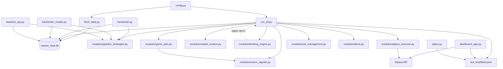

# PythonTrading

**Personal systematic fund** on Alpaca. Currently running **live on ~$300** (small-account guardrails while equity &lt; $500).

The bot automatically applies **small-account safety** when equity &lt; $500:

- **90% VTI core** (passive index anchor)
- **~10% active sleeves** (SPY, NYSE momentum — crypto **off** on Profile A live)
- **1% risk per trade** (~$1–$3 orders)
- **$10 max per order**

**Recommended live stack — Profile A (~$300 live, lock 2026-06-19):**

| Setting | Value |
|---------|-------|
| **VTI core** | **90%** (`SMALL_ACCOUNT_VTI_CORE_PCT=0.90`) |
| **Crypto sleeve** | **OFF** (Profile A / Alpaca live default) |
| **Thinking engine** | **OFF** (paper opt-in only) |
| **Game plan** | Yield-gate-only (`GAME_PLAN_YIELD_GATE_ONLY=true`) |
| **WISDOM_MODE** | `dynamic` |
| Overlap / chunk / co-fire / SPY MA exit / social / macro | **off** (opt-in via `.env`) |

No extra flags required — preflight and `status.py` confirm the stack.

**Paper research** (`paper_aggressive`): **Best Paper Bot v2.2** — dynamic VTI, stat arb, vol overlay, options, overlap/chunk/co-fire **on**; macro/social/risk parity **off**. Thinking engine **opt-in** (`PAPER_THINKING_ENGINE_ENABLED=true`), non-blocking Ollama refresh. See [Profile B](#profile-b-best-paper-bot-v22-paper_aggressive), [Final recommended configuration](#final-recommended-configuration-lock-2026-06-19), and **[Research velocity profile](PAPER_RESEARCH_PROFILE.md)** (high order flow + stat arb/crypto attribution).

**At-a-glance status:** `python status.py` — live + paper equity, regime, and key flags.

**Architecture reference:** [`PROJECT_MANIFEST.md`](PROJECT_MANIFEST.md) · compact LLM manifest: [`data/bot_manifest.txt`](data/bot_manifest.txt) (regenerate with `python scripts/mcp/export_bot_manifest.py`).

---

## Launch & build (consolidated layout)

**Home folder:** `stock-bot/` — all launchers set `PYTHONTRADING_ROOT` to `stock-bot/`. Runtime EXEs and writable data live under **`stock-bot/dist/`**.

**`.env` precedence:** `stock-bot/.env` wins. Frozen EXE loads `stock-bot/.env` first; `dist/.env` only fills keys missing from stock-bot. `build_all.bat` syncs stock-bot → dist as a portable fallback.

| Path | Purpose |
|------|---------|
| `stock-bot/` | Source, **`.env` (edit here)**, portal data, `run_all.py` |
| `stock-bot/dist/` | `Weinstein-Trading-Bot.exe`, `PythonTradingMonitor/`, logs, heartbeats, `market_data.db` |
| `stock-bot/dist/.env` | Fallback copy — do not treat as primary config |
| `stock-bot/dist/PythonTradingMonitor/` | Frozen desktop monitor (CustomTkinter) |

### First-time setup

```powershell
cd C:\Users\Owner\PythonTrading\stock-bot
copy .env.example .env
# Edit .env — Alpaca keys, PAPER_TRADING, optional AUTO_LAUNCH_DASHBOARD=true
python -m venv .venv
.\.venv\Scripts\pip install -r requirements.txt
python scripts\account\preflight.py
```

### Daily usage (recommended)

**Double-click once each morning** (before market open):

```
C:\Users\Owner\PythonTrading\Start_Bot_and_Dashboard.bat
```

Same logic is available as `Start Trading.bat` (repo root) or `stock-bot\fix_setup.bat` (troubleshooting).

#### What it does

1. Stops stray bot and dashboard processes from earlier runs
2. Restarts **both portal books** for your user (`alpaca_live` + `alpaca_paper`):
   - **Live** (~$300) — Profile A conservative via `run_all.py`
   - **Paper** (~$98k) — Best Paper aggressive via `run_paper_bot.py`
3. Opens the **desktop monitor** (`dashboard_app.py` via `pythonw` — no extra console window)
4. Shows a small **startup console** with progress, then minimizes on success

Wait **~60 seconds**, then sign in on the dashboard and open **Overview → Bot status (both books)**. Both books should show fresh heartbeats (not **STALE**).

**Run the launcher only once** per session. Double-clicking again creates duplicate processes.

#### Desktop shortcut

1. In File Explorer, go to `C:\Users\Owner\PythonTrading`
2. Right-click **`Start_Bot_and_Dashboard.bat`** → **Send to** → **Desktop (create shortcut)**
3. Rename the shortcut to something like **PythonTrading Daily**

The shortcut works from the Desktop — the batch file resolves paths from its own location.

#### Do **not** use for daily ops

| Launcher | Why not |
|----------|---------|
| `Weinstein-Trading-Bot.exe` | Single bot, wrong heartbeat path → dashboard shows **STALE** |
| `launch.bat` / `launch_both.bat` | Same — one bot only, not dual-book portal |
| `start.bat` (repo root) | Forwards to EXE / `launch.bat` |
| `dist\Start Weinstein Trading Bot.bat` | Standalone EXE wrapper |

Those are legacy or for quick standalone tests. Portal-managed dual-book ops use **`Start_Bot_and_Dashboard.bat`**.

#### Other launchers (special cases)

| Launcher | When to use |
|----------|-------------|
| **`launch_monitor.bat`** | Monitor only (bots already running) |
| **`stop_dashboard.bat`** | Close stuck dashboard windows |
| **`launch.bat`** | Legacy single-bot (warns you to use daily launcher) |
| **`build_all.bat`** | Rebuild frozen EXEs after code changes |

Portal heartbeats and PID files live under `data/portal/users/<username>/books/alpaca_live/` and `.../alpaca_paper/` — not `dist/bot_heartbeat.json`.

```powershell
cd C:\Users\Owner\PythonTrading\stock-bot
# Manual reset (same as daily launcher):
python scripts\owner_reset.py
```

**Config:** edit **`stock-bot/.env`** and per-book portal `.env` files under `data/portal/users/`. `dist/.env` is only a fallback copy.

### Build frozen EXEs

```powershell
cd C:\Users\Owner\PythonTrading\stock-bot
.\build_all.bat          # monitor + bot (recommended)
# or separately:
.\build_dashboard.bat    # → dist\PythonTradingMonitor\PythonTradingMonitor.exe
python build_exe.py      # → dist\Weinstein-Trading-Bot.exe
```

Quit **PythonTradingMonitor.exe** before rebuilding (unlocks `dist\PythonTradingMonitor\`).

**Logs:** `dist\logs\run_all.log` · `dist\logs\dashboard_auto_launch.log` · `logs\dashboard_crash.log`

---

## System overview

One **24/7 loop** (`run_all.py`) drives everything on Alpaca: refresh bars → regime → yield-gate game plan → VTI core rebalance → sleeve strategies → capped orders → heartbeat JSON → sleep. The **desktop monitor** (`dashboard_app.py`) and **`status.py`** read portal book heartbeats + Alpaca for at-a-glance health; the **portal** (`portal.py`) is the friend/onboarding path.

**Dual-book owner setup:** one portal user (e.g. `dawimberly`) with two books — `alpaca_live` (Profile A) and `alpaca_paper` (Profile B). Start both daily with **`Start_Bot_and_Dashboard.bat`**.

| Component | Role |
|-----------|------|
| **`run_all.py`** | Main orchestrator — Profile A live default, Profile B when `PAPER_CHASE_MODE=1` |
| **`run_paper_bot.py`** | Isolated paper Sharpe chase (Best Paper v2.2) on separate keys/book |
| **`dashboard_app.py`** | CustomTkinter monitor — equity, positions, trades, wisdom; 60s auto-refresh |
| **`status.py`** | CLI snapshot — live + paper equity, regime, stack flags, heartbeat age |
| **`modules/thinking_engine.py`** | Opt-in Ollama PM tilts (paper only by default; live requires manual approval) |
| **`backtester.py`** | Daily-bar mirror of the live stack for validation |

**Two profiles (do not mix on the same book without intent):**

- **Profile A — live** (`current_dynamic`): 90% VTI (&lt; $500), yield-gate-only, overlap/chunk/co-fire **off**, 1% / $10 small-account caps.
- **Profile B — paper v1.3** (`paper_aggressive` / Realistic Research): dynamic core 30–50%, **NYSE momentum + stat arb** (10–14 pairs, RR 1.6), protective shorts, tail risk; vol overlay + options; overlap/chunk/co-fire **on**; thinking opt-in. See [`PAPER_RESEARCH_PROFILE.md`](PAPER_RESEARCH_PROFILE.md).

---

## Memory & performance (Phase 3.2)

Long-running bots and the dashboard were tuned to avoid loading full journals/logs/backtest matrices into RAM:

| Improvement | Where | What it does |
|-------------|-------|--------------|
| **Journal tail reads** | `dashboard_app._read_csv_tail()` | Reads last N CSV rows via `deque` — Trades/Wisdom tabs never load full `paper_journal.csv` |
| **Log tail seek** | `modules/portal_bot.read_bot_log_tail()` | Seeks from end of `bot.log` (~8 KB window) instead of reading the whole file |
| **Backtest cache trim** | `modules/backtester_core.py` | In-process matrix cache capped (`BACKTEST_MEM_CACHE_MAX`, default 2); disk cache under `data/cache/backtest/` kept |
| **Backtest memory release** | `release_backtest_memory()` | Clears in-process caches + `gc.collect()` between compare arms in `backtester.py --compare-final` |
| **Dashboard refresh debounce** | `dashboard_app.refresh_data()` | Coalesces overlapping refresh requests (`_refresh_busy` / `_refresh_pending`) so rapid tab clicks don't stack Alpaca calls |
| **Optional memory indicator** | Dashboard status bar | Shows process RSS (e.g. `142 MB`) when `psutil` is installed — omit from `requirements.txt` if not needed |

No trading logic, risk rules, or order sizing changed — I/O and cache bounds only.

---

## June 2026 stability fixes

Operational hardening for 24/7 live + paper on one PC (no strategy changes on Profile A live):

| Fix | Where | What changed |
|-----|-------|--------------|
| **RAM / I/O bounds** | `dashboard_app.py`, `backtester_core.py`, `portal_bot.py` | Journal/log tail reads, backtest cache cap, refresh debounce — see [Memory & performance](#memory--performance-phase-32) |
| **Daily breaker false trips** | `modules/trading_safety.py` | Detects **anchor contamination** (live ~$300 vs paper ~$98k in `trading_safety_state.json`), resets stale anchors, auto-clears trips when loss is below limit; live session re-primes on startup |
| **Stat-arb reconcile** | `modules/stat_arb_sleeve.py` | Startup reconcile ignores VTI/SPY/NYSE longs and crypto when sleeves disabled; purges stale book rows; resolves orphan pair registries — no spurious orphan warnings on Profile A |
| **Dashboard restart** | `dashboard_app.py`, `modules/portal_bot.py` | **Restart Bot** stops cleanly, clears orphan processes, restarts live + paper when keys configured (positions not closed) |
| **Heartbeat reporting** | `run_all.py`, `status.py`, `status_metrics.py` | Heartbeats include `last_cycle_error`; `status.py` shows age, **STARTING** / **WARMING UP** / **STALE**, scan phase; prefers fresh Alpaca equity over stale heartbeat |
| **Crypto vol gate** | `modules/crypto_vol_gate.py` | Centralized allow/deny with regime pause + vol-only check; optional SpaceX narrative override; status surfaces gate reason |
| **Anchor contamination guard** | `modules/trading_safety.py` | Live open-equity anchor capped vs current equity; paper anchor rejects live-scale values on paper book |

### Verify / test commands

Run from `stock-bot/` (venv active):

```powershell
python tests/test_trading_safety_status.py   # daily loss status + false-trip auto-clear
python tests/test_stat_arb_reconcile.py      # stat-arb orphan filtering / book purge
python tests/test_kraken_budget.py          # Kraken cycle budget caps (exchange stack only)
python status.py                            # live + paper equity, breaker, heartbeat age
python scripts/account/preflight.py         # keys, alerts, small-account sizing
```

---

## Live vs paper — when to use each

| Goal | Profile | How to run | Key env |
|------|---------|------------|---------|
| **Real money ~$100–$300** | Profile A | Portal book `alpaca_live` — started by **`Start_Bot_and_Dashboard.bat`** | `PAPER_TRADING=false`, `ALLOW_LIVE_TRADING=yes` |
| **Paper evaluation / first month** | Profile A on paper keys | Same loop with paper keys | `PAPER_TRADING=true` (default) |
| **Sharpe research ~$98k book** | Profile B | Portal book `alpaca_paper` — same daily launcher | `PAPER_CHASE_MODE=1`, paper Alpaca keys in portal |
| **Both in parallel** | A + B | **`Start_Bot_and_Dashboard.bat`** (recommended) | `data/portal/users/<user>/books/alpaca_{live,paper}/` |

**Monitoring:** `python status.py` prints live + paper equity, regime, stack ON/OFF lines, heartbeat timestamps, and **STALE** when heartbeat age &gt; 90 min. Dashboard **Overview** shows **Bot status (both books)**. Heartbeats: `data/portal/users/<user>/books/alpaca_live/bot_heartbeat.json` and `.../alpaca_paper/bot_heartbeat.json`.

**Before first live cycle:** always run `python scripts/account/preflight.py` (checks keys, alerts, data freshness, small-account sizing). See [Before going live](#before-going-live-real-money).

---

## Long-running stability

Recommended setup for a Windows PC left running 24/7:

1. **Start via daily launcher** — **`Start_Bot_and_Dashboard.bat`** once per session. Use dashboard **Restart Bot** for mid-day recovery; use **Stop Bot** only when shutting down for the day.
2. **Task Scheduler (optional)** — schedule `scripts/background_runner.py --mode auto --trigger startup` at logon and `--trigger midnight` daily. Lightweight mode runs `status.py`, checks heartbeats (stale &gt; 30 min), daily loss circuit, and can auto-start `run_paper_bot.py` when paper-only.
3. **Logging rotation** — `modules/logging_utils.setup_project_logging()` attaches midnight-rotating handlers to `logs/run_all.log` and `logs/events.log` (7 days retained). No manual log cleanup needed for normal operation.
4. **Heartbeat monitoring** — each book writes `bot_heartbeat.json` under its portal book folder. If timestamp is stale (&gt; 90 min in `status.py`): run **`Start_Bot_and_Dashboard.bat`** again (once), or **Restart Bot** in the dashboard. Check `last_cycle_error` in heartbeat / `status.py` output.
5. **Preflight before live** — `python scripts/account/preflight.py` with live keys; confirms `ALLOW_LIVE_TRADING=yes`, equity, alerts, and recent `market_data.db`.
6. **Data refresh** — `fetch_data.py` on schedule or when preflight flags stale DB; background runner can trigger refresh when DB age &gt; 24 h.

### Bulletproof monitoring (daily)

| Check | Command / file | Action if bad |
|-------|----------------|---------------|
| Live + paper health | `python status.py` | Banner, regime, stack ON/OFF, heartbeat age, daily breaker |
| Positions / dust | `python status.py --positions` | Stale paper: `python scripts/cleanup_stale_positions.py --help`; live: `python scripts/cleanup_live_stale_positions.py --dry-run` |
| Heartbeats | `bot_heartbeat.json`, `paper_chase_heartbeat.json` | Timestamp &lt; 30 min when bot running; investigate `last_cycle_error` |
| Daily loss anchor | `trading_safety_state.json` | Live `open` ≈ current equity (~$300), not paper-scale; `circuit_tripped` false unless real loss |
| Crypto vol gate (paper) | `crypto_vol_heartbeat.json` | Gate reason when crypto sleeve active |
| Thinking audit (paper opt-in) | `thinking_engine_last.json`, `logs/thinking_engine.log` | Review before enabling on live |
| Unit tests (after changes) | `python tests/test_trading_safety_status.py` etc. | Run the three tests under [Verify / test commands](#verify--test-commands) |
| Config change | dashboard **Restart Bot** or `python run_paper_bot.py` | Restart paper after `.env` edits |

Dual-bot owners: see [Dual fund bots](#dual-fund-bots-live--paper-sharpe-chase) for isolated heartbeat/journal paths per book.

---

## Remaining known limitations (non-blocking)

These are informational warnings or optional paths — **no action required** for Alpaca live Profile A:

| Item | Symptom | Notes |
|------|---------|-------|
| ~~**Stat-arb orphan warnings**~~ | ~~`Stat-arb orphans (not in book)` at startup~~ | **Resolved (2026-06)** — reconcile filters VTI/SPY/NYSE/crypto when sleeves off; real orphans still logged on paper Profile B |
| ~~**Daily breaker false trip**~~ | ~~`circuit_tripped` with tiny loss~~ | **Resolved (2026-06)** — anchor contamination repair + auto-clear in `trading_safety.py`; verify with `python tests/test_trading_safety_status.py` |
| **Kraken xStocks API off** | Startup banner: SPY/NYSE will not auto-trade on Kraken | Alpaca-only live is fine; set `KRAKEN_AUTOPILOT_ENABLED=false` to silence Kraken paths |
| **Kraken autopilot vs Alpaca** | Preflight warns when both live | Recommended: Alpaca-only for ~$300 live; Kraken is separate `scripts/exchange/` stack |
| **Thinking engine calibration** | Heuristic fallback common on first cycles | Keep off on live; use `--simulate-live-thinking` before enabling |
| **Universe screener age** | `status.py` universe line &gt; 7 days | Run `python scripts/analysis/universe_screener.py` on paper book |
| **Legacy Streamlit dashboard** | `dashboard.py` still works | CustomTkinter `dashboard_app.py` is primary; Streamlit is backup |
| **Log file lock on Windows** | `PermissionError` rotating `run_all.log` | Duplicate bot process — use **Restart Bot** to dedupe |

---

## Two deployment profiles

The repo supports **three deployment targets**. Live defaults stay conservative; paper research opts into aggressive layers via `PAPER_CHASE_MODE`. VPS cloud uses the same Best Paper stack via `cloud_bot/`. Summary: [`scripts/analysis/OPTIMIZED_SYSTEM_SUMMARY.md`](scripts/analysis/OPTIMIZED_SYSTEM_SUMMARY.md).

### Profile A: Live small account (`current_dynamic`)

**Use for:** live ~$100 account, default `run_all.py`, `preflight.py` when not in paper chase.

| Layer | Setting |
|-------|---------|
| **VTI core** | **90%** when equity &lt; $500; **80%** when ≥ $500 |
| **Active sleeves** | ~10% (small) / ~20% (large) of equity |
| **Risk / orders** | 1% / **$10 max** (small) or 2% / scaled (large) |
| **Game plan** | Yield-gate-only |
| **WISDOM_MODE** | `dynamic` |
| **NYSE overlap / beta scaling** | **off** (opt-in via `.env`) |
| **Adaptive chunk / co-fire** | **off** (opt-in) |
| **SPY MA exit** | **off** (opt-in) |
| **Thinking engine** | **off** (paper opt-in; live requires approval) |
| **Halt** | 10% DD; resume 8%; liquidate on breach |

Preflight / `run_all.py` print Profile A via `config.print_live_stack_flags()`.

### Profile B: Best Paper Bot v2.2 (`paper_aggressive`)

**Use for:** paper book, `run_paper_bot.py`, `backtester.py --paper-aggressive`, portal paper user — **not** default live.

**Config source:** `config/best_paper_config.py` + `config.enforce_best_paper_stack()` + `apply_best_paper_config()` (auto on paper chase).

**Goal:** Beat typical mutual-fund **risk-adjusted** returns (Sharpe) with a stable, simplified stack.

#### ON (default)

| Layer | Default | Env flag |
|-------|---------|----------|
| **VTI core** | Dynamic **40–75%** | `PAPER_DYNAMIC_VTI=true` |
| **Risk per trade** | Dynamic **1.1–2.2%** (calm cap 2.2%) | `PAPER_DYNAMIC_RISK_ENABLED=true` |
| **SPY / NYSE MAs** | **MA150 / MA70** (tuned 365d grid) | `PAPER_SPY_MA_WINDOW`, `PAPER_NYSE_MA_WINDOW` |
| **RHYME_E sizing** | **1.60×** | `PAPER_REGIME_E_SIZING_MULT` |
| **NYSE max hold** | **60 bars** | `PAPER_POSITION_MAX_HOLD_BARS` |
| **Stat arb** | v1.3: corr≥0.72, coint p&lt;0.12, **10–14 pairs**, Z 2.0–2.6, RR **1.6:1** + trail, $25M liquidity; runs **with** NYSE momentum (not pairs-only) | `PAPER_STAT_ARB_*` in `.env.example` |
| **Vol overlay** | VIX regime hedge/income | `PAPER_VOL_TRADING_ENABLED=true` |
| **Options income** | Covered calls VTI/SPY | `PAPER_OPTIONS_SLEEVE_ENABLED=true` |
| **Thinking engine** | **Off** (opt-in Ollama PM) | `PAPER_THINKING_ENGINE_ENABLED=true` |
| **Overlap / chunk / co-fire** | **On** | `PAPER_NYSE_OVERLAP_*`, `PAPER_ADAPTIVE_CHUNK`, `PAPER_COFIRE_BUDGET` |
| **Dynamic universe** | Weekly screener refresh | `PAPER_DYNAMIC_UNIVERSE=true` |
| **Active sleeves** | 45/20/20 caps × **1.40×** boost | `PAPER_ACTIVE_SLEEVE_BOOST=1.40` |

Enable thinking in `.env`, then restart `run_paper_bot.py`. LLM runs in a **background thread** (main loop never blocks on Ollama). First cycle uses cached/heuristic tilt until refresh completes. Audit: `logs/thinking_engine.log`, snapshot: `thinking_engine_last.json`.

#### Locked OFF (enforced by `enforce_best_paper_stack()`)

Macro regime adaptor, risk parity, stat arb optimized, social/Felix sleeve, equity pairs, SPY MA exit. Do not enable these on paper without re-backtesting.

Set `PAPER_CHASE_MODE=1` (portal sets this for paper users). Check stack anytime:

```powershell
python status.py
python scripts/account/preflight.py   # paper chase context
```

**Monitoring (daily):**

1. `python status.py` — live + paper equity, safety banner, Profile B ON/OFF lines, thinking snapshot
2. `paper_chase_heartbeat.json` — fresh timestamp if bot running
3. `thinking_engine_last.json` — last narrative, validation score, suggested tilt
4. `logs/thinking_engine.log` — background refresh + tilt apply/reject audit
5. `trading_safety_state.json` — daily loss breaker status

Restart paper bot after changing thinking env: `python run_paper_bot.py`

#### Research velocity profile

For **research velocity** (order flow, stat arb funnels, attribution), use **[`PAPER_RESEARCH_PROFILE.md`](PAPER_RESEARCH_PROFILE.md)** — **Realistic Research v1.3** locked default for `alpaca_paper`: dynamic core 30–50%, stat arb 10–14 pairs, protective shorts (15%), weekly Telegram summary. Startup prints `>>> REALISTIC RESEARCH v1.3` and `>>> STAT ARB v1.3: ...`.

**Stat arb validation (365d):**

```powershell
python backtester.py --paper-aggressive --compare-stat-arb-v13-push --days 365 --no-thinking
```

**Weekly Telegram summary (Fridays 16:30 ET after close):**

```powershell
python scripts/weekly_telegram_summary.py --test
```

#### Backtest validation (365d, fast compare + realistic costs 2026-06-13)

Default execution model: **5 bps equity slippage**, **10 bps crypto slippage**, Alpaca crypto taker fee when fee-aware. Override with `--no-realistic-costs` or `--equity-slippage-bps N`.

| Config | Return | Sharpe | Max DD | vs VTI |
|--------|--------|--------|--------|--------|
| **Best Paper Bot v2.1** | **+43.4%** | **1.63** | **−8.6%** | **+9.9 pp** |
| Best Paper (live vol parity) | +68.0% | 1.96 | −12.4% | +34.6 pp |
| Legacy paper (pre-sleeve) | +27.7% | 1.24 | −13.1% | −5.8 pp |
| VTI buy & hold | +33.5% | — | — | — |

Quick compare: `python backtester.py --days 365 --paper-aggressive --compare-final --fast-mode`

Full accuracy: `python backtester.py --days 365 --paper-aggressive --compare-final`

Full report: [`scripts/analysis/final_paper_bot_backtest.md`](scripts/analysis/final_paper_bot_backtest.md)

#### Thinking engine (Ollama — paper opt-in, live guarded)

Local LLM market reasoning via Ollama (`modules/thinking_engine.py`). **Off by default** on paper; **never auto-applies on live** without explicit approval.

**Paper integration (v2.1):**

- Non-blocking: `maybe_run_thinking()` spawns a daemon thread; trading cycle uses cache/heuristic until LLM completes
- Reasonable tilts: ±6% per sleeve, max 3 sleeves moved, 12% total delta cap; skipped if confidence/narrative/validation fail
- Audit log: `logs/thinking_engine.log` (JSON lines: refresh, apply, reject)

**Production safety (always on — entries + thinking):**

| Guard | Live | Paper |
|-------|------|-------|
| **Daily loss circuit breaker** | **2%** intraday → **no new entries or tilts** for the day | **4%** |
| **Thinking max tilt** | **±6%** per sleeve (hard cap) | ±6% |
| **Manual approval (thinking)** | **Required** before any live tilt apply | auto when engine on |
| **Validator fallback** | heuristic tilt if LLM output fails checks | same |

State files: `trading_safety_state.json` (daily anchor), `thinking_engine_last.json` (audit).

**Live safety (always on when thinking enabled):** ±6% tilt cap · 2% daily loss breaker (all entries) · manual approval required · validator fallback to heuristic.

Approve a pending live tilt after reviewing `thinking_engine_last.json`:

```bash
python scripts/approve_thinking_tilt.py --show
python scripts/approve_thinking_tilt.py
```

| Command | Purpose |
|---------|---------|
| `python scripts/test_thinking_engine.py --max-examples 3` | Live Ollama smoke test |
| `python backtester.py --days 365 --paper-aggressive --compare-thinking` | Paper stack A/B (heuristic proxy) |
| `python backtester.py --days 365 --simulate-live-thinking` | Live small-account what-if (±6% cap) |
| `python scripts/analyze_thinking_engine.py` | Accuracy / tilt scoring |

Every decision is persisted to `thinking_engine_last.json` (timestamp, full reasoning, validation, `decision_id`).

**Not recommended on live ~$100–$300** until Ollama calibration improves. Use `--simulate-live-thinking` to estimate impact first.

#### Monitoring checklist (daily / weekly)

| Check | Command / file | Action if bad |
|-------|----------------|---------------|
| Live + paper equity | `python status.py` | Investigate halt / Alpaca disconnect |
| Regime + stack flags | `python status.py` | Confirm Profile A live, Profile B paper |
| Daily loss circuit | `trading_safety_state.json` / `status.py` | Tripped → no new trades until next day |
| Thinking audit | `thinking_engine_last.json` | Review before `scripts/approve_thinking_tilt.py` on live |
| Risk events | `risk_events.log` | Check halt / resume / liquidations |
| Paper heartbeat | `paper_chase_heartbeat.json` | Stale timestamp → restart paper bot |
| Universe age | `status.py` universe line | >7d → `python scripts/analysis/universe_screener.py` |
| Monthly scorecard | `wisdom_scorecard.json` | Review regime accuracy |

---

## Quick Start – Live $100 Account

1. **Install** (once):

```powershell
cd PythonTrading
python -m venv .venv
.\.venv\Scripts\Activate.ps1
pip install -r requirements.txt
```

2. **Connect live Alpaca keys** (pick one):

   - **Desktop (recommended):** `streamlit run portal.py` → **Register** → **Settings** → paste live keys, **Paper trading OFF**, **Allow live ON**. Then use **`launch.bat`** and sign in (same account as the portal).
   - **CLI only:** copy `.env.example` → `.env` and set:

```env
APCA_API_KEY_ID=your_live_key
APCA_API_SECRET_KEY=your_live_secret
PAPER_TRADING=false
ALLOW_LIVE_TRADING=yes
```

Never commit `.env` — it is gitignored.

**Alpaca production defaults (no strategy changes):**

- Credentials load from `.env` via `python-dotenv` in `config.py`; startup raises `ValueError` if keys are missing.
- Paper mode (`PAPER_TRADING=true`) always uses `https://paper-api.alpaca.markets`.
- Live mode uses `https://api.alpaca.markets` (override with `APCA_API_BASE_URL` if needed).
- A single cached `TradingClient` is reused (`modules/alpaca_client.py`); `run_all.py` reuses one `AlpacaExecutor` per cycle.
- Alpaca API calls retry transient errors (429/5xx/network) up to 3 times with exponential backoff; auth failures exit cleanly.
- Logs: stdout + `logs/run_all.log` and `logs/events.log` (daily rotation, 7 days). Entry points call `modules.logging_utils.setup_project_logging()` — `run_all.py`, `status.py`, `run_paper_bot.py`, `run_spy.py`, `backtester.py`, and satellite backtest scripts. Critical safety paths in `run_all.py` use `logger` / `log_event()` (halt, circuit breaker, auth failures).

3. **Preflight & market data:**

```powershell
python fetch_data.py
python scripts/account/preflight.py
```

Preflight checks live mode, Alpaca connection, alerts, and prints small-account sizing (1% risk, 90% VTI, $10 cap).

4. **Start monitor + bot:**

```powershell
.\launch.bat
# or: python dashboard_app.py --launch-bot
```

Sign in with your portal user. The dashboard shows equity, regime, VTI core, and active sleeves. Use **Restart Bot** for clean restarts after config changes; **Stop Bot** when shutting down for the day.

5. **Check status anytime:**

```powershell
python status.py
```

6. **Optional — paper Sharpe chase in parallel:** [Dual fund bots](#dual-fund-bots-live--paper-sharpe-chase) (`launch_both.bat`). Backtest paper settings before changing live caps.

At equity **≥ $500**, small-account rules relax automatically (80% VTI, 2% risk per trade).

---

Three strategy sleeves (SPY trend, vol-gated crypto pairs, NYSE momentum), a **yield-gate-only** macro overlay, VTI passive core, shared risk controls, and SQLite market data from yfinance. Also supports **paper research** (~$98k book) and the [friend portal](#friends-download-from-github-and-run-locally).

## Architecture



**One process:** `run_all.py` runs all sleeves on a single Alpaca account with per-sleeve capital caps enforced by `modules/alpaca_executor.py`. Each cycle writes `bot_heartbeat.json` (or `paper_chase_heartbeat.json` for paper chase). The **thinking engine** runs in a background thread on paper when enabled — main loop never blocks on Ollama. **Dashboard** and **status.py** read heartbeats + Alpaca for monitoring; they do not execute trades.

**Two Alpaca books (optional):**

| Book | Keys | Role |
|------|------|------|
| **Live / main** | `APCA_*` | Small live account (~$100) or primary paper keys |
| **Paper research** | `PAPER_APCA_*` | Isolated ~$98k paper book for strategy research (`scripts/research/run_paper_piece.py`) |

Live and paper research use **different allocation profiles** — see [VTI core](#vti-passive-core-live) and [Paper aggressive research](#paper-aggressive-research-profile).

## Fund sleeves (default allocation)

| Sleeve | Base cap | Strategy | When it trades |
|--------|----------|----------|----------------|
| **SPY** | 45% | Price > MA200; exit on MA break | US equity session open |
| **Crypto** | 20% | Z-score correlated pairs | **High volatility only** (`CRYPTO_VOL_ONLY`) |
| **NYSE** | 20% | Strongest stock/ETF above MA50 (excludes SPY) | US equity session open |
| **Cash buffer** | 15% | — | Structural headroom for next buys |
| **Metal** | 0% (default) | GLD/SLV/CPER | Only when full game plan is on (not yield-gate-only) |

On a $100k account with **Profile A** (live default), SPY can hold at most ~$45k; crypto ~$20k; NYSE ~$20k; ~$15k stays as cash headroom. Each buy is **2% of equity per order** on large accounts (capped at $10k per order). **Adaptive chunk** and **co-fire budget** are off unless you opt in via `.env`.

On a **~$100 live account** (equity &lt; $500), `config.configure_account_profile()` auto-applies **1% risk**, **$10 max per order**, and **90% VTI core** — active sleeves scale to the remaining ~10%.

Effective caps come from `config.effective_sleeve_cap()` and `config.fund_allocation_pct()`. With **yield-gate-only** (default), long sleeves use **full** base caps — no 0.9 scale and no metal sleeve.

When **VTI core** is enabled, active sleeves scale to the **remaining equity slice** after the passive VTI allocation — e.g. 90% VTI + 10% active (small live) → SPY cap ≈ 4.5% of total equity (45% × 10%); 80% VTI + 20% active (large live) → SPY cap ≈ 9%.

Tune base caps in `config.py`:

```python
SPY_SLEEVE_CAP_PCT = 0.45
CRYPTO_SLEEVE_CAP_PCT = 0.20
NYSE_SLEEVE_CAP_PCT = 0.20
FUND_CASH_BUFFER_PCT = 0.15  # reference; see effective_cash_buffer_pct()
CRYPTO_VOL_ONLY = True
```

## Fund allocation & cash buffer

The **~15% cash** is **not** a standalone strategy sleeve. It is **structural headroom** from the fund’s max long deployment: base SPY + crypto + NYSE caps sum to **85%**, leaving **15%** unallocated so buys never assume 100% of equity is deployable.

| Concept | What it means |
|---------|----------------|
| **`FUND_CASH_BUFFER_PCT`** | Config reference (0.15). The live value comes from `effective_cash_buffer_pct()`. |
| **`effective_cash_buffer_pct()`** | `1 − metal sleeve − scaled long caps`. Ensures all sleeve caps sum to 100%. |
| **Dry powder** | Cash sitting in Alpaca above current positions — available for the next automated buy without breaching caps. |
| **`STRESS_CASH_PCT` (25%)** | **Separate** macro defense. On stress days only, game plan trims toward 25% cash. Not the everyday 15% headroom. |

**Yield-gate-only (recommended default):** SPY 45% / crypto 20% / NYSE 20% / cash **15%** — full long caps, no metal sleeve.

**Full game plan** (`GAME_PLAN_YIELD_GATE_ONLY=false`): long sleeves ×0.9, metal 10%, cash ~13.5%; stress cash trim to 25% on macro stress.

Preflight and `bot_heartbeat.json` report `effective_cash_buffer_pct()` alongside sleeve exposure.

## Recommended configuration by profile

Sharpe phase backtests selected **current_dynamic** as the **live** baseline. Paper research uses **paper_aggressive** (Best Paper v2.2) with optional chase extras. Details: [`scripts/analysis/OPTIMIZED_SYSTEM_SUMMARY.md`](scripts/analysis/OPTIMIZED_SYSTEM_SUMMARY.md).

### Final recommended configuration (lock 2026-06-19)

| Book | Profile | Stack |
|------|---------|-------|
| **Live ~$300** | Profile A (`current_dynamic`) | **90% VTI**, crypto **OFF**, thinking **OFF**, yield-gate-only, 1% / $10 caps, overlap/chunk/co-fire off |
| **Paper ~$98k** | Profile B v2.2 (`paper_aggressive`) | Dynamic VTI 40–75%, stat arb + vol overlay + options, overlap/chunk/co-fire **on**; thinking opt-in; macro/social off |

Confirm anytime: `python status.py` (Profile A vs v2.2 locked lines) · `python scripts/account/preflight.py`

```env
# Live Profile A (~$300) — defaults; only set if overriding
PAPER_TRADING=false
ALLOW_LIVE_TRADING=yes
VTI_CORE_ENABLED=true
SMALL_ACCOUNT_VTI_CORE_PCT=0.90
GAME_PLAN_YIELD_GATE_ONLY=true
# Live uses SPY MA200 / NYSE MA50 (config defaults); paper-aggressive uses PAPER_* tuned MAs
# Crypto + thinking stay off on live Profile A (no env needed)

# Paper Profile B — portal / run_paper_bot.py sets PAPER_CHASE_MODE=1
PAPER_CHASE_MODE=1
PAPER_APCA_API_KEY_ID=...
PAPER_APCA_API_SECRET_KEY=...
```

### Profile A — live (`current_dynamic`)

| Layer | Setting |
|-------|---------|
| **Game plan** | Yield-gate-only — `GAME_PLAN_YIELD_GATE_ONLY=true` |
| **Sleeves (base)** | 45% SPY / 20% crypto / 20% NYSE / 15% cash (scaled by VTI core) |
| **SPY** | MA200 entry; `SPY_EXIT_ON_MA_BREAK=false` (opt-in) |
| **NYSE** | Overlap filter off; beta scaling off (opt-in) |
| **Crypto** | Vol-gated pairs only; **off on live Profile A** (small account) |
| **Sizing** | Adaptive chunk + co-fire off (opt-in) |
| **Risk** | 10% max DD halt; resume at 8%; liquidate to 25% cash on breach |
| **Regime** | Skip panic/bear entries; `DERIVED_BEAR_PAUSE_ENABLED=false` |
| **Wisdom** | `WISDOM_MODE=dynamic`, `SENTIMENT_SOURCE=price` |
| **Small account** | equity &lt; $500 → 90% VTI, 1% risk, $10 max order |

Preflight prints Profile A via `config.print_recommended_stack_flags()` (dispatches to `print_live_stack_flags()`):

```
--- current_dynamic live stack (Profile A) ---
  game_plan:              yield-gate-only
  yield_gate:             True
  nyse_overlap_filter:    False (corr max 0.8)
  nyse_beta_scaling:      False
  spy_exit_on_ma_break:   False
  adaptive_chunk:         False
  cofire_budget:          False
  halt_resume_dd:         8% | liquidate_on_breach: True
  derived_bear_pause:     False
  wisdom_mode:            dynamic
  small_account:        ON (<$500) | risk 1% | max order $10
  vti_core:             90% VTI passive | active 10%
  sleeves: SPY 5% | crypto 2% | NYSE 2% | metal 0% | cash 1%
```

(Sleeve percentages above are effective on a ~$100 account with 90% VTI core.)

### Profile B — Best Paper Bot (`paper_aggressive`)

Same locked stack as [Profile B above](#profile-b-best-paper-bot-paper_aggressive). See `config.get_best_paper_bot_stack()`.

```
--- Best Paper Bot (paper_aggressive / Profile B) ---
  paper_chase_mode:       ON (PAPER_CHASE_MODE)
  dynamic_vti:            on (40%-75% by vol/stress)
  dynamic_risk:           on (2.2% / 1.65% / 1.1% calm-mod-stress)
  spy_nyse_ma:            SPY MA150 | NYSE MA70 (365d tune)
  regime_e_sizing:        x1.60 | max hold 60 bars
  stat_arb:               on
  vol_overlay:            on
  options_sleeve:         on
  regime_shift:           on
  nyse_overlap_filter:    True
  adaptive_chunk:         True
  cofire_budget:          True
  spy_exit_on_ma_break:   False
  social_sleeve:          off
  vti_core:             dynamic 40-75% VTI | active boost 1.40x
  crypto_vol_only:      False
  sleeves: SPY 45% | crypto 20% | NYSE 20% | metal 0% | cash 15%
```

## Game plan (yield-gate-only default)

Macro overlay is wired into `run_all.py`. **Recommended:** yield gate only — blocks **new SPY buys** when 10Y yield (TNX) is above MA50 and rising (TLT weakness fallback). No metal deploy, no stress-cash trim, no 0.9 long-scale haircut.

| Mode | Yield gate | Metal 10% | Stress cash | Long scale |
|------|------------|-----------|-------------|------------|
| **Yield-gate-only** (default) | yes | no | no | 1.0 |
| Full `game_plan_gld_slv_cper` | yes | yes (50/30/20 GLD/SLV/CPER) | yes (25% cash on stress) | 0.9 |

**Stress** (full plan only) = SPY below MA200, OR TLT below MA50, OR bear/panic RHYME regime.

### Game plan A/B (2017–2026)

Verified 2026-06-02 (`game_plan_ab_test.py`, max daily history):

| Variant | Full-window return | Sharpe | Fresh 2022 return |
|---------|-------------------|--------|-------------------|
| Baseline | +259.75% | 0.75 | −21.40% |
| yield_gate_only (recommended) | +259.16% | 0.75 | **−17.75%** (+3.65 pp vs baseline) |
| game_plan_gld_slv_cper | +257.01% | 0.80 | −13.16% |

Yield-gate-only keeps full caps with ~0.6 pp return drag on the long window while avoiding metal sleeve, stress-cash trims, and 0.9 long-scale complexity. Full metal plan helps fresh 2022 MaxDD but costs return on recent windows.

Re-run: `python scripts/analysis/game_plan_ab_test.py` or `python scripts/research/backtest_game_plan_live.py`.

### Game plan `.env` (recommended)

```env
GAME_PLAN_ENABLED=true
GAME_PLAN_YIELD_GATE_ONLY=true
YIELD_GATE_ENABLED=true
```

Full legacy blend: set `GAME_PLAN_YIELD_GATE_ONLY=false` and keep metal/stress env vars in `.env.example`.

Preflight prints macro signals (`stress`, `yield_gate`, `bond_stress`) when game plan is active.

## VTI passive core (Profile A live)

Live applies **90% VTI** when equity &lt; $500; **80%** at ≥ $500 (`config.configure_account_profile()`). Thinking engine adjusts **active sleeve caps only** on live (±6% tilt cap); it does not replace the VTI anchor unless you explicitly change `SMALL_ACCOUNT_VTI_CORE_PCT` / `VTI_CORE_PCT`.

### Fixed VTI + Best Paper v2.1 + Thinking (365d, 2025-03 → 2026-06)

Command: `python backtester.py --days 365 --paper-aggressive --compare-vti-levels`

Stack: stat arb + vol overlay + options + overlap/chunk/co-fire + **upgraded Thinking Engine** (VTI-beat heuristic; ±6% tilt cap). VTI buy & hold benchmark: **+33.5%**.

| VTI level | Return | Sharpe | Max DD | Avg active | vs VTI |
|-----------|--------|--------|--------|------------|--------|
| **90% (live-like)** | +61.4% | 1.80 | **−9.5%** | 10% | +27.9 pp |
| **80%** | **+75.6%** | **1.90** | −9.6% | 20% | **+42.1 pp** |
| 75% | +73.2% | 1.90 | −11.2% | 25% | +39.7 pp |
| 70% | +76.2% | 1.90 | −11.4% | 30% | +42.8 pp |

**Risk-adjusted winner:** **80% VTI** — ties best Sharpe (1.90) with shallow drawdown (−9.6%), +75.6% return (+42 pp vs VTI). **90%** is best for capital preservation (shallowest MaxDD). **70%** adds ~0.6 pp return vs 80% but ~1.8 pp deeper drawdown — poor trade-off.

### Recommendations ($300–$1000 live)

| Equity | Best VTI % | Why |
|--------|------------|-----|
| **$300–$499** | **90%** | Matches small-account guardrails; best MaxDD in test; active stack still adds +28 pp vs passive VTI |
| **$500–$1000** | **80%** | Step down at $500 threshold; best Sharpe/return balance with full stat-arb/vol/options stack on paper |
| **Paper research** | **Dynamic 40–75%** | `PAPER_DYNAMIC_VTI=true` — do not use fixed 70% live; paper can hunt alpha, live stays anchored |

**Thinking Engine (paper):** opt-in via `PAPER_THINKING_ENGINE_ENABLED=true`. Tuned prompt focuses on **beating VTI on Sharpe**, avoiding crowded AI/tech chase, and coordinating **stat arb** (crypto pairs) + **vol overlay** (trim beta when VIX elevated). Live: thinking stays **off by default**; if enabled later, tilts are ±6% on active sleeves only — keep **90%/80% VTI anchor**.

```env
VTI_CORE_ENABLED=true
VTI_CORE_PCT=0.80
SMALL_ACCOUNT_VTI_CORE_PCT=0.90
VTI_CORE_REBALANCE_DRIFT_PCT=0.02
```

Backtest commands:

```powershell
python backtester.py --days 365 --paper-aggressive --compare-vti-levels
python backtester.py --days 365 --compare-vti-core
python scripts/analysis/print_thinking_demo_samples.py   # sample PM outputs
```

## Social / Felix sleeve (legacy — off by default)

Creator-macro sleeve driven by **YouTube transcripts** (Felix & Friends + **Andrei Jikh**) blended with headline web sentiment. **Disabled by default** on both live and paper; code kept for future opt-in. When enabled, runs on the **paper research book** (`PAPER_APCA_*`); optional **live mirror** on the main account.

| Setting | Default | Meaning |
|---------|---------|---------|
| `SOCIAL_SLEEVE_ENABLED` | `false` (opt-in) | Turn on Felix + social rotation |
| `SOCIAL_SLEEVE_CAP_PCT` | `0.10` | Paper social book cap (% of that account) |
| `SOCIAL_MIRROR_TO_LIVE_PCT` | `0.15` | Live reserve = social cap × this (e.g. 1.5% of live equity) |
| `FELIX_SENTIMENT_ENABLED` | `false` (opt-in; auto-on with paper chase) | Score latest synced transcript |
| `SPACEX_IPO_AUTO_BUY` | `false` on live | IPO auto-buy disabled |

Targets: **GLD** (bearish macro), **XLE** (bullish energy), **SPY** (neutral). Live mirror skips SPY when the main fund already runs the SPY sleeve.

Sync creator transcripts:

```powershell
python scripts/maintenance/sync_felix_transcripts.py --max 30 --backfill-dates
python scripts/maintenance/sync_felix_transcripts.py --channel andrei_jikh --max 15
```

Registered channels: `felix_and_friends`, `andrei_jikh` (`UCGy7SkBjcIAgTiwkXEtPnYg`). Weights: `SOCIAL_FELIX_CHANNEL_WEIGHT` / `SOCIAL_ANDREI_JIKH_WEIGHT` (default 50/50).

## Paper aggressive research profile (Sharpe chase)

The **paper book** can run a profit-seeking profile **without changing live ~$100 caps**.

| How to run | Command |
|------------|---------|
| **24/7 loop** (recommended) | `python run_paper_bot.py` or portal **Start bot** with **paper** keys |
| **One-shot pieces** | `python scripts/research/run_paper_piece.py --piece all-active --apply` |

`PAPER_CHASE_MODE=1` enables the aggressive profile inside `run_all.py` (portal sets this automatically when your saved keys are paper).

**Hardware / WiFi:** the bot is idle **most of the time** (45–60s sleep between cycles; price refresh every 10–15m). You are **not** maxing out a modern PC or home broadband. Paper chase auto-enables overlap/chunk/co-fire, Felix sync (sentiment only), NYSE beta scaling, and faster refresh — **not** social sleeve or macro adaptor. Still light load.

| Setting | Live (~$100, equity &lt; $500) | Live (≥ $500) | Paper aggressive |
|---------|-------------------------------|---------------|------------------|
| VTI core | **90%** (`SMALL_ACCOUNT_VTI_CORE_PCT`) | **80%** (`VTI_CORE_PCT`) | **Dynamic 40–75%** (`PAPER_DYNAMIC_VTI=true`) |
| Active sleeves | ~10% total | ~20% total | **~31% avg** with dynamic VTI; 1.40× boost on base caps |
| Social / macro | **off** | **off** | **off** (opt-in via `.env`) |
| Crypto vol gate | High vol only | High vol only | **Off** (`PAPER_CRYPTO_VOL_ONLY=false`) |
| Wisdom sizing floor | defensive cuts | defensive cuts | **1.0** (no shrink) |

```powershell
# Inspect profile (dry-run)
python scripts/research/run_paper_piece.py --piece status --piece alloc

# Deploy when US market is open
python scripts/research/run_paper_piece.py --piece all-active --apply

# Mirror live-like caps on paper
python scripts/research/run_paper_piece.py --piece alloc --conservative
```

Backtest the paper profile:

```powershell
python backtester.py --days 365 --compare-paper-aggressive
python backtester.py --days 365 --paper-aggressive
```

Recent 365d A/B (2025-04 → 2026-06): live-like 80/20 **+28.2%** Sharpe 1.43; paper aggressive 20/80 **+16.5%** Sharpe 0.85; active-only +15.1%. Paper aggressive wins on active deployment but lags when VTI has a strong year.

## Quick start (paper / CLI)

For **live ~$100**, use [Quick Start – Live $100 Account](#quick-start--live-100-account) above.

**Paper evaluation** (default `PAPER_TRADING=true`):

```powershell
copy .env.example .env
# Edit .env with Alpaca paper APCA_* keys
python fetch_data.py
python scripts/account/preflight.py
python run_all.py
```

**Desktop monitor:** sign in via monitor EXE or `python dashboard_app.py` — see [Launch & build](#launch--build-consolidated-layout).

### Dual fund bots (live + paper Sharpe chase)

Two **separate** `run_all.py` processes — one command:

```powershell
.\launch_both.bat
# or: python launch_bots.py
```

**One-time setup**

**Option A — two portal users** (`streamlit run portal.py`):

1. **you-live** → live Alpaca keys, **Paper trading OFF**, Allow live ON (conservative 90% VTI when equity &lt; $500).
2. **you-paper** → paper Alpaca keys, **Paper trading ON** (Sharpe chase: 20% VTI, extra layers).
3. Copy `data/portal/fund_pair.json.example` → `data/portal/fund_pair.json`:

```json
{ "live_user": "you-live", "paper_user": "you-paper" }
```

**Option B — live portal user + paper keys in project `.env`** (common owner setup):

1. **you-live** in the portal with live keys (paper OFF, allow live ON).
2. Keep **paper** `APCA_*` keys in the project root `.env` with `PAPER_TRADING=true`.
3. Set `"paper_user": "@root"` in `fund_pair.json` (see example file). Paper bot logs go to `data/fund/paper/` — separate from live.

Or save the pair in one step:

```powershell
python launch_bots.py --live-user you-live --paper-user you-paper --init-pair
python launch_bots.py --live-user you-live --paper-user @root --init-pair
```

Override without editing JSON: `FUND_LIVE_USER` and `FUND_PAPER_USER` in `.env`.

**Where data lives**

| Shared (one copy) | Per book (do not mix) |
|-------------------|------------------------|
| `market_data.db` | Portal user: `data/portal/users/<username>/` — heartbeat, journal, bot.log, `.env` |
| `fetch_data.py` once | `@root` paper slot: `data/fund/paper/` — heartbeat, journal, bot.log (keys still in project `.env`) |
| | `@root` live slot (if used): `data/fund/live/` |

Log in to the desktop monitor as **you-live** or **you-paper** to see that book’s heartbeat. `python launch_bots.py --status` / `--stop` manages both.

**Backtest paper chase before changing live** (after paper bot has run or anytime):

```powershell
python backtester.py --days 365 --paper-aggressive
python backtester.py --days 365 --compare-paper-aggressive
```

Always run commands from **`stock-bot/`** so relative paths (`market_data.db`, logs, `dist/`) resolve correctly.

## Paper trading on Alpaca (recommended first month)

`run_all.py` trades **only on Alpaca paper** by default (`PAPER_TRADING=true`). Kraken keys in `.env` are for `scripts/exchange/` only — not used by the main fund loop.

1. Create **paper** API keys at [Alpaca Paper Dashboard](https://app.alpaca.markets/paper/dashboard/overview).
2. Put them in `.env` as `APCA_API_KEY_ID` and `APCA_API_SECRET_KEY` (not live keys).
3. Verify before leaving it running:

```powershell
python scripts/account/preflight.py
python scripts/account/verify.py
python scripts/account/check_account.py
```

4. Refresh data, then start the fund loop (leave terminal open, or use a VPS later):

```powershell
python fetch_data.py
python run_all.py
```

5. Each week, review logs and equity on the Alpaca paper dashboard.

**Safety:** Live trading is blocked unless you set `PAPER_TRADING=false` **and** `ALLOW_LIVE_TRADING=yes` in `.env`. Do not set those during your paper month.

### Before going live (real money)

See [Quick Start – Live $100 Account](#quick-start--live-100-account) for the main flow. Use `PAPER_APCA_*` for the separate paper research book (`run_paper_bot.py`).

| Setting | Default | Notes |
|---------|---------|-------|
| `WISDOM_MODE` | `dynamic` | Price + sentiment sizing |
| `GAME_PLAN_YIELD_GATE_ONLY` | `true` | Blocks hostile-rate SPY entries |
| `VTI_CORE_ENABLED` | `true` | Passive core sleeve |
| `VTI_CORE_PCT` | `0.80` | Large accounts; **90%** auto when equity &lt; $500 |
| `NYSE_OVERLAP_FILTER_ENABLED` | `false` | Opt-in |
| `ADAPTIVE_CHUNK_ENABLED` | `false` | Opt-in |
| `COFIRE_BUDGET_ENABLED` | `false` | Opt-in |
| `SPY_EXIT_ON_MA_BREAK` | `false` | Opt-in |
| `SOCIAL_SLEEVE_ENABLED` | `false` | Felix/social off on live |
| `MACRO_REGIME_ADAPTOR_ENABLED` | `false` | Macro adaptor off on live |

**Extra checklist** before first live cycle:

```powershell
# 1. Full preflight (includes Live Trading Checklist when PAPER_TRADING=false)
python scripts/account/preflight.py

# 2. Refresh 5m bars (preflight also fetches; re-run if checklist flagged stale data)
python fetch_data.py

# 3. Confirm Telegram/email alerts fire
python scripts/account/test_alerts.py

# 4. Start monitor + both bots (recommended)
..\Start_Bot_and_Dashboard.bat

# Or terminal only (portal-managed live skips the 10s abort window)
python run_all.py
```

`preflight.py` verifies: `ALLOW_LIVE_TRADING=yes`, equity &gt; $50, alerts configured, recent `market_data.db` refresh, and prints small-account sizing when applicable. Portal-started live bots skip the manual 10-second countdown; CLI `python run_all.py` still shows it.

**Daily use:** double-click **`Start_Bot_and_Dashboard.bat`** at the repo root (or your desktop shortcut). Use dashboard **Restart Bot** after `.env` changes; **Stop Bot** only when shutting down.

**Stop bot from terminal:**

```powershell
python -c "from dashboard_app import _stop_bot_processes; print(_stop_bot_processes())"
```

Set `KRAKEN_AUTOPILOT_ENABLED=false` in `.env` if you want **Alpaca-only** live (preflight warns when Kraken autopilot is also live).

Optional sanity checks:

```powershell
python scripts/account/verify.py
python scripts/account/check_account.py
python backtester.py --days 365
```

### Before a one-month paper run

```powershell
python scripts/account/preflight.py
python backtester.py --days 500
python run_all.py
```

Preflight checks paper mode, Alpaca connection, market data, and game plan macro signals. The bot then:

- Enforces **sleeve caps** (scaled by VTI core and account size) on each buy
- Runs **yield-gate-only** game plan by default (blocks hostile-rate SPY entries)
- **Adaptive chunk** and **co-fire budget** are off by default (opt-in via `.env`)
- Runs **crypto only in high-volatility** regimes (still skips panic/bear)
- Applies **5% stop-loss** exits; **10% max drawdown** halt with **8% resume** and optional breach liquidation
- **Cost-basis aware**: scales buys when a sleeve is underwater on avg entry; blocks discretionary sells below cost (stops still fire)
- **Macro event guard**: reduces sizing before NFP/CPI/FOMC/PPI/GDP releases (hardcoded calendar in `modules/macro_calendar.py`)
- Requires **0.5+ correlation** on crypto pairs
- **Scan schedule** (`modules/scan_schedule.py`): overnight crypto-only when US equity is closed; equity sleeves at session open
- Writes **`paper_journal.csv`** and **`bot_heartbeat.json`** each cycle

### Regime and risk

Market regime comes from `modules/market_context.py` (sentiment + volatility). All sleeves skip entries in:

- `RHYME_B: Panic_Volatility`
- `RHYME_E: Steady_Bearish_Decline`

Crypto has an additional gate: when `CRYPTO_VOL_ONLY=true`, pairs are skipped unless cross-asset volatility is **High**.

## Desktop monitor (CustomTkinter)

Primary monitor for dual-book ops — dark theme, auto-refresh, **Overview shows both Live and Paper**.

### One-click launch (recommended)

Use **`Start_Bot_and_Dashboard.bat`** at the repo root — it starts both portal books and opens the monitor. See **[Daily usage](#daily-usage-recommended)**.

**Monitor only** (bots already running): `launch_monitor.bat` or `pythonw dashboard_app.py`.

**Sign in** with your portal username (e.g. `dawimberly`). Password is required each time the dashboard opens fresh. **Remember username** is stored in `data/portal/desktop_prefs.json`.

**Desktop shortcut (Windows):**

1. Right-click **`Start_Bot_and_Dashboard.bat`** (repo root) → **Send to** → **Desktop (create shortcut)**.
2. Rename to **PythonTrading Daily**.

Or run `powershell -ExecutionPolicy Bypass -File scripts\create_monitor_shortcut.ps1` and point it at the daily launcher if you customize that script.

Portal users store keys under `data/portal/users/<username>/books/<book_id>/.env`. A `stock-bot/.env` is used for CLI and legacy fund slots.

**Troubleshooting:**

| Issue | Fix |
|-------|-----|
| Dashboard window missing | Check `logs\dashboard_crash.log` or `dist\logs\dashboard_auto_launch.log` |
| Shortcut does nothing | Re-create shortcut to **`Start_Bot_and_Dashboard.bat`**; run **`stop_dashboard.bat`**, then launch once |
| Multiple bots running | Run **`Start_Bot_and_Dashboard.bat`** once only — it cleans orphans first |
| Stale heartbeat | Run daily launcher once, or **Restart Bot** in dashboard; check `last_cycle_error` in heartbeat / `python status.py` |

### Manual launch

```powershell
pip install -r requirements.txt
python dashboard_app.py
python dashboard_app.py --launch-bot   # also start run_all.py
```

Tabs: **Positions** (default), **Overview**, **Trades**, **Wisdom**, **Charts** — main content fills the window below hero metrics (equity, cash, P&L, sparkline). Shows small-account mode (1% risk, 90% VTI, $10 max order), a **Small Account Summary** panel, and a red **LIVE TRADING** banner when `PAPER_TRADING=false`. Use **Refresh** for an immediate update; **Restart Bot** for clean stop + relaunch; **Stop Bot** ends `run_all.py` without liquidating positions. Charts are **off by default** — enable **Charts on refresh** or open the Charts tab. Optional **Minimize to tray** keeps the monitor running in the system tray when you close the window.

Auto-refresh every **60 seconds**. Data sources: per-user `bot_heartbeat.json` (portal path or `data/fund/<slot>/`), Alpaca API, `paper_journal.csv`, `wisdom_scorecard.json`, `market_data.db`.

### Build a Windows .exe (optional)

See **[Launch & build](#launch--build-consolidated-layout)** — use **`build_all.bat`** for monitor + bot, or build separately:

```powershell
.\build_dashboard.bat    # dist\PythonTradingMonitor\PythonTradingMonitor.exe
python build_exe.py        # dist\Weinstein-Trading-Bot.exe
```

Manual PyInstaller (monitor):

```powershell
.\.venv\Scripts\Activate.ps1
pip install pyinstaller pillow
python scripts/generate_dashboard_icon.py
python -m PyInstaller dashboard.spec --noconfirm
```

**Before rebuilding:** quit **PythonTradingMonitor.exe** (and tray icon). Output lives under **`stock-bot/dist/`** (gitignored — rebuild locally).

Start in: `C:\Users\Owner\PythonTrading`

**Streamlit backup** (browser UI):

```powershell
streamlit run dashboard.py
```

## Friends: download from GitHub and run locally

Share this repo with programmer friends. Each person runs the bot **on their own computer** with **their own Alpaca paper account** (or live, if they choose).

**Repo:** [github.com/dawimberly/trading-bot](https://github.com/dawimberly/trading-bot)

**Full guide (stock + UFC):** [FRIENDS.md](FRIENDS.md)

### Stock trading bot

1. **Install [Python 3.11+](https://www.python.org/downloads/)** (check “Add python.exe to PATH”).
2. **Clone the repo:**
   ```powershell
   git clone https://github.com/dawimberly/trading-bot.git
   cd trading-bot\stock-bot
   ```
3. **Double-click `friend_setup.bat`** — installs dependencies and opens the portal in the browser.
4. In the portal:
   - **Register** an account (local to their PC)
   - **Connect Alpaca** — paste [paper API keys](https://app.alpaca.markets/paper/dashboard/overview); keep **Paper trading** checked
   - **Bot** tab → **Download market data** (once) → **Start bot**
5. **Dashboard** tab shows equity, regime, and sleeves.

No manual `.env` editing. Keys are stored under `data/portal/users/<username>/.env` on their machine only.

### Mac / Linux

```bash
git clone https://github.com/dawimberly/trading-bot.git
cd trading-bot/stock-bot
chmod +x friend_setup.sh
./friend_setup.sh
```

### Manual setup (any OS)

```powershell
cd trading-bot\stock-bot
python -m venv .venv
.\.venv\Scripts\Activate.ps1   # Mac/Linux: source .venv/bin/activate
pip install -r requirements.txt
python fetch_data.py
streamlit run portal.py
```

### What friends get

| Step | What happens |
|------|----------------|
| Login | Local account in `data/portal/users.db` |
| Alpaca / Settings | Connect or update API keys (paper or live) |
| Bot page | Start/stop `run_all.py` with their keys |
| Dashboard | Their heartbeat, positions, regime |

**Paper first:** friends should use Alpaca **paper** keys until they trust the stack. Live requires checking **Allow live trading** on the Alpaca setup page and `ALLOW_LIVE_TRADING=yes` in their saved config.

**Optional:** `python scripts/account/preflight.py` still works if they copy their portal `.env` to the project root as `.env` for CLI checks.

### Optional: you host one server

If you prefer one shared server instead of everyone cloning:

```powershell
$env:PORTAL_INVITE_CODE = "your-secret-code"
streamlit run portal.py --server.address 0.0.0.0 --server.port 8501
```

Share URL + invite code. For most friends, **clone + `friend_setup.bat` on their PC** is simpler.

| File | Purpose |
|------|---------|
| `friend_setup.bat` / `friend_setup.sh` | One-click install + open portal |
| `portal.py` | Login, Alpaca keys, dashboard, bot |
| `launch.bat` | Owner’s local desktop monitor + bot (not required for friends) |

### UFC betting bot (same repo)

Separate stack under `ufc-predictor/` + `ufc_betting_bot/`. Dry-run / paper only — no auto-betting.

```powershell
git clone https://github.com/dawimberly/trading-bot.git
cd trading-bot\ufc_betting_bot
friend_setup.bat
```

First run downloads fight data and trains the model (~15–30 min). Dashboard opens on **http://localhost:8502**. Optional `THE_ODDS_API_KEY` in `ufc_betting_bot\.env` for live lines. See [FRIENDS.md](FRIENDS.md).

## How to review bot performance

The bot writes a **wisdom journal** every cycle and runs a **daily self-evaluation** (when `WISDOM_EVAL_ENABLED=true`) that compares live equity to aligned backtest sims on the same calendar window. Live equity is resampled to **daily last** so returns match daily-bar sim cadence.

### Quick aligned snapshot (recommended)

```powershell
# Regenerate scorecard + print live vs sim for the active WISDOM_MODE window
python scripts/analysis/live_vs_backtest_snapshot.py --refresh-eval

# Same, plus trade-level journal vs Alpaca fill reconciliation
python scripts/analysis/live_vs_backtest_snapshot.py --refresh-eval --reconcile
```

The snapshot reports live return, active-mode sim return, `live_minus_active_sim_pp`, VTI benchmark, and trade signal count for the window.

### Manual evaluation

```powershell
# Daily rolling scorecard (same hook as run_all, but on demand)
python scripts/maintenance/evaluate_wisdom.py
python scripts/maintenance/evaluate_wisdom.py --force

# Calendar-month rollup
python scripts/maintenance/evaluate_wisdom.py --monthly --force
python scripts/maintenance/evaluate_wisdom.py --monthly --month 2026-05 --force
```

Outputs: `wisdom_scorecard.json`, append-only `wisdom_evaluations.jsonl`, and optional `wisdom_monthly_YYYY-MM.json`.

### Trade reconciliation only

```powershell
python scripts/analysis/trade_reconciliation.py
python scripts/analysis/trade_reconciliation.py --days 30 --json reconcile_report.json
```

Matches `paper_journal.csv` signals to Alpaca fills and estimates notional/slippage vs sim sizing.

### What to read

| File | Purpose |
|------|---------|
| `wisdom_scorecard.json` | Latest daily eval: live vs all sim modes |
| `wisdom_evaluations.jsonl` | History of daily scorecards |
| `wisdom_journal.csv` | Per-cycle equity, regime, wisdom mode |
| `paper_journal.csv` | Trade signals and game plan events |
| `bot_heartbeat.json` | Last cycle: sleeves, cash headroom, halted state |

## Live vs backtest expectations

Short live history is normal. Live P&L will **diverge** from simulation for several structural reasons:

| Factor | Live | Backtest / wisdom sim |
|--------|------|------------------------|
| Bar cadence | 5-minute bars | Daily bars |
| Fills | Alpaca market orders, fees, partial fills | Model fills at daily close |
| Sleeve enforcement | Real-time cap checks on each order | Same logic, daily rebalance |
| Gates | Yield gate, vol gate, regime skip in real time | Forward-filled daily macro |
| Game plan | `backtester_wisdom.py` and wisdom sim include game plan when enabled | Aligned window in scorecard |

Use the snapshot script for an **apples-to-apples** read: same calendar dates, daily-resampled live equity, and sim modes run over that exact window. Large gaps early on often mean too few live days — check `daily_samples` in the scorecard.

Directional backtests remain useful for strategy design; the performance review tools are for **tracking live drift** once paper trading is running.

## Backtesting

**Hub:** `backtester.py` mirrors the live `run_all.py` pipeline (regime, sleeves, halt). **Core engine:** `modules/backtester_core.py` (data cache, metrics, slippage, walk-forward). **Satellites** (`backtester_wisdom.py`, `backtester_metals.py`, `backtester_macro_hedge.py`, `backtester_long_short.py`) share helpers in `modules/backtest_common.py`.

### Quick vs full runs

| Mode | Command | Notes |
|------|---------|--------|
| **Quick smoke test** | `python backtester.py --days 365 --paper-aggressive --fast-mode` | ~22 tickers; stat-arb/vol off — ~2–5× faster |
| **Realistic costs** | Default 5 bps equity + 10 bps crypto slippage | `--no-realistic-costs` to disable |
| **Full accuracy** | `python backtester.py --days 365 --paper-aggressive` | Full universe + all sleeves |
| **Final compare** | `python backtester.py --days 365 --paper-aggressive --compare-final` | Parallel arms; Profit Factor, Win%, Avg Trade, vs VTI |
| **Fast compare** | `python backtester.py --days 365 --paper-aggressive --compare-final --fast-mode` | Quick A/B table (~minutes vs ~hours) |
| **Purged walk-forward** | `python backtester.py --days 365 --paper-aggressive --walk-forward 3` | 3-fold purged CV with embargo gap |
| **HTML report** | `python backtester.py --days 365 --paper-aggressive --report-html` | Equity, rolling Sharpe, drawdown charts → `scripts/analysis/backtest_report.html` |

Disk cache: daily close matrix cached under `data/cache/backtest/` (invalidates when `market_data.db` changes).

### Common flags

```powershell
python backtester.py --days 365 --vti-core 0.80          # fixed 80% VTI anchor
python backtester.py --days 365 --paper-aggressive --no-thinking
python backtester.py --days 365 --equity-slippage-bps 5   # 5 bps equity slippage
python backtester.py --days 365 --crypto-slippage-bps 10  # +10 bps crypto slippage
python backtester.py --days 365 --fast-mode
python backtester.py --days 365 --paper-aggressive --compare-final --fast-mode
python backtester.py --days 365 --paper-aggressive --compare-final --no-parallel
python backtester.py --days 365 --paper-aggressive --walk-forward 3
python backtester.py --days 365 --paper-aggressive --slippage-sensitivity
python backtester.py --days 365 --paper-aggressive --report-html
python backtester.py --days 365 --paper-aggressive --export-json --export-csv
python backtester.py --days 365 --paper-aggressive --compare-final --final-all-windows
```

Uses **Profile A** flags by default; `--paper-aggressive` uses Profile B (`config.print_recommended_stack_flags(profile=...)` on startup).

```powershell
# Integrated fund (recommended stack; prints sleeve flags)
python backtester.py --days 500
python backtester.py --max              # full history with halt
python backtester.py --max --no-halt    # validate crypto sleeve path

# Paper aggressive (dynamic VTI, overlap/chunk/co-fire; social/macro off)
python backtester.py --days 365 --paper-aggressive
python backtester.py --days 365 --paper-aggressive --compare-final
python backtester.py --days 365 --paper-aggressive --compare-thinking

# Live small-account + thinking what-if (90% VTI, ±8% tilt cap; not for production live)
python backtester.py --days 365 --simulate-live-thinking

# VTI core A/B (70/30, 80/20 vs active-only)
python backtester.py --days 365 --compare-vti-core
python backtester.py --days 365 --vti-core 0.8

# Paper aggressive (dynamic VTI, overlap/chunk/co-fire; social/macro off)
python backtester.py --days 365 --paper-aggressive
python backtester.py --days 365 --compare-dynamic-vti
python backtester.py --days 365 --compare-paper-sleeve-features

# Game plan A/B grid (yield_gate_only vs full blend)
python scripts/analysis/game_plan_ab_test.py
python backtester_metals.py --from 2017 --to 2023
python scripts/research/backtest_game_plan_live.py

# Risk / sizing / NYSE refinement grids
python scripts/analysis/risk_layer_ab.py
python scripts/analysis/deployment_efficiency_ab.py
python scripts/analysis/refinements_grid_ab.py
python scripts/analysis/nyse_anti_overlap_ab.py

# Macro hedge variants
python backtester_macro_hedge.py --game-plan

# SPY sleeve only
python backtest_spy.py --days 500

# Wisdom modes
python backtester_wisdom.py --from 2017 --to 2023

python fetch_data.py --daily --days 500
```

| Script | What it tests |
|--------|----------------|
| `backtester.py` | **Hub** — integrated fund + sleeve-aware executor; `--paper-aggressive`, `--compare-final`, `--fast-mode`, `--walk-forward`, `--report-html`, `--export-json`, `--export-csv`, `--slippage-sensitivity`, `--no-parallel` |
| `modules/backtester_core.py` | Memory + disk cache, indicator precompute, parallel compare, purged walk-forward, slippage sweep, HTML/CSV/JSON export |
| `modules/backtest_common.py` | Shared year slicing + yfinance normalize for satellite backtest scripts |
| `scripts/research/run_paper_piece.py` | Isolated paper book pieces: `status`, `alloc`, `vti_core`, `social`, `spy`, `crypto`, `nyse`, `all-active` |
| `scripts/maintenance/sync_felix_transcripts.py` | Bulk-sync Felix YouTube transcripts for social sleeve |
| `backtester_metals.py` | Game plan variants incl. `yield_gate_only` |
| `backtester_macro_hedge.py` | Yield gate, GLD, stress cash |
| `scripts/research/backtest_game_plan_live.py` | Live blend vs baseline CSVs |
| `scripts/analysis/game_plan_ab_test.py` | Yield-gate-only vs full game plan |
| `scripts/analysis/risk_layer_ab.py` | Halt resume + liquidate grid |
| `scripts/analysis/deployment_efficiency_ab.py` | Adaptive chunk / co-fire |
| `scripts/analysis/refinements_grid_ab.py` | SPY exit, ladder, NYSE beta |
| `scripts/analysis/nyse_anti_overlap_ab.py` | NYSE–SPY correlation filter |
| `scripts/analysis/OPTIMIZED_SYSTEM_SUMMARY.md` | Post-optimization stack reference |
| `backtest_spy.py` | SPY MA200 sleeve in isolation |
| `backtester_wisdom.py` | Wisdom sentiment modes |
| `scripts/analysis/live_vs_backtest_snapshot.py` | Aligned live vs sim |
| `scripts/maintenance/evaluate_wisdom.py` | Manual wisdom evaluation |

Live bot uses **5-minute** bars; backtests and wisdom sims use **daily** bars. Results are directional — use the performance review section for aligned live tracking.

## Optional: standalone SPY bot

`run_spy.py` runs **only** the SPY sleeve in its own loop. **Prefer `run_all.py`** for the integrated fund. Do not run both on the same account unless you know the caps overlap.

```powershell
python scripts/account/preflight_spy.py
python run_spy.py
```

Standalone SPY logs go to `spy_paper_journal.csv`, `spy_bot_heartbeat.json`, etc.

## Alerts (optional)

Configure **Telegram** and/or **email** in `.env`, then test:

```powershell
python scripts/account/test_alerts.py
```

| Event | When | Default |
|-------|------|---------|
| **Risk halt / resume** | Drawdown halt triggers; trading resumes | On |
| **Drawdown warning** | Drawdown crosses 5% (before 10% halt) | On |
| **Yield gate** | Yield gate turns on or off | On |
| **Daily summary** | Once per day after **4:30 PM ET** | On |
| **Weekly summary** | Once per week after **4:30 PM ET Friday** (market closed) | On (paper) |
| **Live fills** | Live account only, notional ≥ $5 | On |
| SpaceX / BTC / Felix | IPO, narrative, creator spam | **Off** |

Policy flags in `.env` (see `.env.example`): `TELEGRAM_ALERT_HALT`, `TELEGRAM_ALERT_DRAWDOWN_MAJOR`, `TELEGRAM_ALERT_YIELD_GATE`, `TELEGRAM_ALERT_DAILY_SUMMARY`, `TELEGRAM_DAILY_SUMMARY_TIME`, `TELEGRAM_ALERT_LIVE_FILLS`, `TELEGRAM_LIVE_FILL_MIN_USD`, `TELEGRAM_ALERT_SPACEX`, `TELEGRAM_ALERT_BTC`, `TELEGRAM_ALERT_SOCIAL`.

**Telegram setup:**

1. Create a bot with [@BotFather](https://t.me/BotFather) and add `TELEGRAM_BOT_TOKEN` to `.env`.
2. Get your chat id — easiest: message [@userinfobot](https://t.me/userinfobot) and copy the `Id` number into `TELEGRAM_CHAT_ID`.
3. Or message your bot, then run:

```powershell
python scripts/account/get_telegram_chat_id.py --wait
python scripts/account/test_alerts.py
```

Alerts are non-fatal: if Telegram is slow, trading continues.

**Gmail setup:** Use an [app password](https://myaccount.google.com/apppasswords) with `SMTP_HOST=smtp.gmail.com`, port `587` (optional — weekly summary uses Telegram only).

**Friday weekly summary:** With Telegram configured, the bot sends a weekly message after **4:30 PM ET on Fridays** once the market is closed. Manual test: `python scripts/weekly_telegram_summary.py --test`. Live book: `TELEGRAM_WEEKLY_LIVE_ENABLED=true`. Disable: `TELEGRAM_WEEKLY_SUMMARY_ENABLED=false`.

## Environment variables

| Variable | Required | Used by |
|----------|----------|---------|
| `APCA_API_KEY_ID` | Yes (paper trading) | All Alpaca scripts via `config.get_alpaca_credentials()` |
| `APCA_API_SECRET_KEY` | Yes | Same |
| `PAPER_TRADING` | No | Default `true` — keep paper keys during evaluation |
| `ALLOW_LIVE_TRADING` | No | Must be `yes` to enable live (with `PAPER_TRADING=false`) |
| `SENTIMENT_SOURCE` | No | Default `price` (free). Set `tavily` only if you have API quota |
| `WISDOM_MODE` | No | Default `dynamic`. Fallback: `baseline`. Legacy modes (`arbitrage`, `governor`, etc.) map to dynamic with a warning |
| `WISDOM_GAP_THRESHOLD` | No | Web vs price divergence gate (default `0.25`) |
| `GAME_PLAN_ENABLED` | No | Default `true` |
| `GAME_PLAN_YIELD_GATE_ONLY` | No | Default `true` — yield gate without metal/stress/0.9 scale |
| `YIELD_GATE_ENABLED` | No | Default `true` — block new SPY buys on hostile rates |
| `ADAPTIVE_CHUNK_ENABLED` | No | Default `false` (opt-in) — larger chunks when sleeve room allows |
| `COFIRE_BUDGET_ENABLED` | No | Default `false` (opt-in) — shared budget when SPY+NYSE co-fire |
| `SPY_EXIT_ON_MA_BREAK` | No | Default `false` (opt-in) |
| `HALT_RESUME_DRAWDOWN_PCT` | No | Default `0.08` (set `0` for legacy never-resume) |
| `HALT_LIQUIDATE_ON_BREACH` | No | Default `true` |
| `NYSE_OVERLAP_FILTER_ENABLED` | No | Default `false` (opt-in); `NYSE_SPY_CORR_MAX=0.80` |
| `NYSE_BETA_SCALING_ENABLED` | No | Default `false` (opt-in) — size NYSE picks by inverse beta vs SPY |
| `DERIVED_BEAR_PAUSE_ENABLED` | No | Default `false` |
| `METAL_SLEEVE_CAP_PCT` | No | Full game plan only (default `0.10`) |
| `STRESS_CASH_PCT` | No | Full game plan only (default `0.25`) |
| `VTI_CORE_ENABLED` | No | Passive VTI slice (default `true`) |
| `VTI_CORE_PCT` | No | Live VTI target (default `0.80`; **0.90** auto when equity &lt; $500) |
| `SMALL_ACCOUNT_EQUITY_THRESHOLD` | No | Small-account cutoff (default `500`) |
| `SMALL_ACCOUNT_RISK_PER_TRADE` | No | Risk when small (default `0.01`) |
| `SMALL_ACCOUNT_MAX_NOTIONAL` | No | Max order when small (default `10`) |
| `SMALL_ACCOUNT_VTI_CORE_PCT` | No | VTI % when small (default `0.90`) |
| `PAPER_APCA_API_KEY_ID` | No | Separate Alpaca paper book for research |
| `PAPER_APCA_API_SECRET_KEY` | No | Same |
| `PAPER_AGGRESSIVE` | No | Paper research profit profile (default `true` in `.env.example`) |
| `PAPER_CHASE_MODE` | No | Sharpe chase profile in `run_all.py` (portal/paper bot set automatically) |
| `PAPER_VTI_CORE_PCT` | No | Paper VTI target (default `0.20`) |
| `PAPER_ACTIVE_SLEEVE_BOOST` | No | Active sleeve multiplier on paper (default `1.40`) |
| `FUND_LIVE_USER` | No | Override `fund_pair.json` live portal username |
| `FUND_PAPER_USER` | No | Override paper username or `@root` for project `.env` paper keys |
| `SOCIAL_SLEEVE_ENABLED` | No | Felix / social macro sleeve |
| `SOCIAL_MIRROR_TO_LIVE_PCT` | No | Fraction of social cap mirrored to live account |
| `FELIX_SENTIMENT_ENABLED` | No | Blend Felix transcript mood into social score |
| `WISDOM_EVAL_ENABLED` | No | Daily self-eval (default `true`) |
| `WISDOM_EVAL_DAYS` | No | Rolling window for scorecard (default `30`) |
| `WISDOM_MONTHLY_ENABLED` | No | Calendar-month rollup + alert (default `true`) |
| `TAVILY_API_KEY` | No | Only when `SENTIMENT_SOURCE=tavily` |
| `SPY_APCA_API_KEY_ID` | No | Optional separate paper account for `run_spy.py` only |
| `SPY_APCA_API_SECRET_KEY` | No | Same |
| `KRAKEN_API_KEY` | No | `scripts/exchange/` only (not used by `run_all.py`) |
| `KRAKEN_SECRET_KEY` or `KRAKEN_API_SECRET` | No | `scripts/exchange/` |
| `TELEGRAM_BOT_TOKEN` | No | Telegram bot token |
| `TELEGRAM_CHAT_ID` | No | Your Telegram chat id |
| `TELEGRAM_ALERT_*` | No | Alert policy flags — see [Alerts](#alerts-optional) and `.env.example` |
| `SMTP_HOST`, `SMTP_USER`, `SMTP_PASSWORD`, `ALERT_EMAIL_TO` | No | Optional email alerts |
| `TELEGRAM_WEEKLY_SUMMARY_ENABLED` | No | Friday weekly Telegram (default on for paper) |
| `TELEGRAM_WEEKLY_SUMMARY_TIME` | No | Friday send time ET (default `16:30`) |
| `PAPER_STAT_ARB_ENABLED` | No | Stat arb pairs (paper aggressive; default on) |
| `PAPER_STAT_ARB_MAX_PAIRS` | No | Base pair cap (default `10`; expands to 12–14) |
| `PAPER_STAT_ARB_RISK_REWARD` | No | Z-space profit:stop ratio (default `1.6`) |
| `PAPER_STAT_ARB_Z_ENTRY_MAX` | No | High-vol Z entry ceiling (default `2.6`) |
| `TELEGRAM_WEEKLY_LIVE_ENABLED` | No | Weekly summary on live book (default `false`) |

Legacy `ALPACA_API_KEY` / `ALPACA_SECRET_KEY` still work as fallbacks.

**Never commit `.env`** — it is in `.gitignore`. Use `.env.example` as a template.

## Project layout

```
stock-bot/
├── friend_setup.bat        # Friends: clone → install → open portal (Windows)
├── friend_setup.sh         # Friends: same on Mac/Linux
├── portal.py               # Friends: login + Alpaca keys + bot (browser)
├── launch.bat              # Monitor EXE + python run_all.py
├── launch_monitor.bat      # Monitor EXE only
├── stop_dashboard.bat      # Stop monitor + dashboard_app
├── launch_both.bat         # Same as launch.bat
├── launch_bots.py          # Dual-bot launcher (--status, --stop, --init-pair)
├── run_paper_bot.py        # 24/7 paper Sharpe chase (root .env, isolated logs)
├── build_all.bat           # build_dashboard.bat + build_exe.py
├── build_dashboard.bat     # → dist/PythonTradingMonitor/
├── build_exe.py            # → dist/Weinstein-Trading-Bot.exe
├── dashboard_app.py        # Desktop monitor (CustomTkinter) — owner UI
├── dashboard.py            # Streamlit monitor (backup)
├── dashboard.spec          # PyInstaller config for Windows .exe
├── assets/dashboard.ico    # Shortcut / exe icon
├── data/
│   ├── portal/             # users.db, fund_pair.json, users/<name>/
│   └── fund/               # @root bot slots (e.g. paper/ heartbeat, journal)
├── run_all.py              # Main 24/7 integrated fund loop (+ game plan)
├── status.py               # One-line live + paper equity, regime, flags
├── tests/                  # Unit tests (trading_safety, stat_arb reconcile, kraken budget)
├── run_spy.py              # Optional standalone SPY loop
├── fetch_data.py           # yfinance → SQLite (5m live, daily backtest)
├── config.py               # Universe, sleeves, game plan, credentials, paths
├── backtester.py           # Fund backtest (SPY + crypto + NYSE)
├── backtester_metals.py    # Metal hedge + game_plan_gld_slv_cper backtests
├── backtester_macro_hedge.py  # Yield gate, GLD, stress cash variants
├── backtest_spy.py         # SPY sleeve backtest + grid search
├── backtester_wisdom.py    # Wisdom sentiment modes + game plan backtest
├── modules/
│   ├── pipeline_strategies.py  # SPY, crypto, NYSE strategies
│   ├── vti_core.py             # Passive VTI rebalance (live + paper)
│   ├── macro_regime_adaptor.py # Oil/gold/VIX/geo regime (paper opt-in)
│   ├── social_sleeve.py        # Felix / social macro (legacy, off by default)
│   ├── social_sleeve_backtest.py  # Parallel social book in backtester
│   ├── felix_sentiment.py      # Transcript sync + scoring
│   ├── cost_basis.py           # Avg-entry sizing guard
│   ├── macro_calendar.py       # NFP/CPI/FOMC sizing reduction
│   ├── game_plan.py            # Metal sleeve + stress cash (live)
│   ├── macro_signals.py        # TNX/TLT daily signals for game plan
│   ├── alpaca_executor.py      # Sleeve caps + order sizing
│   ├── deployment_sizing.py    # Adaptive chunk + co-fire budget
│   ├── wisdom_evaluator.py     # Daily scorecard, live vs sim modes
│   ├── data_refresh.py         # Session-aware data refresh
│   ├── scan_schedule.py        # Overnight crypto-only vs US equity session
│   ├── fund_config.py          # fund_pair.json + @root slot validation
│   ├── portal_auth.py          # Portal/desktop login (SQLite)
│   ├── portal_bot.py           # Start/stop bot per portal user or @root slot
│   ├── portal_paths.py         # Per-user data paths
│   ├── market_context.py       # Regime / volatility / sentiment
│   ├── logging_utils.py        # setup_project_logging(), log_event() → logs/
│   ├── backtest_common.py      # Shared helpers for backtester hub + satellites
│   ├── backtester_core.py      # Cache, metrics, costs, walk-forward reporting
│   ├── alpaca_client.py        # Cached TradingClient + retry wrapper
│   ├── alerts.py
│   └── ...
└── scripts/
    ├── analysis/           # A/B grids, OPTIMIZED_SYSTEM_SUMMARY.md, live vs backtest
    ├── research/           # Game plan backtests, run_paper_piece.py
    ├── maintenance/        # evaluate_wisdom, sync_felix_transcripts, cleanup
    ├── db/                 # SQLite utilities
    ├── account/            # Alpaca + alerts (preflight, preflight_spy, verify)
    ├── generate_dashboard_icon.py  # Icon for launch shortcut / PyInstaller
    ├── create_monitor_shortcut.ps1 # Desktop shortcut → launch_monitor.bat
    ├── dashboard_running.ps1       # Detect running monitor (venv or .exe)
    └── exchange/           # Kraken checks
```

## Utility scripts

```powershell
python status.py                             # Live + paper equity, regime, flags
python tests/test_trading_safety_status.py   # Daily loss / anchor unit test
python tests/test_stat_arb_reconcile.py      # Stat-arb reconcile unit test
python scripts/generate_dashboard_icon.py    # assets/dashboard.ico for shortcuts
powershell -File scripts/create_monitor_shortcut.ps1  # Desktop shortcut for .exe monitor
python scripts/account/preflight.py          # Pre-flight before paper month
python scripts/analysis/live_vs_backtest_snapshot.py --refresh-eval
python scripts/maintenance/evaluate_wisdom.py --force
python scripts/research/backtest_game_plan_live.py
python scripts/analysis/game_plan_ab_test.py
python scripts/account/preflight_spy.py      # SPY-only standalone check
python scripts/account/verify.py
python scripts/account/check_account.py
python scripts/account/check_balance.py
python scripts/account/get_telegram_chat_id.py --wait
python scripts/account/test_alerts.py
python scripts/db/check_tables.py
python scripts/exchange/health_check.py      # Kraken only
```

## Data fetch

```powershell
python fetch_data.py                    # 5m bars for live bot (~5 days)
python fetch_data.py --daily --days 365 # daily bars for backtester
python fetch_data.py --daily --days 500 # longer history (free via yfinance)
```

## Logs and data

| File | Purpose |
|------|---------|
| `market_data.db` | SQLite OHLCV per ticker |
| `trade_history.log` | Trade log from `run_all.py` |
| `trading_history.jsonl` | Position ledger |
| `risk_events.log` | Drawdown halt and stop events |
| `paper_journal.csv` | Structured log for paper-month analysis (`game_plan` events when enabled) |
| `bot_heartbeat.json` | Last cycle: regime, sleeve exposure, game plan state, trades, halted, `last_cycle_error` |
| `trading_safety_state.json` | Daily loss anchor + circuit breaker per book (live / paper) |
| `crypto_vol_heartbeat.json` | Crypto vol gate state (paper / when crypto active) |
| `logs/dashboard_launch.log` | stderr from `launch.bat` / `pythonw` if dashboard fails silently |
| `logs/monitor_*.log` | stderr from `launch_monitor.bat` / `.exe` startup |
| `logs/run_all.log` | Main bot log (daily rotation, 7 days) |
| `logs/events.log` | Structured `log_event()` output (daily rotation) |
| `logs/thinking_engine.log` | Thinking engine audit (JSON lines) |
| `logs/dashboard_crash.log` | traceback if dashboard fails after sign-in |
| `wisdom_journal.csv` | Every cycle: wisdom config, web/price/gap, equity, shadow modes |
| `wisdom_scorecard.json` | Latest daily self-evaluation (live vs sim modes) |
| `wisdom_evaluations.jsonl` | Append-only history of daily scorecards (perpetual log) |
| `wisdom_monthly_YYYY-MM.json` | Calendar-month rollup (live vs sim modes) |
| `wisdom_monthly_history.jsonl` | Append-only history of monthly rollups |
| `web_sentiment_live.json` | Cached daily headline sentiment |
| `spy_backtest_results.csv` | Output of `backtest_spy.py --all` |
| `fund_game_plan_live_backtest.csv` | Full-window game plan vs baseline |
| `fund_game_plan_fresh_2022.csv` | Fresh-capital 2022 stress test results |
| `fund_metals_backtest_results.csv` | Output of `backtester_metals.py` |
| `spy_paper_journal.csv` | Standalone `run_spy.py` journal only |
| `spy_bot_heartbeat.json` | Standalone SPY bot heartbeat |
| `alert_state.json` | Alert dedupe state (halt notified, last daily summary) |

## Cloud VPS (Profile C — 24/7 paper)

Run **Best Paper Bot v2.1** on a Linux VPS without duplicating strategy code. The cloud bot supervises parent `run_all.py` with forced paper-only safety.

**Full guide:** [`cloud_bot/README_CLOUD.md`](cloud_bot/README_CLOUD.md)

```bash
cd cloud_bot
python runtime/main.py --dry-run      # validate config + keys
python runtime/main.py --backtest --days 365 --compare
python runtime/main.py --run          # 24/7 supervisor (or systemd)
python runtime/main.py --status       # health check
python runtime/main.py --stop         # graceful stop
```

| Item | Path |
|------|------|
| Supervisor log | `cloud_bot/data/logs/cloud_bot.log` (daily rotation) |
| Heartbeat | `cloud_bot/data/cloud_bot_heartbeat.json` |
| Parent bot log | `logs/run_all.log` + `logs/events.log` (daily rotation) |

Forced on cloud: `PAPER_TRADING=true`, `ALLOW_LIVE_TRADING=false`, paper API endpoint only.

## Notes

- **Manifest files:** [`PROJECT_MANIFEST.md`](PROJECT_MANIFEST.md) (human architecture summary) · [`data/bot_manifest.txt`](data/bot_manifest.txt) (compact for LLMs — regenerate: `python scripts/mcp/export_bot_manifest.py`).
- **Background health:** `python scripts/background_runner.py --mode auto --trigger manual` for on-demand heartbeat/safety check; see [Long-running stability](#long-running-stability).
- **Single virtualenv:** Use `.venv` only. Reinstall with `pip install -r requirements.txt` after pulling changes.
- **`write_bot.py`:** Regenerates `fetch_data.py` only. Does **not** overwrite `run_all.py`.
- **Paper trading:** `PAPER_TRADING=true` by default in `.env`.
- **Desktop launch:** `launch.bat` (venv) or `launch_monitor.bat` (`.exe`) → sign in → `--launch-bot`. Shortcut **Start in** must be the project root.
- **Dual bots:** `launch_bots.py` / `launch_both.bat`; pair live + paper in `data/portal/fund_pair.json` (paper can be `@root`).
- **Small account:** equity &lt; $500 triggers 1% risk, $10 max order, 90% VTI — see `config.configure_account_profile()`.
- **Strategy sharing:** `run_all.py`, `backtester.py`, and `backtest_spy.py` share `modules/pipeline_strategies.py`.
- **Alpaca fees:** US stocks/ETFs are commission-free. Crypto market orders use `ALPACA_CRYPTO_TAKER_FEE_PCT` (default 0.25% per leg); live sizing and `backtester.py` reserve that fee on crypto buys only (`ALPACA_CRYPTO_FEE_AWARE=true`).
- **NYSE overlap:** SPY and NYSE sleeves both hold US equities; caps limit double exposure. SPY is excluded from the NYSE MA50 picker. GLD, SLV, and CPER are excluded from NYSE momentum and counted in the metal sleeve.
- **Game plan metals:** GLD, SLV, CPER are in `UNIVERSE` for data refresh but not in the NYSE momentum picker. Macro daily bars (TLT, TNX) bootstrap on first `run_all.py` cycle.
